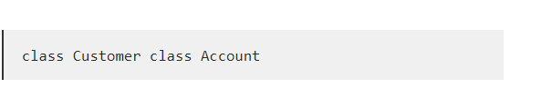

# Naming Conventions

## Intro
Learning to write code can be extremely confusing. There are so many formulas to remember. And if you are off by one capital letter, or one extra letter, your code may not work. With all this learning and memorizing the last thing you want to worry about is Naming your variables, constants, methods, or classes. But believe me. focusing on Naming Conventions at the beginning, will save you in the long run.

## What Is A Naming Convention?
Naming convention is a rule for programmers to follow when naming identifiers like classes, variables, constants, and methods. This rule makes sure every programmer follows the same naming rules. This allows your code to be as clean, and as easy to read as possible.
#### Defintion
>A file naming convention is a framework for naming your files in a way that describes what they contain and how they relate to other files.
https://datamanagement.hms.harvard.edu/collect/file-naming-conventions

## Why Follow Naming Conventions?
Naming Conventions are very important for the readability of your code later on. Not just for you, but for whoever else looks at your code after you. It allows you or anyone else to easily identify the code, and what it does, just off the name. It will save time for both you and the other programmers who look at your code time when editing or making changes to the code you entered. Without the use of consistent naming convention, you and your teammates could be confused by code. In return making it more time consuming for everyone.

https://www.tutorialspoint.com/why-we-should-follow-the-naming-conventions-in-java

### Key Benefits From Following Naming Conventions
- It reduced the amount of effort needed to read and understand the source code.
- It allows more time to focus on other important issues with the code instead of struggling and arguing over naming standards. 

https://www.tutorialspoint.com/why-we-should-follow-the-naming-conventions-in-java

## How To Pick A Name For Your Identifier Following Naming Conventions
Every name you choose for your identifier has to be meaningful. Make sure the name is on topic with what your code does. If you are making code for a bank account. Then make sure the names of your identifiers have to do with bank accounts and more specifically what your code ACTUALLY does. It is better to have a longer but specific name than a short and vague name. You always want to make sure that you can understand what the code does just based on the name of the identifier.

## Naming Conventions For Different Identifiers
To keep things organized. There are different naming conventions used for different identifiers. Here are a few rules to follow when naming specific identifiers.

### Packages
These names should be in lowercase. If you have a small project with only a few packages it’s okay to give them a simple, meaningful name.

Here's an example where the programmer names one package “pokeranalyzer” and the other one “mycalculator” Both these names allow you to understand what they do without seeing the code.

### Classes
These names should be in CamelCase (You will learn about this later on). Nouns are preferred. Because a class usually represents something in the real world.

Here we have two class names. One with “Customer” which is clear that the class is about the customer. And another with “Account” which is also clear that the class is about an account.

### Interfaces
Like classes. Interfaces should be in CamelCase. They typically have a name that describes an operation that the class can do.

Here you can see two names. “Comparable” So you know its going to be compared to something. And “Enumerable” which tells you it’s going to have something to do with 
Counting.

### Methods 
Names for methods should be in mixed case(you will learn more about this later on). Try to use verbs to describe what a method does.

Here for two really good examples of names for a method. You have "calculateTax()" and "getSurname()". Both these make it very easy to identify what these methods do!

### Variables
Like Methods. Variables should be written in mixed case. Variable names should represent the value of the variable.

In this exmaple you have two Variables "firstName" and "orderNumber". These examples show how naming your variables correctly make it easy to figure out what they are for.

### Constants
Constant names should be in UPPERCASE. Every letter should be capitalized. It should also have a underscore instead of a space.

This exmaple has two Constants "DEFAULT_WIDTH" and "MAX_HEIGHT". As you can see both are written in capital letters. And seperated by a space. They also identify what the constant does in the name. 

https://www.thoughtco.com/using-java-naming-conventions-2034199#:~:text=By%20using%20standard%20Java%20naming,to%20fix%20or%20modify%20it

## Cases in Naming Conventions
It is important to follow the rules listed above. But following these cases will make your code even easier to follow and understand

- lowercase - Is where all letter and words are written in lowercase.

- UPPERCASE -  Is where every word is written in all uppercase, and if there is a space it is substituted with a underscore.

- Camelcase (AKA Upper Camelcase) - is where every new word starts with a capital letter.

- mixedCase (AKA lower camelCase) - is where every word EXCEPT the first word starts with a capital letter. The first words start with a lower case.

## References
- File Naming Conventions. Datamanagement.hms.harvard.edu. https://datamanagement.hms.harvard.edu/collect/file-naming-convention

- Why we should follow the naming conventions in Java? Www.tutorialspoint.com. https://www.tutorialspoint.com/why-we-should-follow-the-naming-conventions-in-java

- A Quick Guide to Using Naming Conventions in Java. ThoughtCo. Retrieved March 31, 2022, from https://www.thoughtco.com/using-java-naming-conventions-2034199#:~:text=By%20using%20standard%20Java%20naming

- Java Naming Conventions - Javatpoint. (2011). Www.javatpoint.com. https://www.javatpoint.com/java-naming-conventions

