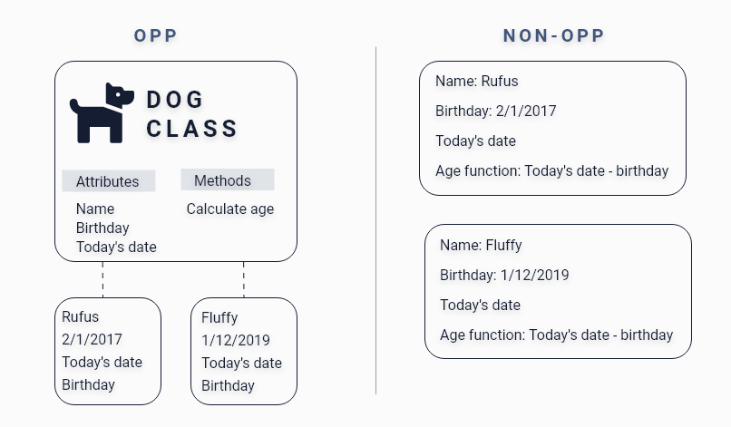
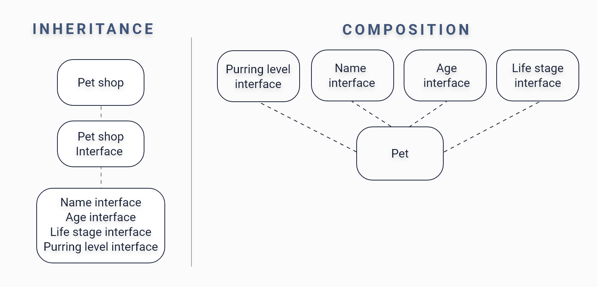

# Object-Oriented Programming & Interface Segregation Principle
---
## Intro
In this section, first, we will go over OPP paradigms with examples, the four principles of OPP paradigms with examples. Then will go over Open–closed principle and Interface Segregation Principle from the five SOLID principles of object-oriented design with examples. 


## OOP paradigms
##### Definition 
>Object Oriented programming (OOP) is a programming paradigm that relies on the concept of classes and objects. 
It is used to structure a software program into simple, reusable pieces of code blueprints (usually called classes), 
which are used to create individual instances of objects. 
There are many object-oriented programming languages including JavaScript, C++, Java, and Python.

[What is object-oriented programming? OOP explained in depth By Erin Doherty](https://www.educative.io/blog/object-oriented-programming) 

##### Example


As illustrated in the picture, we first have a Car class that contains Attributes and Methods. 
Inside Attributes, we got color, brand, year make then witing each attribute we have different values. 
Inside Methods, we have functions that are only accessible to car objects; 
for example, the Repaint method will help us change the car color for each instance  we create; 
the same goes for Tiers upgrade method.

##### Why should you use OOP
* OOP wil help you simplify your complex structer :relaxed:
* You can use it across programs! :star2:
* You can set class specific behaviour through polymorphism :+1:
* It will make debuging a braze :relieved:



A real example of how OOP can create an easy program for a pet shop. 

when we use OOP, we specify the attribute and method once, and as more dogs check-in, we fill out their name and age; for today's date and age, data will be pulled from the main class to reflect today's date and age. 
* :one: We crated parent class "Dog class"
* :two: We creatrd child classes represanting diffrant subcategories "Attributes & Methods"
* :three: We added unique attributes and behaviors "Name, Birthday, Today's date, Calculate age" 
* :four: We Createed objects from the child class "Rufus & fluffy information"

```
NON-OOP
//Object of one individual dog
var rufus = {
    name: "Rufus",
    birthday: "2/1/2017",
    age: function() {
        return Date.now() - this.birthday;
    },
    attendance: 0
}

//Object of second individual dog
var fluffy = {
    name: "Fluffy",
    birthday: "1/12/2019",
    age: function() {
        return Date.now() - this.birthday;
    },
    attendance: 0
}
```

On the other hand, when we didn't use OOP, we had to create a different variable for each dog then add different specifications for them, meaning whenever new dog check-in, we'll have to fill out today's date again and retype the function to give us their age. 

In short, OOP will is ideal for complex structures which allow you to reuse your code and avoid repetition, you can a classes that has specific Attributes and Methods that has many instances as you like. 


### Principles of OOP
Object-oriented programs has four principles which are Inheritance, Encapsulation, Abstraction, and Polymorphism

#### Inheritance
##### Defenition: 
Inheritance is the procedure in which one class inherits the attributes and methods of another class. 

[Inheritance in Java Programming](https://beginnersbook.com/2013/03/inheritance-in-java/)

##### Example: 

```
public class dogs {

}

public class dogs extends cats{

}
```

##### Why use Inheritance? 


#### Encapsulation
Defenition: Encapsulation is a method to hide the data in a single entity or unit along with a method to protect information from outside. 
[Encapsulation in Java](https://www.scientecheasy.com/2020/07/encapsulation-in-java.html/#:~:text=Every%20Java%20class%20is%20an,encapsulates%20several%20combinations%20of%20medicine.)

```
public class BankInformation {
    private int accBalance;
    
}
```
Example: bank software declarer your balance as a private variable; therefore, it's only available to you when you log in. if they declare it as a public variable, it would be available to everyone, and they fail to protect your privacy. 

#### Why use Encapsulation? 

#### Abstraction
Defenition: Abstraction is the method of hiding the unwanted information.
Example: 
```
public class Dog {
    //Declared private variables 
    private int dateOfBirth;
    private int todayDate;
}
public int getAge(){
    //Created get method to access private variables
        return dogAge;
    }
```
[Difference between Abstraction and Encapsulation in Java](https://www.geeksforgeeks.org/difference-between-abstraction-and-encapsulation-in-java-with-examples/)

#### Why use Abstraction? 

#### Polymorphism
Defenition: Polymorphism means "many forms", and it occurs when we have many classes that are related to each other by inheritance. 
Example: In our car illustration the attribute color behaved differently for each instance; for sam's car, it reflected green, for Abe's car, it was yellow, and bills car was blue


## Open–Closed Principle In OOP 
### Definition 
>In object-oriented programming, the open–closed principle states "software entities should be open for extension, but closed for modification"; that is, such an entity can allow its behaviour to be extended without modifying its source code. Open–closed principle is one of the five SOLID principles of object-oriented design.
[Open–closed principle](https://en.wikipedia.org/wiki/Open%E2%80%93closed_principle#:~:text=In%20object%2Doriented%20programming%2C%20the,without%20modifying%20its%20source%20code.)


### Example
Let's say that the pet store owner now need us to create a class that includes cats 
that will provide the same information for the dog class (name, birthday, age) 
and include cat's life stages (Kitten, Junior, Adult, Mature, Senior, Super Senior)
Easy right? that will require us to make changes in different places MOST IMPORTANTLY we will need to modify the main class. 
How can we use the open-closed principle then? 
We can create different classes for each output, for example 

```
class petName {
    String pet name;
}

class petAge{
    int todayDate;
    int dateOfBirth;
    int age
}

class petLifeStages{
    String lifeStages
}
```

Here we grouped variables based on how we will use them; for example, we had today's date, date of birth, and age in one group. 

now the classes we made are closed, we don't need to touch them, and if the pet store owner wants to add a new class, we can do that since our code allows us to add new classes "open." 


## Interface Segregation Principle     

### Definition 
In the field of software engineering, the interface segregation principle states that no code should be forced to depend on methods it does not use. 
[Wikipedia](https://en.wikipedia.org/wiki/Interface_segregation_principle)

Its alos one of the five SOLID principles of object-oriented design.
### Example
 
If we decided to use the same principle in our pet shop, we would be creating 
different roles then give all the necessary roles to pet instance.
Which allow us to add more roles like Purring level since it's cat's thing 
the dog method will not depend on it. 
