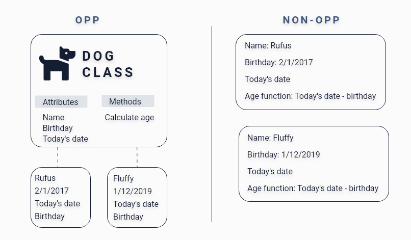

# Object-Oriented Programming & Interface Segregation Principle
---
## Intro
In this section, first, we will go over OPP paradigms with examples, the four principles of OPP paradigms with examples. Then will go over Interface Segregation Principle from the five SOLID principles of object-oriented design with examples and dry principle with example.


## OOP paradigms
#### Definition 
>Object Oriented programming (OOP) is a programming paradigm that relies on the concept of classes and objects. 
It is used to structure a software program into simple, reusable pieces of code blueprints (usually called classes), 
which are used to create individual instances of objects. 
There are many object-oriented programming languages including JavaScript, C++, Java, and Python.

[What is object-oriented programming? OOP explained in depth By Erin Doherty](https://www.educative.io/blog/object-oriented-programming) 

#### Example


```
Java
{

/* fields/data menbers,

Variables,

Methods,

Properties,

*/

}

```

To ensure your code follows opp, you need to use composition over inheritance to create loosely coupled classes, 
you should also use object and interface to create multiple inheritances to save you time, 
Try to avoid using inheritance only in your code to avoid difficulties when you change your class; remember that in inheritance, whenever you make changes to the main class, other classes follow 



In short, OOP is ideal for complex structures which allow you to reuse your code and avoid repetition, you can creat classes that has specific Attributes and Methods that has many instances as you like. 

#### Why you should use OOP
- [x] :one: OOP wil help you simplify your complex structer 
- [x] :two: You can use it across programs 
- [x] :three: You can set class specific behaviour through polymorphism 
- [x] :four: It will make debuging a braze 


### Principles of OOP
Object-oriented programs has four principles which are Inheritance, Encapsulation, Abstraction, and Polymorphism

### Inheritance
#### Defenition: 
Inheritance is the procedure in which one class inherits the attributes and methods of another class. 

#### Why you should use Inheritance? 
- [x] :one: You will be able to re-use your code 
- [x] :two: Your code will be highly readable 

[Inheritance in Java Programming](https://beginnersbook.com/2013/03/inheritance-in-java/)


### Encapsulation
#### Defenition: 
Encapsulation is a method to hide the data in a single entity or unit along with a method to protect information from outside. 
[Encapsulation in Java](https://www.scientecheasy.com/2020/07/encapsulation-in-java.html/#:~:text=Every%20Java%20class%20is%20an,encapsulates%20several%20combinations%20of%20medicine.)

#### Why you should use Encapsulation? 
- [x] :one: Help you maintenan your code 
- [x] :two: Increases rour code usability
- [x] :three: Change your code independently whenever needed 


#### Example (Inheritance + Encapsulation): 

Now let's see how both inheritance and encapsulation will translate in our code example. 

```
Java

public class Vehicle {
private String color, model;  

public Vehicle(String color,String model) {
		this.color=color;
		this.model=model;
	}
	public String getColor() {
		return color;
	}
	public void setColor(String color) {
		this.color = color;
	}
	public String getModel() {
		return model;
	}
	public void setModel(String model) {
		this.model = model;
}
	public void printdetails() {
		System.out.println("Color: "+this.color+"\n"+"Model: "+this.model);
	}
}}

public class Car extends Vehicle { 
	
	public Car(int speed,String color,String model) {
		super(color,model);
	}
	
	public void carDetails() {
		super.printdetails();
	
         }}

```

First, we used encapsulation to protect the data so the user can’t access them directly when we declared our value as privet, 
then we crated car class which  inheritance from our main class "Vehicle."


### Abstraction
#### Defenition: 
Abstraction is the method of hiding the unwanted information. 

[Difference between Abstraction and Encapsulation in Java](https://www.geeksforgeeks.org/difference-between-abstraction-and-encapsulation-in-java-with-examples/)

#### Why you should use Abstraction? 
- [x] :one:  Reduce your code complexity
- [x] :two: Increase your application security by providing important details only to users 
- [x] :three: Write your code once & avoid repetition 


### Polymorphism
#### Defenition: 
Polymorphism means "many forms", and it occurs when we have many classes that are related to each other by inheritance. 


#### Why you should use polymorphism? 
- [x] :one: Type your code once and reuse it as much you like 
- [x] :two: Makes debug easier 
- [x] :three: Store multiple data types in single variable 

#### Summery  
- [x] :one: OOP relies on the concept of classes and objects 
- [x] :two: OOP used to structure a software program into simple, reusable pieces of code 
- [x] :three: JavaScript, C++, Java, and Python are exmple of OOP 
- [x] :four: OOP has four principle Inheritance, Encapsulation, Abstraction and, Polymorphism 

#### Example (Abstraction + Polymorphism): 

```
Java

public abstract class Animal {
	
	public abstract void chooseColor(String color);
	
}}
public class Cat extends Animal{
	
	@override
	public void chooseColor(String color) {
		System.out.println("Cat chosen color: "+color);
		
	}
	//overloading
	public void chooseColor(String color, String color2) {
		System.out.println("Cat first chosen colors is: "+color);
		System.out.println("Cat second chosen colors is: "+color2);
		
	}
}

```

To put abstraction polymorphism into code, we crated animal class which we defined as an abstract method
after that extended the cat class to Animal class 
then we override the method, and in Cat class, so the same method chooseColor now gives us two methods  


## Interface Segregation Principle     

#### Definition 
In the field of software engineering, the interface segregation principle states that no code should be forced to depend on methods it does not use. 
[Wikipedia](https://en.wikipedia.org/wiki/Interface_segregation_principle)

Its alos one of the five SOLID principles of object-oriented design.


#### What's the benefit of Interface Segregation Principle?
- [x] :one: Increase your code readability
- [x] :two: Increase maintainability of your code 

#### Tips to help you follow Interface Segregation Principle 
- [x] :one: Spend some time at the design phase constricting your application 
- [x] :two: Avoid using one large interface for you application 
- [x] :three: Brake off application interface into smaller groups 


#### Example

```
Java

public interface Polygon {
	
	abstract String getColor();
	
	//default method
	default void getSameColor(){
		System.out.println("Polygon color is red and I will get color of polygon");
	}}

public class Rectangle implements Polygon {
	private String color;
	public Rectangle(String color) {
		this.color=color;
	}
	public String getColor() {
		return this.color;
	}
}
```
Here we defined one method, "Rectangle class" then, inside the class, we made the body of this abstract method.


## Do Not Repeat Yourself Principle
#### Definition
>"Don't repeat yourself" is a principle of software development aimed at reducing repetition of software patterns, replacing it with abstractions or using data normalization to avoid redundancy. 
[Wikipedia](https://en.wikipedia.org/wiki/Don't_repeat_yourself)

In short, you should avoid copying your code, and if you find yourself doing so take a look back on
your code structure and see what you can improve following the dry principle 

#### Example

A good example of dry concept is what we used in the "inheritance" example earlier to avoid repetition, which will essentially make debugging easier 


#### Why use dry concept when coding?
- [x] :one: Reduce workload by reducing unnecessary code 
- [x] :two: Maintain and debug your code easily 
- [x] :three: Avoid technical debt 

#### Tips to help you follow DRY principle 
- [x] :one: Avoid writing lengthy codes insted build your code in smaller reusable units 
- [x] :two: Establish you code logic first to help with your code writing processe 
