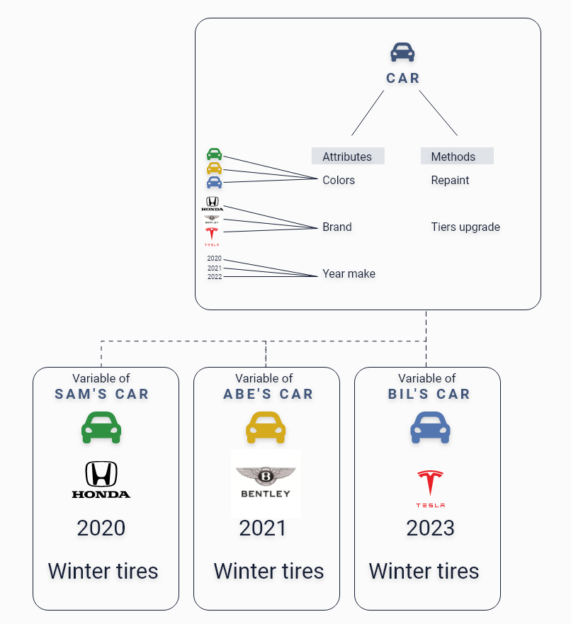

# Object-Oriented Programming, Principles of OPP & Interface Segregation Principle
---
## Intro
In this section, first, we will go over Object-Oriented Programming (OPP) paradigms with examples, the four principles of OPP paradigms with examples. Then will go over Interface Segregation Principle from the five SOLID principles of object-oriented design with examples and the DRY principle with examples.


## OOP paradigms
### Definition 
>Object Oriented programming (OOP) is a programming paradigm that relies on the concept of classes and objects. 
It is used to structure a software program into simple, reusable pieces of code blueprints (usually called classes), 
which are used to create individual instances of objects. 
There are many object-oriented programming languages, including JavaScript, C++, Java, and Python ([What is object-oriented programming? OOP explained in-depth By Erin Doherty](https://www.educative.io/blog/object-oriented-programming)).

### Example


Here I'll explain the OOP concept through inheritance. 
This code saves our time and allows you to reuse your code and avoid repetition,
we extended the Car class attributes/methods that we need for SamsCar, AbesCar, BilsCar classes 


```Java
public class Car {
	private String color, brand, yearMake;
	public Car(String color, String brand, String yearMake) {
		this.color=color;
		this.brand=brand;
		this.yearMake=yearMake;
	}
	public void repaint() {
	}
	public void tireUpgrade() {
	}
}

public class SamsCar extends Car {
	public SamsCar(String color, String brand, String yearMake) {
		super(color,brand,yearMake);
	}
	public void update() {
		super.tireUpgrade();
	}
}

public class AbesCar extends Car {
	public AbesCar(String color, String brand, String yearMake) {
		super(color,brand,yearMake);
	}
	public void update() {
		super.tireUpgrade();
	}

}
public class BilsCar extends Car {
	public BilsCar(String color, String brand, String yearMake) {
		super(color,brand,yearMake);
	}
	public void update() {
		super.tireUpgrade();
	}
}
```


What happens if we don't use OOP? 
We will have to declare all the three attributes again and again in the classes, which is a bad practice.


To ensure your code follows opp, you need to use composition over Inheritance to create loosely coupled classes. You should also use objects and interface to create multiple inheritances to save time. Try to avoid using only inheritance in your code to avoid difficulties when you change your class; remember that in inheritance, whenever you make changes to the main class, other classes follow.


In short, OOP is ideal for complex structures which allow you to reuse your code and avoid repetition. You can create classes with specific attributes and methods that have as many instances as you like. 

### Why you should use OOP
- OOP will help you simplify your complex structure 
- You can use it across programs
- You can set class-specific behavior through polymorphism 
- It will make debugging a braze 


## Principles of OOP
Object-oriented programs have four principles: inheritance, encapsulation, abstraction, and polymorphism.

### Inheritance
#### Definition: 
Inheritance is the procedure in which one class inherits the attributes and methods of another class. 

#### Why should you use Inheritance? 
- You will be able to reuse your code 
- Your code will be highly readable 

[Source: Inheritance in Java Programming](https://beginnersbook.com/2013/03/inheritance-in-java/)


### Encapsulation
#### Definition: 
Encapsulation is a method to hide the data in a single entity or unit along with a method to protect information from outside. 
[Source: Encapsulation in Java](https://www.scientecheasy.com/2020/07/encapsulation-in-java.html/#:~:text=Every%20Java%20class%20is%20an,encapsulates%20several%20combinations%20of%20medicine.)

#### Why should you use Encapsulation? 
- Help you maintain your code 
- Increases your code usability
- Change your code independently whenever needed 


#### Example (Inheritance + Encapsulation): 

Let's see how both Inheritance and Encapsulation will translate in our code example. 

```Java
public class Vehicle {
	private String color, model;  
	public Vehicle(String color, String model) {
		this.color=color;
		this.model=model;
	}
	public String getColor() {
		return color;
	}
	public void setColor(String color) {
		this.color = color;
	}
	public String getModel() {
		return model;
	}
	public void setModel(String model) {
		this.model = model;
	}
	public void printDetails() {
		System.out.println("Color: "+this.color+"\n"+"Model: "+this.model);	
	}
}

public class Car extends Vehicle { 
	public Car(int speed,String color,String model) {
		super(color,model);
	}
	public void carDetails() {
	super.printDetails();
	}
}
```

First, we used encapsulation to protect the data so the user can't access them directly when we declared our value as `private`, 
then we crated car class which inherits from our main class `Vehicle`.


### Abstraction
#### Definition: 
Encapsulation is defined as the wrapping up of data under a single unit. It is the mechanism that binds together code and the data it manipulates.
This we can protect the date from outside manipulation [Difference between Abstraction and Encapsulation in Java](https://www.geeksforgeeks.org/difference-between-abstraction-and-encapsulation-in-java-with-examples/).

#### Why should you use Abstraction? 
- Reduce your code complexity
- Increase your application security by providing important details only to users 
- Write your code once & avoid repetition 


### Polymorphism
#### Definition: 
Polymorphism means "many forms," It occurs when we have many classes related to each other by inheritance. 


#### Why should you use polymorphism? 
- Type your code once and reuse it as much you like 
- Makes debugging easier 
- Store multiple data types in a single variable 

#### Example (Abstraction + Polymorphism): 

```Java
public abstract class Animal {
	public abstract void chooseColor(String color);
}

public class Cat extends Animal{
	@override
	public void chooseColor(String color) {
		System.out.println("Cat chosen color: "+color);
	}
		//overloading
	public void chooseColor(String color, String color2) {
		System.out.println("Cat first chosen colors is: "+color);
		System.out.println("Cat second chosen colors is: "+color2);	
	}
}

```

To put abstraction polymorphism into code, we crated animal class which we defined as an `abstract` method
after that extended the `Cat` class to `Animal` class 
then we override the method, and in `Cat` class, so the same method `chooseColor` now gives us two methods. 


## Summary  
- OOP relies on the concept of classes and objects 
- OOP is used to structure a software program into simple, reusable pieces of code 
- JavaScript, C++, Java, and Python are examples of OOP programming languages 
- OOP has four principles Inheritance, Encapsulation, Abstraction, and, Polymorphism 
