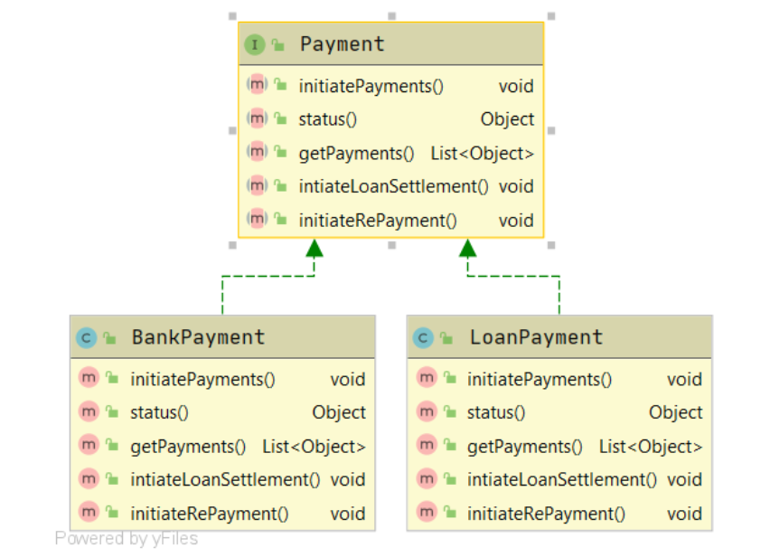
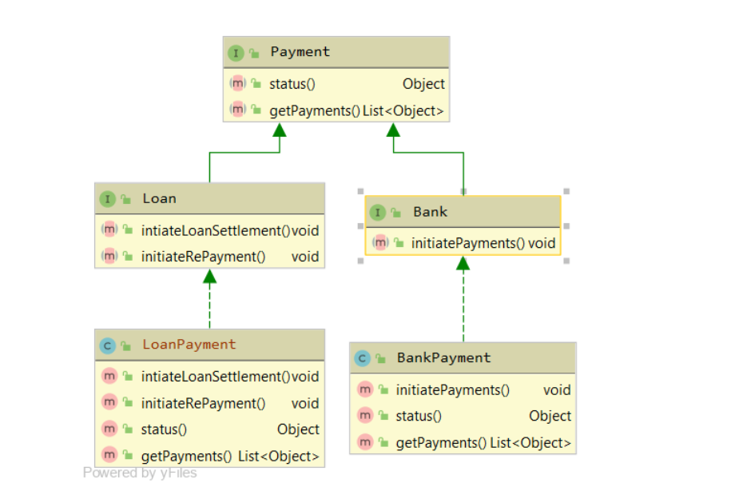

# SOLID
## Introduction
In this section we are going to talk about SOLID which is an an acronym for the first five object-oriented programming (OOP) principles. These principles outline best practices for designing software while keeping in mind the project's long-term maintenance and expansion. Adopting these techniques can also help you avoid restructure your code, and design agile or adaptive software. The SOLID principles were first introduced by the famous Computer Scientist Robert J. Martin (a.k.a Uncle Bob) in his paper in 2000.  But the SOLID acronym was introduced later by Michael Feathers. The goal was *"To create understandable, readable, and testable code that many developers can collaboratively work on"*. It represents:-
- S- Single responsibility Principle (SRP) 
- O- Open-closed Principle (OCP)
- L- Liskov Substitution Principle(LSP)
- I- Interface segregation principle(ISP)
- D- Dependency inversion principle(DIP)

## Single Responsibility Principle(SRP)
According to SRP, each component should only have one responsibility. This makes the classes and their methods simple to read and comprehend, as well as ensuring that changes only affect the component that has to be modified. This means that if a class is a data container, such as a book or a student, and it has fields related to that object, it should only change when the data model changes. Following SRP principle makes it easier to work on different teams and edit the code without any conflict or errors. This principle is not only for the code, but also for the files and their structure in the project. It makes the version control easier. Violating the SRP principle makes it hard to test and maintain code. Lets take a look at an example to understand this

```Java
class Book {
    String name;
    String authorName;
    int year;
    int price;
    String isbn;
}

public Book(String name, String authorName, int year, int price, String isbn) {
    this.name = name;
    this.authorName = authorName;
    this.year = year;
    this.price = price;
    this.isbn = isbn;
}
```
We will create a class `Book` with some fields. Now let's create the invoice class which will contain the logic for creating the invoice and calculating the total price. 

```Java
public class Invoice {
	private Book book;
	private int quantity;
	private double discountRate;
	private double taxRate;
	private double total;

	public Invoice(Book book, int quantity, double discountRate, double taxRate) {
		this.book = book;
		this.quantity = quantity;
		this.discountRate = discountRate;
		this.taxRate = taxRate;
		this.total = this.calculateTotal();
	}

	public double calculateTotal() {
        double price = ((book.price - book.price * discountRate) * this.quantity);
		double priceWithTaxes = price * (1 + taxRate);
		return priceWithTaxes;
	}

	public void printInvoice() {
        System.out.println(quantity + "x " + book.name + " " + book.price + "$");
        System.out.println("Discount Rate: " + discountRate);
        System.out.println("Tax Rate: " + taxRate);
        System.out.println("Total: " + total);
	}

    public void saveToFile(String filename) {
	    // Creates a file with given name and writes the invoice
	}

}
```
So here we have created our Invoice class with three methods:-
- `calculateTotal` method, which calculates the total price
- `printInvoice` method, that should print the invoice to console
- `saveToFile` method, responsible for writing the invoice to a file

Currently our class is violating SRP. Our `printInvoice` method requires to change the class if we want to change the printing format.Same with `saveToFile`, both of these methods are mixing persistence logic with business logic. So to fix this we will create two new classes for our printing and persistence logic so we will no longer need to modify the invoice class for those purposes.

```Java
public class InvoicePrinter {
    private Invoice invoice;

    public InvoicePrinter(Invoice invoice) {
        this.invoice = invoice;
    }

    public void print() {
        System.out.println(invoice.quantity + "x " + invoice.book.name + " " + invoice.book.price + " $");
        System.out.println("Discount Rate: " + invoice.discountRate);
        System.out.println("Tax Rate: " + invoice.taxRate);
        System.out.println("Total: " + invoice.total + " $");
    }
}

public class InvoicePersistence {
    Invoice invoice;

    public InvoicePersistence(Invoice invoice) {
        this.invoice = invoice;
    }

    public void saveToFile(String filename) {
        // Creates a file with given name and writes the invoice
    }
}
```
Here are some of the things you can do to make sure you are following SRP:-
- Constants, enumerations, interfaces, etc. must be organized in the same way as the code. The necessary constants related to the required class must be placed in the appropriate files in the same folder as the class, etc.
- A function or method should only do one thing. As with the class, it must be properly named and do exactly what the name says.
- Avoid unnecessary comments as more comments will make the code less readable.
- Split the code into small functions this will make the code more testable.
### Liskov Substitition Principle
The Liskov Substitution Principle states that subclasses should be substitutable for their base classes.This rule also applies to an inheritance. It can be seen as a method of applying the open-closed principle. The rule explains how to properly override parent class methods.Liskov substitution principle can be summarized as follows:

>If you have a function or class X using class A, then the replacement of class A by any of its subclasses should not break the function of X.

It is about implementing inheritance; a subclass cannot contradict or change the parent class's behaviour or meaning. If the parent's method is overridden, it must support the parent logic while having no effect on the general result. This is expected behaviour because we assume that when we use inheritance, the child class inherits everything that the superclass has. The child class broadens but never narrows the behaviour. As a result, when a class violates this principle, it results in some nasty bugs that are difficult to detect. Let's look at an example:

```Java
public interface Car {
    void turnOnEngine();
    void accelerate();
}
```
Above, we define a simple `Car` interface with a couple of methods. Let's implement our interface and provide some code for the methods.

```Java
public class MotorCar implements Car {
    private Engine engine;
    
    //Constructors, getters + setters
    public void turnOnEngine() {
        //turn on the engine!
        engine.on();
    }

    public void accelerate() {
        //move forward!
        engine.powerOn(1000);
    }
}
```
As our code describes, we have an `Engine` that we can turn on, and we can increase the power. But what if we have an electric car:

```Java
public class ElectricCar implements Car {

    public void turnOnEngine() {
        throw new AssertionError("I don't have an engine!");
    }

    public void accelerate() {
        //this acceleration is crazy!
    }
```
We are changing the behaviour of our program by introducing a car without an engine into the mix. This is a clear violation of the Liskov substitution principle, and it is a little more difficult to correct than our previous two principles.
One possible solution would be to rework our model into interfaces that account for our `Car`'s engineless state.

If you decide to apply this principle to your code, the behavior of your classes becomes more important than its structure. Unfortunately, there is no easy way to enforce this principle. You need to implement your own checks to ensure that your code follows the Liskov Substitution Principle. In the best case, you do this via code reviews and test cases. Here are some things you can keep in mind while applying this rule:
- Don’t implement any stricter validation rules on input parameters than implemented by the parent class.
- Apply at the least the same rules to all output parameters as applied by the parent class.

## Interface Segregation Principle     

### Definition 
In the field of software engineering, the interface segregation principle states that no code should be forced to depend on methods it does not use ([Wikipedia](https://en.wikipedia.org/wiki/Interface_segregation_principle)).

It's also one of the five SOLID principles of object-oriented programming.


### What's the benefit of the Interface Segregation Principle?
- Increase your code readability
- Increase the maintainability of your code 

### Tips to help you follow the Interface Segregation Principle 
- Spend some time in the design phase constricting your application 
- Avoid using one large interface for your application 
- Break off application interface into smaller groups 

### Example

```Java
public interface Polygon {
	abstract String getColor();
	//default method
	default void getSameColor(){
        System.out.println("Polygon color is red and I will get color of polygon");
    }
}

public class Rectangle implements Polygon {
	private String color;
	public Rectangle(String color) {
        this.color=color;
    }
	public String getColor() {
        return this.color;
    }
}
```
Here we defined one class `Rectangle` then, inside the class, we made the body of this abstract method, and we ended up with two classes, each has their independent methods. 

Let's see another example for a `Payment` interface used by an implementation `BankPayment` in [Interface Segregation Principle in Java](https://www.baeldung.com/java-interface-segregation)



Notice in the class diagram, and referring to the interfaces in the earlier section, that the `status()` and `getPayments()` methods are required in both the implementations. On the other hand, `initiatePayments()` is only required in `BankPayment`, and the `initiateLoanSettlement()` and `initiateRePayment()` methods are only for the `LoanPayment`.

With that sorted, let's break up the interfaces and apply the Interface Segregation Principle. Thus, we now have a common interface:


```Java
public interface Payment {
    Object status();
    List<Object> getPayments();
}
```

And two more interfaces for the two types of payments:

```Java
public interface Bank extends Payment {
    void initiatePayments();
}

public interface Loan extends Payment {
    void intiateLoanSettlement();
    void initiateRePayment();
}
```
And the respective implementations, starting with `BankPayment`:

```Java
public class BankPayment implements Bank {

    @Override
    public void initiatePayments() {
        // ...
    }

    @Override
    public Object status() {
        // ...
    }

    @Override
    public List<Object> getPayments() {
        // ...
    }
}
```
And finally, our revised `LoanPayment` implementation:

```Java
public class LoanPayment implements Loan {

    @Override
    public void intiateLoanSettlement() {
        // ...
    }

    @Override
    public void initiateRePayment() {
        // ...
    }

    @Override
    public Object status() {
        // ...
    }

    @Override
    public List<Object> getPayments() {
        // ...
    }
}
```
Now, let's review the new class diagram:



As we can see, the interfaces don't violate the principle. The implementations don't have to provide empty methods. This keeps the code clean and reduces the chance of bugs.

## Dependency Inversion Principle (DIP)
The Dependency Inversion principle states that our classes should depend upon interfaces or abstract classes instead of concrete classes and functions. We want our classes to be open to extension, so we have reorganized our dependencies to depend on interfaces instead of concrete classes. The purpose of this principle is to weaken the relationship between classes and combat the complexity of the system. In 2000 Uncle Bob summarizes this principle as follows:

>If the Open-Closed Principle states the goal of OO architecture, the DIP states the primary mechanism.

If you consequently apply the Open/Closed Principle and the Liskov Substitution Principle to your code, it will also follow the Dependency Inversion Principle.Let's look at the example below:

```Java
public class WindowsMachine {}
```
Here we have created a `WindowMachine` class, now let's add some constructor to this class.

```Java
public class WindowsMachine {

    private final StandardKeyboard keyboard;
    private final Monitor monitor;

    public WindowsMachine() {
        monitor = new Monitor();
        keyboard = new StandardKeyboard();
    }

}
```
This code will work, and we'll be able to use the `StandardKeyboard` and `Monitor` freely within our `WindowsComputer` class.

Now, by declaring the `StandardKeyboard` and `Monitor` with the new keyword we've tightly coupled these three classes together which makes it hard to test. Let's decouple our machine from the `StandardKeyboard` by adding a more general `Keyboard` interface and using this in our class:

```Java
public interface Keyboard { }

public class WindowsMachine{

    private final Keyboard keyboard;
    private final Monitor monitor;

    public WindowsMachine(Keyboard keyboard, Monitor monitor) {
        this.keyboard = keyboard;
        this.monitor = monitor;
    }
}
```
Let's also modify our `StandardKeyboard` class to implement the `Keyboard` interface so that it's suitable for injecting into the `WindowsMachine` class:

```Java
public class StandardKeyboard implements Keyboard { }
```

Now our classes are decoupled and communicate through the `Keyboard` abstraction. If we want, we can easily switch out the type of keyboard in our machine with a different implementation of the interface. We can follow the same principle for the `Monitor` class.
## Let’s summarize!
SOLID principles are intended to reduce code complexity. Following these rules from the start will make your life much easier and will help you avoid common code problems.
The concept of single responsibility is critical. Correctly understandable nomenclature and appropriate content of a function or class provides a significant advantage. You are almost certain to violate the rest of the SOLID rules if you violate the single responsibility principle, but following it will make it easier to follow the other rules.

## Do Not Repeat Yourself Principle
### Definition
> "Don't repeat yourself" is a principle of software development aimed at reducing the repetition of software patterns, replacing them with abstractions, or using data normalization to avoid redundancy 
([Wikipedia](https://en.wikipedia.org/wiki/Don't_repeat_yourself)).

In short, you should avoid copying your code, and if you find yourself doing so, take a look back on
your code structure and see what you can improve following the dry principle 

### Example

A good example of a dry concept is what we used in the inheritance example earlier to avoid repetition, which will essentially make debugging easier. 


### Why use the DRY concept when coding?
- Reduce workload by reducing unnecessary code 
- Maintain and debug your code easily 
- Avoid technical debt 

### Tips to help you follow the DRY principle 
- Avoid writing lengthy codes; instead, build your code in smaller reusable units 
- Establish your code logic first to help with your code writing process 

## Citations
Solid. Wikipedia. Retrieved March 5, 2022, from (https://en.wikipedia.org/wiki/SOLID) 

A Solid Guide to SOLID Principles (https://www.baeldung.com/solid-principles)

Erinç, Y. K. (2020, August 20). The SOLID Principles of Object-Oriented Programming Explained in Plain English. freeCodeCamp.Org. (https://www.freecodecamp.org/news/solid-principles-explained-in-plain-english/)
