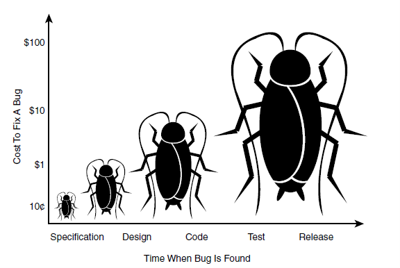

# DGL 104 Winter 2022 - Class Textbook

## Chapter 5 : TESTING

<br>

### Table of Contents
* [Introduction](https://github.com/nic-dgl104-winter-2022/class-textbook/blob/main/ch5/README.md#introduction)
* [Testing Principles](https://github.com/nic-dgl104-winter-2022/class-textbook/blob/main/ch5/README.md#testing-principles)
    1. [Testing Shows the Presence of Defects, Not Their Absence](https://github.com/nic-dgl104-winter-2022/class-textbook/blob/main/ch5/README.md#1-testing-shows-the-presence-of-defects-not-their-absence)
    2. [Exhaustive Testing is Impossible](https://github.com/nic-dgl104-winter-2022/class-textbook/blob/main/ch5/README.md#2-exhaustive-testing-is-impossible)
    3. [Early Testing Saves Time and Money](https://github.com/nic-dgl104-winter-2022/class-textbook/blob/main/ch5/README.md#3-early-testing-saves-time-and-money)
    4. [Defects Cluster Together](https://github.com/nic-dgl104-winter-2022/class-textbook/blob/main/ch5/README.md#4-defects-cluster-together)
    5. [Beware the Pesticide Paradox](https://github.com/nic-dgl104-winter-2022/class-textbook/blob/main/ch5/README.md#5-beware-the-pesticide-paradox)
    6. [Testing is Context Dependent](https://github.com/nic-dgl104-winter-2022/class-textbook/blob/main/ch5/README.md#6-testing-is-context-dependent)
    7. [Absence of Errors Fallacy](https://github.com/nic-dgl104-winter-2022/class-textbook/blob/main/ch5/README.md#7-absence-of-errors-fallacy)
* [How To Decide What To Test And When](https://github.com/nic-dgl104-winter-2022/class-textbook/blob/main/ch5/README.md#how-to-decide-what-to-test-and-when)
* [References](https://github.com/nic-dgl104-winter-2022/class-textbook/blob/main/ch5/README.md#references)

#
<br> 

### INTRODUCTION

](testingImages/testing.png/)

This chapter covers the seven testing principles provided by *ISTQB (International Software Testing Qualifications Board)*, its importance to a smooth functionality and reliability of the applications/ products and for meeting the user/ client’s expectations and requirement. 

We also demonstrate and helps you decide on which stage of development we are going to conduct testing and which testing method is best suitable in specific applications or products.

<br> 

#### What is Software Testing?

According to [Wikipedia](https://en.wikipedia.org/wiki/Software_testing) “Software testing is the act of examining the artifacts and the behavior of the software under test by validation and verification. Software testing can also provide an objective, independent view of the software to allow the business to appreciate and understand the risks of software implementation.”

](testingImages/fightingDefect.png/)

For conducting software testing, we are not only evaluating and checking the application’s functions and reliabilities of what application intended to do, but also it will prevent possible bugs, we can determine the improvements that we can implement, and it helps to reduce development costs.

<br> <br>

### TESTING PRINCIPLES

Software testing is a vital part for application’s success, and it is a complicated process to perform. It is helpful to have a reference and guidelines to follow and understand the ISTQB, who list seven fundamental principles of testing:

<br>

](testingImages/testingPrinciples.png/)

<br>

#### 1. Testing Shows the Presence of Defects, Not Their Absence

No one can say that their product or application is defect free. We conduct software testing to discover flaws and issues before launching it to the market. Testing helps us to reduce the hidden defects and possible crushed, but then again identifying and resolving these issues is not a totally guarantee that the application is defect free. Instead, it will add confidence and certainty that the application is working, functioning smoothly and on how it builds.

Examples of products that experience defects after launching to the market:

* Samsung Galaxy Note 7 – explosion issue
* Microsoft Windows 98 – crashed issue
* Microsoft Windows Vista – use of battery power in laptops issue

Do you think that these large companies that have lots of resources make enough testing for their product’s success and not risk their reputation? 

<br>

#### 2. Exhaustive Testing is Impossible

Testing everything is not possible, but instead established the priorities and focus on these for testing. In other words, testing all possible scenarios or possibilities is not feasible because of huge number of it.

[Test Automation Resources](https://testautomationresources.com/software-testing-basics/exhaustive-testing-fundamentals/) provides example of exhaustive testing:

](testingImages/exhausiveTestingExample.PNG/)

```
The IE Tools > Advanced Options window

53 binary conditions
1 condition with 3 options
1 condition with 4 options
2^53 = 9,007,199,254,740,992
       x    12
       = 108,086,391,056,891,904 possible combinations of conditions 
```

```
At one second per test execution:

108,086,391,056,891,904 / 360 = 300,239,975,158,033.067 hours 
(12,509,998,964,918.04 days or 34,273,969,766.9 years) 
to test all possible combinations.
```

Instead of testing everything, I’ve researched for alternatives or strategies to include for effective testing. Here’s the strategies for exhaustive testing by [Test Automation Resources](https://testautomationresources.com/software-testing-basics/exhaustive-testing-fundamentals/) , check the link for detailed information:

* Impact on Business
* Probability of failure
* Regression
* Recovery

Furthermore, we can prioritize or focus testing based on the results of risks assessments of the application. Through this we can identify the most important module that we can concentrate in our testing process.

<br>

#### 3. Early Testing Saves Time and Money

In any kind of development, early detection saves time, effort, and cost. As ISTQB states that “to find defects early, both static and dynamic test activities should be started as early as possible in the software development lifecycle.”

There is supportive research conducted by the IBM company, that the cost of removing software defects increases over time. So, a defect found in the post-production stage costs 30 times more than what it would cost if it were found in the design stage.

Also, from the data gathered by HP, the cost of correcting a defect detected at the last stage of a project life cycle (that is deployment and maintenance) is 30-100 times higher than the cost of the same defect being detected at the first stage.

To make it clearer, here is the illustration of Ron Patton on his book Software Testing, of how the costs increases based on the stage or time that the defect was found:


 
The sayings “prevention is better that cure” may apply in early software testing. Furthermore, early testing with consistent collaboration and communication between developer, tester, and user are keys for effective quality assurance. 

<br>

#### 4. Defects Cluster Together

From evaluating different articles and concepts of “defect cluster”, in terms of testing, this only means that the distribution of defects is not even across the application but instead can be detected in a particular section or module that affects the whole application especially for large systems.

In clustering the defects, the tester will find the defects or issues in a particular area this means it will save time and effort in finding them.
 
](testingImages/unclusteredVsClustered.png/)

To this concept, we can apply the “Pareto Principle” also known as 80-20 rule where it means about 80% of the defects is caused by 20% of modules.

](testingImages/paretoPrinciple.png/)
 
 This emphasizes that the large number of issues are basically coming from small part of the applications. For the testers, this principle helps them to set the right priorities to detect more faults and fix them immediately.

<br>

#### 5. Beware the Pesticide Paradox

This only means that if we repeat same tests all over again, it will no longer find new defects. For us to detect new defects, we must update existing test, data and make new test. 

This is what pesticide paradox, in a long run the pesticide will no longer effective in killing the pests/ bugs as illustrated below:

](testingImages/pesticideParadox.png/)

To prevent this pesticide paradox, we have to create new set of test cases to examine other area of application or make new test cases and add them to existing test cases. 

<br>

### 6. Testing is Context Dependent

All the testing will first define the context of the application and from this context we can provide on which testing methods, types and approach should be performed and applied.

As I am researching for the example of this context dependent, they all give same examples as ISTQB provided: 

* Safety critical industry control software is tested completely differently from an e-commerce mobile app. 

* Testing in an Agile project is also done differently than testing in a Waterfall software development lifecycle project. 
* The software of a passenger plane is tested differently than a website with static information.

In design principles content is the king while in software testing, the context is.

<br>

### 7. Absence of Errors Fallacy

The results of testing, for doesn’t finding any flaws or the application without defects is never proves that absence of issues, maybe the users have. In this principle, it is all about the application’s usability, it doesn’t matter how many defects has been detected and fixed, the matter is if the application meets the user’s expectations and requirements. It is important principle to consider for ensuring the quality of the application.

Here are some illustrations that shows the principle of “Absence of Errors Fallacy”:

*Illustration 1:*

](testingImages/errorFallacy.png/)

*Illustration 2:*

](testingImages/errorFallacy2.png/)
 
It is some of us experiences as the user’s **expectations versus reality**. These illustrations demonstrate to focus on solving and providing the pitfalls of the users in order to have a successful and usable applications or products.

<br> <br>


### HOW TO DECIDE WHAT TO TEST AND WHEN


<br> <br>

### REFERENCES

**Testing Principles:**

* [Wikipedia](https://en.wikipedia.org/wiki/Software_testing) – What is Software Testing

* [Javatpoint](https://www.javatpoint.com/software-testing-principles), 
[GeeksforGeeks](https://www.geeksforgeeks.org/software-engineering-seven-principles-of-software-testing/), 
[Linkedin](https://www.linkedin.com/learning/istqb-foundation-exam-prep) – Testing Principles

* [Test Rail - Blog](https://blog.gurock.com/defect-clusters-in-software-testing/) – Fighting Defect Illustration 

* [Contemporary Staffing Solutions](https://contemporarystaffing.com/manual-tester-insights/) – Testing Illustration 

* [Javatpoint](https://www.javatpoint.com/software-testing-principles) – 7 Testing Principles

* [Test Automation Resources](https://testautomationresources.com/software-testing-basics/exhaustive-testing-fundamentals/) – Exhausive Testing Example

* Textbook: Software Testing by Ron Patton – Effects of Time and Cost Illustration

* [PitSolutions](https://www.pitsolutions.ch/blog/defect-clustering-and-pesticide-paradox/) – Unclustered Vs Clustered Defects

* [Maria Killam](https://mariakillam.com/the-8020-rule-also-applies-to-the-most-popular-paint-colours/) – Pareto Principle

* [Online Education](http://internet-tutors.org/2015/11/pesticide-paradox/) – Pesticide Paradox Illustration

* [Ruwanthi Ranasinghe](https://medium.com/@ruwanthiranasinghe1996/7-principles-of-software-testing-25ba867f75ea/) – Absence of Errors Fallacy Illustration 1

* [Imobiliare.ro](https://labs.imobiliare.ro/post/135630464550/seven-testing-principales) – Absence of Errors Fallacy Illustration 2

<br>

**How To Decide What To Test And When:**

In this unit we will be exploring the topic of how to decide what to test and when. This topic is heavily swayed by how large the budget is and how much time the developer(s) has to get everything finished. There are also a multitude of things to consider prior to testing and you should always consider everything testing related before even starting the project. Also always remember to think about both the hardware and software when testing. When something is going wrong on a particular user’s device they most likely will not be blaming their device so it's important to try to accommodate for as many scenarios as possible.

<br>

### When To Start Testing

When it comes to testing, a good strategy is to test often and test as early as possible in your development. However there are a lot of questions about what exactly you should be testing because if you test everything constantly you may run into budget issues either in terms of cost or time. So then it begs the question of when I should be testing.

## Test Often, Test Early

Test often, test early is a saying you will hear from almost anyone talking about good testing practices. Testing should be starting right at the beginning of the application design process, even before any coding has started. In some cases, you may even want to build your tests before anything else.

## Test-First Programming

Test-first programming is a technique where you design automatic tests before writing any code. This technique can feel strange at first although it enhances your ability and speed at catching bugs.

Essentially the technique involves creating a production test for an output you want and then writing your code until you successfully pass your test(s). It is quite a simple technique but is extremely efficient. This allows things like refactoring or other small changes in code to be done much more easily as well as if anything is to go wrong the tests will pick it up right away.

<br>

### What Should I Test?

I will once again mutter the motto of “test often, test early”. This is because frankly it is the best way to prevent as many bugs in your app’s as possible. So then should you be testing everything? Well the answer to that is if possible yes, however, sometimes it is hard to just think about how you have to test everything. So we will go a bit more step by step and highlight some areas that should be prioritised.

Let's talk about residual defect rates per kloc (1 thousand lines of code). According to https://ocw.mit.edu/ans7870/6/6.005/s16/classes/03-testing/index.html the following are typical rates for released products:

1-10 defects/kloc: Typical industry standard
0.1-1 defects/kloc: High-quality
0.01-0.1 defects/kloc: The best, safety critical

So as you can see, the rates in which defects occur are low. Obviously as developers we would all like our projects to have no issues whatsoever although, this is just not possible. So there are bound to be problems, but where are these problems showing up?

When it comes to what to look for in terms of issues, it is important to take note of what bugs are caused by. So let's look at what are some common causes of bugs according to bitbar.com:

* 33% of issues are caused by the hardware:
* 10% - Display
* 10% - Memory
* 7% - Sensors
* 4% - Chipset
* 2% - Other Hardware

* 67% of issues are caused by software
* 32% Platform
* 29% OEM Customizations
* 6% Other Software

Now, with this information we can start to prioritize what to test and watch out for. Although alawys keep in mind to test everything if possible.

Now, let's go over a bit more in depth on testing best practises to determine what we will be testing. 

* Plan your tests in advance. As we talked about previously, start planning your tests before or at the start of development.

* Define the test scope. Figure out what to prioritise as its not always possible to test every OS, device model, etc so it should be planned out based on what your application has to offer.

* Test the network capabilities. The app should be able to operate in all kinds of connectivity areas

* Test client AND server side. This helps to estimate how much size of load the app can handle

* Use a real device when testing. We will cover this more in depth below but to sum it up. An emulator cannot predict the outcomes of a real device.

* Choose your testing frequency. Decide on how you are wanting to run test throughout the design of your app and stick to it.

* Test in a multitude of languages. It is important to be accessible in all ways possible. This also will help to eliminate issues through translation that may offend someone.

* Battery testing. It is extremely important to test the consumption of battery your app uses as nobody will keep an app that drains their phone too fast.

* Different hardware features. Since smartphones have so many sensors etc that interact with their surroundings etc. you need to make sure they interact properly with your app.

* Test for updates. Since updates may affect how your app will run you need to keep on top of the updates.

* Check for restricted permissions. This is extremely important! You need to make sure your app is only using permissions that the user allows as they are sensitive about data security.

* Automate testing. Automating your tests is another important thing to keep in mind. It increases your productivity and can actually save on a lot of money overall.

### Testing With An Emulator VS A Real Device

When deciding between an emulator or a real device you must first ask yourself what your budget is like. Testing on real devices can become fairly expensive however it is almost necessary to do so if you are wanting to publish a globally accepted app. Let's first look at some of the pros and cons of testing on an emulator vs real devices.

# Real Device

Pros:
* Accurate when testing user interactions
* Real occuring events (inturrupts, batter, charge effects)
* Overall performance
* Consistant results

Cons:
* Can be expensive
* Tricky to debug with

As you can see, testing with real devices has tons of positive effects when testing. I will elaborate some more on what this all means. When testing user interactions you can reliably test actions such as pinching, zooming, and scrolling. Overall performance is another thing that testing with real devices offers as crucial results.

# Emulator

Pros:
* Free
* Great for debugging
* Good for cross-platform testing

Cons:
* Only can mimic a real device
* Inconsistant results
* Different network environment

Emulators are best suited for debugging and cross-platform testing. Any other kind of test has way too many variables going in to trust the results.

Now that we have gone over some of the pros and cons for real devices and emulators you can kind of see how important it will be to test using real devices. However most if not all of your debugging should be done on an emulator as they are usually suited for that.

