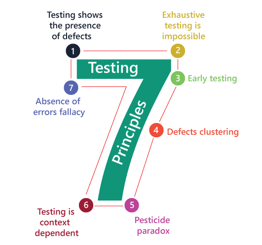
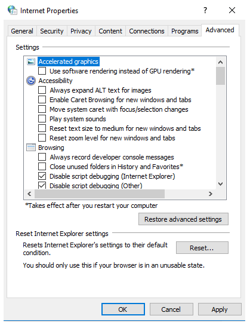
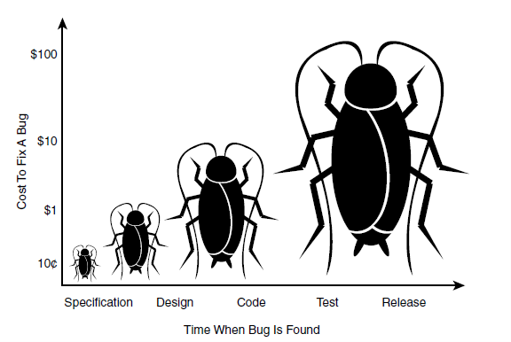
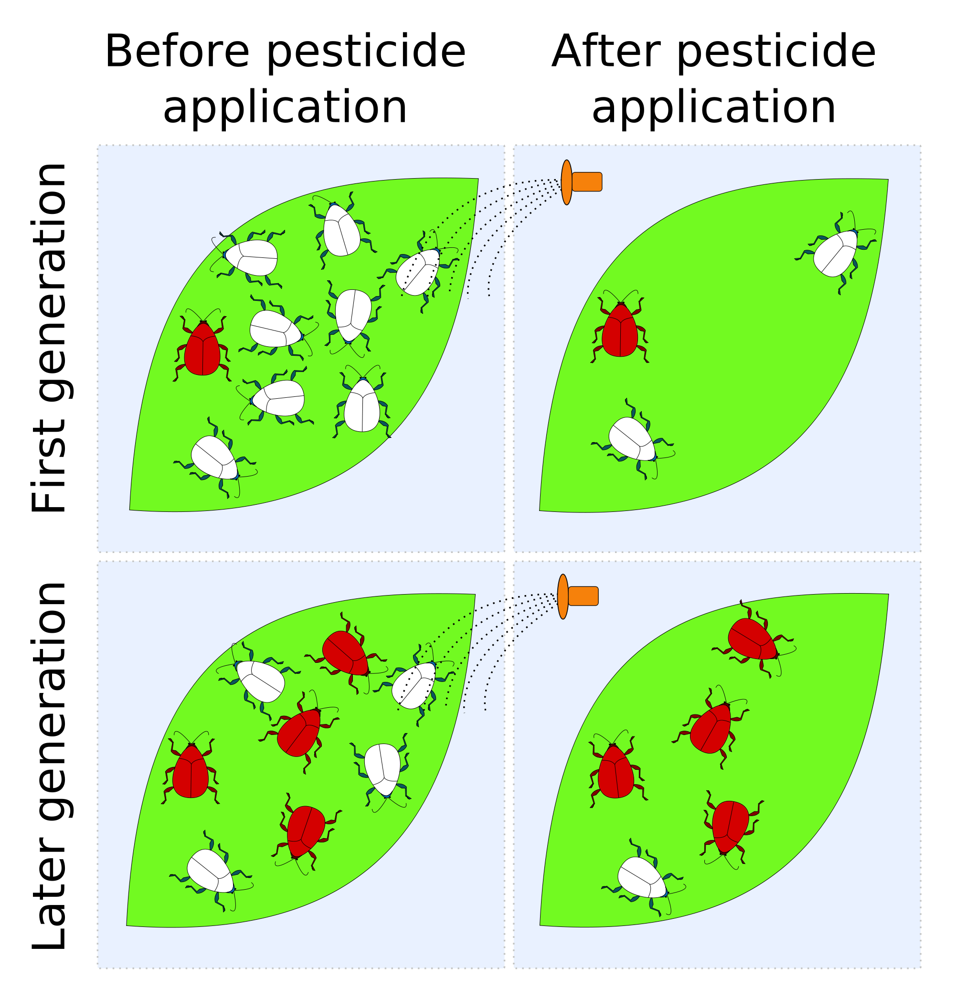

# Software Testing

## What is software testing?

According to [Wikipedia](https://en.wikipedia.org/wiki/Software_testing): 
>Software testing is the act of examining the artifacts and the behavior of the software under test by validation and verification. Software testing can also provide an objective, independent view of the software to allow the business to appreciate and understand the risks of software implementation.


[Image source](https://contemporarystaffing.com/manual-tester-insights/)

For conducting software testing, we are not only evaluating and checking the application’s functions and reliabilities of what application intended to do, but also it will prevent possible bugs, we can determine the improvements that we can implement, and it helps to reduce development costs.

## Testing Principles

Software testing is a vital part for application’s success, and it is a complicated process to perform. It is helpful to have a reference and guidelines to follow and understand the ISTQB, who list seven fundamental principles of testing:



[Image source](https://www.javatpoint.com/software-testing-principles)


## 1. Testing Shows the Presence of Defects, Not Their Absence

No one can say that their product or application is defect free. We conduct software testing to discover flaws and issues before launching it to the market. Testing helps us to reduce the hidden defects and possible crushed, but then again identifying and resolving these issues is not a totally guarantee that the application is defect free. Instead, it will add confidence and certainty that the application is working, functioning smoothly and on how it builds.

Examples of products that experience defects after launching to the market:

* Samsung Galaxy Note 7 – explosion issue
* Microsoft Windows 98 – crashed issue
* Microsoft Windows Vista – use of battery power in laptops issue

Do you think that these large companies that have lots of resources make enough testing for their product’s success and not risk their reputation? 

### 2. Exhaustive Testing is Impossible

Testing everything is not possible, but instead established the priorities and focus on these for testing. In other words, testing all possible scenarios or possibilities is not feasible because of huge number of it.

[Test Automation Resources](https://testautomationresources.com/software-testing-basics/exhaustive-testing-fundamentals/) provides example of exhaustive testing:


[Image source](https://testautomationresources.com/software-testing-basics/exhaustive-testing-fundamentals/)
```
The IE Tools > Advanced Options window

53 binary conditions
1 condition with 3 options
1 condition with 4 options
2^53 = 9,007,199,254,740,992
       x    12
       = 108,086,391,056,891,904 possible combinations of conditions 
```

```
At one second per test execution:

108,086,391,056,891,904 / 360 = 300,239,975,158,033.067 hours 
(12,509,998,964,918.04 days or 34,273,969,766.9 years) 
to test all possible combinations.
```

Instead of testing everything, I’ve researched for alternatives or strategies to include for effective testing. Here’s the strategies for exhaustive testing by [Test Automation Resources](https://testautomationresources.com/software-testing-basics/exhaustive-testing-fundamentals/) (check the link for detailed information):

* Impact on Business
* Probability of failure
* Regression
* Recovery

Furthermore, we can prioritize or focus testing based on the results of risks assessments of the application. Through this we can identify the most important module that we can concentrate in our testing process.


### 3. Early Testing Saves Time and Money

In any kind of development, early detection saves time, effort, and cost. As ISTQB states that “to find defects early, both static and dynamic test activities should be started as early as possible in the software development lifecycle.”

There is supportive research conducted by the IBM company, that the cost of removing software defects increases over time. So, a defect found in the post-production stage costs 30 times more than what it would cost if it were found in the design stage.

Also, from the data gathered by HP, the cost of correcting a defect detected at the last stage of a project life cycle (that is deployment and maintenance) is 30-100 times higher than the cost of the same defect being detected at the first stage.

To make it clearer, here is the illustration of Ron Patton on his book Software Testing, of how the costs increases based on the stage or time that the defect was found:


 
The sayings “prevention is better that cure” may apply in early software testing. Furthermore, early testing with consistent collaboration and communication between developer, tester, and user are keys for effective quality assurance. 


### 4. Defects Cluster Together

From evaluating different articles and concepts of “defect cluster”, in terms of testing, this only means that the distribution of defects is not even across the application but instead can be detected in a particular section or module that affects the whole application especially for large systems.

In clustering the defects, the tester will find the defects or issues in a particular area this means it will save time and effort in finding them.
 

[Image source](https://www.pitsolutions.ch/blog/defect-clustering-and-pesticide-paradox/)

To this concept, we can apply the “Pareto Principle” also known as 80-20 rule where it means about 80% of the defects is caused by 20% of modules.


[Image source](https://mariakillam.com/the-8020-rule-also-applies-to-the-most-popular-paint-colours/)
 
 This emphasizes that the large number of issues are basically coming from small part of the applications. For the testers, this principle helps them to set the right priorities to detect more faults and fix them immediately.


### 5. Beware the Pesticide Paradox

This only means that if we repeat same tests all over again, it will no longer find new defects. For us to detect new defects, we must update existing test, data and make new test. 

This is what pesticide paradox, in a long run the pesticide will no longer effective in killing the pests/ bugs as illustrated below:


[Image source](http://internet-tutors.org/2015/11/pesticide-paradox/)

To prevent this pesticide paradox, we have to create new set of test cases to examine other area of application or make new test cases and add them to existing test cases. 


### 6. Testing is Context Dependent

All the testing will first define the context of the application and from this context we can provide on which testing methods, types and approach should be performed and applied.

As I am researching for the example of this context dependent, they all give same examples as ISTQB provided: 

* Safety critical industry control software is tested completely differently from an e-commerce mobile app. 

* Testing in an Agile project is also done differently than testing in a Waterfall software development lifecycle project. 

* The software of a passenger plane is tested differently than a website with static information.

In design principles content is the king while in software testing, the context is.


### 7. Absence of Errors Fallacy

The results of testing, for doesn’t finding any flaws or the application without defects is never proves that absence of issues, maybe the users have. In this principle, it is all about the application’s usability, it doesn’t matter how many defects has been detected and fixed, the matter is if the application meets the user’s expectations and requirements. It is important principle to consider for ensuring the quality of the application.

Here are some illustrations that shows the principle of “Absence of Errors Fallacy”:

#### Illustration 1


[Image source](https://medium.com/@ruwanthiranasinghe1996/7-principles-of-software-testing-25ba867f75ea/)

#### Illustration 2


[Image source](https://labs.imobiliare.ro/post/135630464550/seven-testing-principales)
 
It is some of us experiences as the user’s **expectations versus reality**. These illustrations demonstrate to focus on solving and providing the pitfalls of the users in order to have a successful and usable applications or products.


## REFERENCES

1. [Wikipedia](https://en.wikipedia.org/wiki/Software_testing) – What is Software Testing

2. [Javatpoint](https://www.javatpoint.com/software-testing-principles), 
[GeeksforGeeks](https://www.geeksforgeeks.org/software-engineering-seven-principles-of-software-testing/), 
[Linkedin](https://www.linkedin.com/learning/istqb-foundation-exam-prep) – Testing Principles

3. [Test Rail - Blog](https://blog.gurock.com/defect-clusters-in-software-testing/) – Fighting Defect Illustration 

4. [Contemporary Staffing Solutions](https://contemporarystaffing.com/manual-tester-insights/) – Testing Illustration 

5.  [Javatpoint](https://www.javatpoint.com/software-testing-principles) – 7 Testing Principles

6. [Test Automation Resources](https://testautomationresources.com/software-testing-basics/exhaustive-testing-fundamentals/) – Exhausive Testing Example

7. Textbook: Software Testing by Ron Patton – Effects of Time and Cost Illustration

8. [PitSolutions](https://www.pitsolutions.ch/blog/defect-clustering-and-pesticide-paradox/) – Unclustered Vs Clustered Defects

9. [Maria Killam](https://mariakillam.com/the-8020-rule-also-applies-to-the-most-popular-paint-colours/) – Pareto Principle

10. [Online Education](http://internet-tutors.org/2015/11/pesticide-paradox/) – Pesticide Paradox Illustration

11. [Ruwanthi Ranasinghe](https://medium.com/@ruwanthiranasinghe1996/7-principles-of-software-testing-25ba867f75ea/) – Absence of Errors Fallacy Illustration 1

12. [Imobiliare.ro](https://labs.imobiliare.ro/post/135630464550/seven-testing-principales) – Absence of Errors Fallacy Illustration 2


