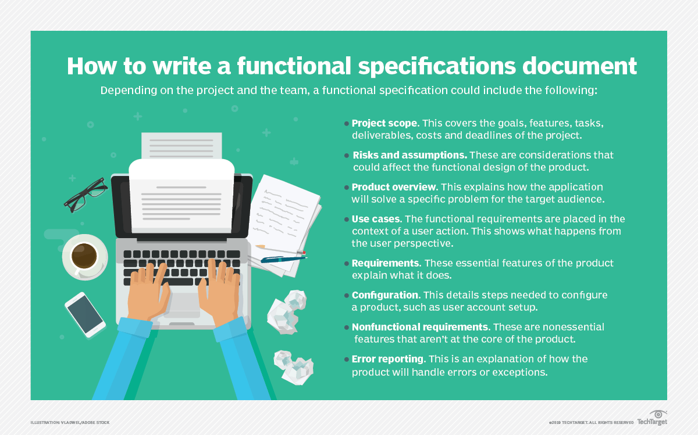
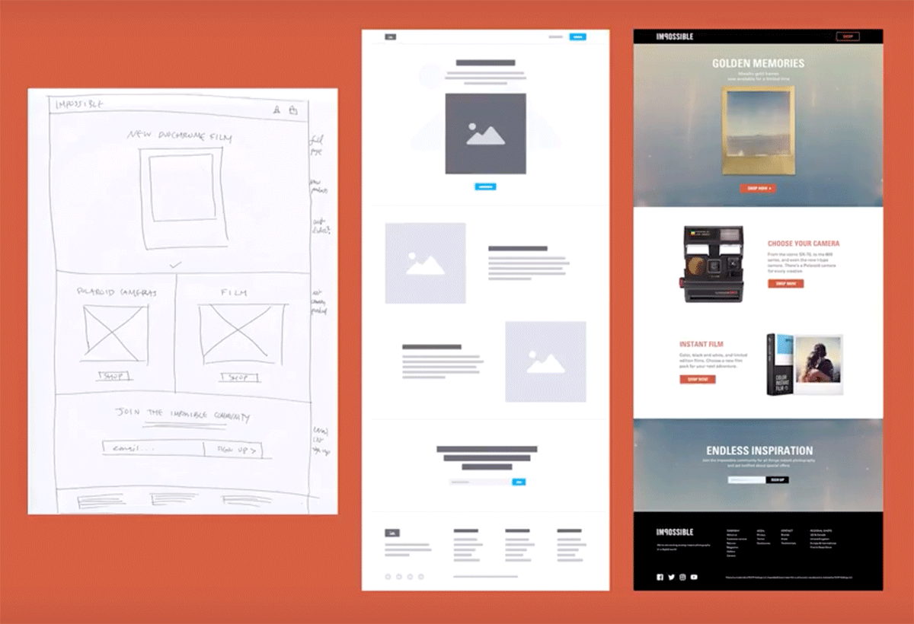

# DGL 104 Winter 2022 - Class Textbook
## Chapter 6
Welcome to chapter 6! This chapter is all about User Interface and Functional Requirements. A quick summary of this section, it's essentially how designers and developers work together and what tools they may use to do so. Below, you'll find our Table of Contents, and then we'll jump right into our chapter!

### Table of Contents
- [How to Assess a User Interface from a Developer's Perspective (Shay)](#how-to-assess-a-user-interface-from-a-developers-perspective-shay).
  - [Introduction](#introduction)
  - [User Interface](#user-interface)
  - [Working Together](#working-together)
  - [Better Communication](#better-communication)
  - [References](#references)
- [How to Assess a User Interface from a Developer's Perspective (Trevor)](#how-to-assess-a-user-interface-from-a-developers-perspective-trevor).
  - [Introduction](#introduction-1)
  - [Design Systems](#design-systems)
  - [Team Oriented Thinking](#team-oriented-thinking)
  - [Promoting Communication](#promoting-communication)
  - [Summary](#summary)
  - [Links and Tools](#links-and-tools)
- [The Language of Technical Requirements](#the-language-of-technical-requirements)
  - [Introduction](#introduction-2)
  - [Technical Requirements](technical-requirements)
  - [Formal Approaches](formal-approaches)
  - [Informal Approaches](informal-approaches)
  - [Conclusion](#conclusion)

# How to Assess a User Interface from a Developer's Perspective (Shay)

## What are the biggest challenges with communication developers encounter during communication with designers?

### Introduction
While looking at the user interface developers may overlook some components, by doing this it can lead to communication issues between developers and designers. So, in this section the challenges faced during communication will be examined in more depth, to find ways these issues can be avoided from the start. 

### User Interface
[User interface](https://www.techtarget.com/searchapparchitecture/definition/user-interface-UI) plays a huge role in digital development no matter the product.  Since user interface is how the user can interact with the application or website mainly focusing on looks or style. For example, the homepage of a website having the app bar along the top to make it easy to browse the site while also being intuitive. This means the user interface design is the first way the application or website makes an impression on the user.  So being able to have a cohesive, easily operable and aesthetic user interface is of huge importance. 

### Working Together
This means keeping both developers and designers on the same page is the best way to keep a consistent design across all elements of the application. Although sometimes achieving that is more difficult than it sounds. As mentioned by Kathryn Grayson Nanz in [Design Systems for Developers](https://www.telerik.com/blogs/design-systems-developers), many developers tend to tune out when design elements are brought up in conversation. Which can lead to details being missed during [communication]( https://developer.apple.com/videos/play/wwdc2017/809/) and will lead to more things needing to be fixed later rather than being done from the start. Another [source](https://opensenselabs.com/blog/articles/communication-designer-developer) of challenges is that although both teams are working on the same project, they each approach the challenge with different mindsets leading to each team having different priorities. Lastly differences in time estimation may pop up, leaving either team frustrated with each other when deadlines were missed if they didn’t leave enough time for the other team.

### Better Communication
A simple way to prevent the challenges from the start is for developers to ask plenty of questions when you receive references from the designer so that developers have a clear picture in mind of their intended design. Another common problem is physical barriers, since some companies tend to view each team as fully separate designers and developers might not actually see each other often. Where as, if they worked closer in harmony it would be much easier to just go discuss with the other team. Although the new issue since this article was written is many companies have decided to let employees work from home since the climate of today’s world. This means most communication is most likely done over emails or applications such as slack making it harder to fully understand designers’ intention. So possibly a solution to this is to have short video conferences more frequently to help the product be more cohesive when finished. Another unique approach that has been mentioned is having each team learn a bit of the other’s job so the gap between each team is smaller meaning there is mutual understanding on both ends of the project. Lastly when doing important beginning meeting to discuss time frames instead of doing them separately, have both teams do it at the same time so they know exactly what to expect and can offer input if needed. 

There’s also many technologies and different resources that can lay things out more clearly for each team so there’s even less opportunity for communication error. These will be introduced in the next section.

### References
Churchville, F. (2021, September 15). User Interface (UI). SearchApp Architecture. Retrieved from https://www.techtarget.com/searchapparchitecture/definition/user-interface-UI 

Nanz, K. G. (2022, February 7). Design Systems for Developers. Telerik Blogs. Retrieved from https://www.telerik.com/blogs/design-systems-developers

Inc., A. (2017). Communication Between Designers and Engineers - WWDC17. Apple Developer. Retrieved from https://developer.apple.com/videos/play/wwdc2017/809/

Rawat, S. (2020, August 27). The case for communication between designer and developer. Opensense labs, Drupal Development company. Retrieved from https://opensenselabs.com/blog/articles/communication-designer-developer

# How to Assess a User Interface from a Developer's Perspective (Trevor)

Quick note about this section, any hyperlinked text you see, will be summarized at the end. So don't feel like you need to interrupt your reading!
## What are Some Tools/Strategies Designers and Developers can Use to Work Better Together? 

### Introduction
But first, why is this even important? Aren’t they different jobs? Why would they care about working so closely together so well? And while true, they are different jobs, they’re both working towards the same end goal, being building an app, website, service etc. Think of it like building a house, why would a plumber care what the carpenters are doing? Well, they need to know so that they know where to put the pipes, and how the house is going to look. Same thing with digital development, designers and developers need to understand each other’s work so that they’re both working towards the same goal.

### Design Systems
As mentioned in the previous section, design systems are one way designers and developers can work together on a project. As [Kathryn Grayson Nanz](https://www.telerik.com/blogs/design-systems-developers) writes in her post “Design Systems for Developers”, a design system is essentially a library of how the product should look in the end. Using this system, designers can outline how the product should look, saving the team’s time by eliminating the time each developer may take to think about how buttons, text, layout, images etc., should look. A more subtle advantage to using a system like this is comfort for your developers(they may not feel comfortable making those design decisions on their own!). To summarize, a design system provides a complete outline of how almost every aspect of the product should look, streamlining the development process. For additional information, [DesignCourse](https://youtu.be/wc5krC28ynQ) has an excellent video about design systems on their YouTube!

### Team Oriented Thinking
In addition to design systems, there are many general ideas or concepts that designers can use do better work with their developers. These ideas below come from Adobe, being written by designer [Fabricio Teixeira](https://xd.adobe.com/ideas/perspectives/leadership-insights/principles-designer-developer-collaboration/). One of the first points he makes in his post, is to design with the idea that the developer is your user. Sounds odd at first, we know, but if you think about it, end users aren’t going to be the first one to see your designs, the development team is. Another point he makes is to understand that each development team is different, and you’re never really “done” with your designs, there’s likely to be some back and forth between the teams. The next points cover the ideas of Minimum Viable Products (MVPs) and team passion. Instead of feeling frustration whenever the project manager cuts feature from the product, designers can use that “extra” time to focus on making good documentation for the features, and spending time communicating with developers to ensure that their vision gets across. You may think, why would it be on the designers to encourage the developers, who cares? And the simple answer is, it’s much easier to work on a project if you’re passionate about it, and designers are much more likely to talk to clients than developers are. So, sharing client responses or passion can provide essential inspiration, remember, digital development is a team sport! For more ideas about how to go about these ideas, [James Cartwright](https://xd.adobe.com/ideas/perspectives/leadership-insights/fostering-designer-developer-collaboration/) (also from Adobe) wrote a similar article titled, “What Does it Actually Take for Designers and Engineers to Work Together in Perfect Harmony?”

### Promoting Communication
[Sean LeSeur](https://slickplan.com/blog/designers-developers-working-together) also covers tips and ideas outlining how developers and designers can work together in their post for Slickplan. Instead of writing from the designer side as Fabricio has, Sean instead looks at it from a sort of outside view, looking at ways to get designer and developer to work and talk together. One of the first points covered is simply setting expectations. Neither “side” (we say in quotations because it’s a team, not an us vs them) of the development team can work effectively if they aren’t working towards the same goal. Additionally, communication is key, and that can mean anything from setting clear communication channels, to giving good constructive feedback on both development aspects as well as design. Especially nowadays, looking into software such as Slack or Zoom can ease production. You may ask how? Well, as Sean outlines in his post, Slack or Zoom can provide a central area for all discussions, and using Zoom can let users share their screen, instead of writing things in text and hoping the other side understands. To view more information what tools the team can use, you may want to take a look at [Jonathan Saring’s](https://blog.bitsrc.io/15-designer-and-developer-collaboration-tools-for-2021-8fae54ac2298) article titled, “17 Designer Developer Collaboration and Handoff Tools For 2021”, written for Bits and Pieces.

### Summary
To provide a sort of summary for this post, designers and developers are becoming more intertwined as the idea of any “rockstar” members (as Fabricio Teixeira puts it) starts disappearing. It’s important for the design team to assist the development team so that the final product looks and works well. This doesn’t necessarily mean that designers suddenly become developers, instead meaning that they just work together, and provide each other with support. Team members can support each other in many ways as well. The major one being a design system providing the entire team with a sense of direction and easing development struggles. A common theme with all materials we’ve read is that remember that digital development is a team sport. Sounds obvious we know, but it really means that designers should work with developers and developers should work with designers, instead of simply saying “that’s not my area.” Next, we’ll provide a summary of all the links and tools we’ve mentioned in this section.

### Links and Tools
Now, to provide a summary of what tools are useful for such a thing. Below we’ll provide some links to additional resources, including the links provided above with a sentence or two summarizing the idea/tool.

- [Slack](https://slack.com/). You’ve likely heard the name and already know what it is, if you haven’t, it’s a great communication tool that allows for quick messages to your team, or private messages to specific team members. Not quite as long or formal as an email (though they certainly could be if you wanted!) but again, often much faster especially in terms of back and forth. Also includes the ability to record video and audio clips if you have the premium version. Think of it like a more professional/business themed [Discord server](https://discord.com/).
- [Zoom](https://zoom.us/). Again, you’ve probably already heard of this, it’s a video conference software. Allowing teams to work more remotely, instead of all commuting to a single office space.
- [Microsoft Teams](https://www.microsoft.com/microsoft-teams/group-chat-software). Similar to the two above, it’s a sort of all in one tool for text chats, voice calls or video calls. Free to use, as long as you keep the meetings to an hour or less, then it’s roughly $4-5 (USD-CAD) per month per user.
- [Kathryn Grayson Nanz’s](https://www.telerik.com/blogs/design-systems-developers) post for Progress Telerik “Design Systems for Developers.” Outlines what a design system is, and why they are useful to design and development teams.
- [Fabricio Teixeira’s](https://xd.adobe.com/ideas/perspectives/leadership-insights/principles-designer-developer-collaboration/) post for Adobe, “5 principles for Better Designer-Developer Collaboration.” This post, as the name suggests, is 5 relatively simple ways to improve collaboration between team members.
- [James Cartwright’s](https://xd.adobe.com/ideas/perspectives/leadership-insights/fostering-designer-developer-collaboration/) post also for Adobe, “What Does it Actually Take for Designers and Engineers to Work Together in Perfect Harmony?” Again, as the title suggests, this post is about how designers and developers (engineers) can better work together. The post also further proposes the idea that it’s not an “us vs them” working environment.
- [Sean LeSeur’s](https://slickplan.com/blog/designers-developers-working-together) post for Slickplan, “Designers and Developers Working Together (7 Collaboration Tips).” Another post outlining how to set clearer expectations, and how to go about promoting open communication between designers and developers.
- [DesignCourse’s](https://youtu.be/wc5krC28ynQ) YouTube video, “What is a Design System? Design Systems 101 for Designers.” Gary Simon (the host) explains what a design system is, and also provides some examples, including taking a look at Google’s design system, [Material.io](https://material.io/)
- [Jonathan Saring’s](https://blog.bitsrc.io/15-designer-and-developer-collaboration-tools-for-2021-8fae54ac2298) post for Bits and Pieces, “17 Designer Developer Collaboration and Handoff Tools For 2021.” This post goes over many different tools (too many to link here without it looking awful) that can be helpful when designing, or when handing a design off to a developer.
- [Rachel Andrew’s](https://www.smashingmagazine.com/2018/04/working-together-designers-developers/) article for smashing magazine titled, “Working Together: How Designers And Developers Can Communicate To Create Better Projects.” This article goes over some tips and ideas on what they consider to be ideal conditions for team work. Including simple (yet important!) ideas such as having a feedback period between sides, so one side doesn’t just throw a file to the other and then move on to their next project.
- [MediaValet’s](https://www.mediavalet.com/blog/getting-designers-and-developers-working-together/) article titled, “How to Get Your Designers and Developers Working Together.” Again goes over the same base ideas that the others posts go over. However, this post outlines what each “side” of a designer-developer team does, as well as how they got about it. For example, they say the designer side uses tools such as the Adobe suite and Sketch to do their work, while the developer side will create the product using HTML, CSS and Java etc. It’s a short 5 minute read.

# The Language of Technical Requirements

## How does communication benefit both development requirements and the design of an application?

### Introduction
As talked about previously while working with a team of both developers and designers many things can get lost in communication. Although to provide the customer with a concise final product, it’s very important that developers and designers stay on the same page for not only the design requirements but also the development requirements. So, in this section we’ll discuss some of the ways to outline the technical requirements and design requirements, so everyone is always on the same page. 

### Technical Requirements 
[Technical Requirements](https://www.indeed.com/career-advice/finding-a-job/technical-requirements) are the technical aspects and issues that are required for the product to run successfully. This is important since it specifies exactly how the software should function and the needs of the application. To achieve this documents that clearly define the specifications are often used, these can either be formal such as functional specification documents or informal such user stories and wireframes. Despite if the company goes formal or informal, these documents work well keeping the team on track.

### Formal Approaches 
[Functional specification documents]( https://www.techtarget.com/searchsoftwarequality/definition/functional-specification#:~:text=A%20functional%20specification%20is%20a,developers%20write%20the%20programming%20code) (FSD) outline the capabilities of the software, the appearance, usability criteria and how users interact with the software in detail, as well as many other requirements. These documents serve as the outline of the whole project and how it should function. Although these documents are very formal in tone and can take considerable amounts of time to create as they may include several things as outlined in the picture below.

 

 

While the FSD may not include all these, even writing only the needed ones still takes plenty of time to create well. This is the reason some companies may not go the formal route. 

### Informal Approaches 
The first informal way to get all the information to the team is User Stories. [User Stories]( https://www.visual-paradigm.com/guide/agile-software-development/what-is-user-story/) are a general description of a feature as described from the user’s perspective. These often take a “just enough” approach, which is practical for ever changing requirements as work on the project advances.  Since unlike FSD’s these are short and easy to write, they are easier to change if the client changes requirements. They are even written on post-it’s or index cards quite often, as the general layout is simplified to who, what and why. Most commonly in the format “As (who), I want (what) , so that (why)”. An  example of this would be “As a (customer), I want to (receive an SMS when the item is arrived) so that (I can go pick it up right away)”. This is the reason user stories are a common method since they can be as broad or narrow as you want, save time while writing them and are easily changeable and are a way to outline the application from the user’s perspective. 

Another informal method is [wireframes]( https://careerfoundry.com/en/blog/ux-design/what-is-a-wireframe-guide/)these are an illustration that outline the page structure, layout and user flow. These can be either drawn by hand or created digitally. Wireframing is a quick and cost-effective way to layout to view the project visually. Which means it’s easy to see how everything works together and if any features need to be moved or removed. Wireframes tend to include logos, search fields, headers, navigation systems, and place holder text. These are useful for both developers and designers as they can easily see where everything goes and what needs to be completed. An excellent example of wireframes as they move through different stages is pictured below. 

 

### Conclusion
In conclusion the communication between developers and designers is a huge aspect of completing a cohesive end product. As outlined above there's many different strategies and applications that can help bridge the communication gap so that the whole project goes smoothly.
