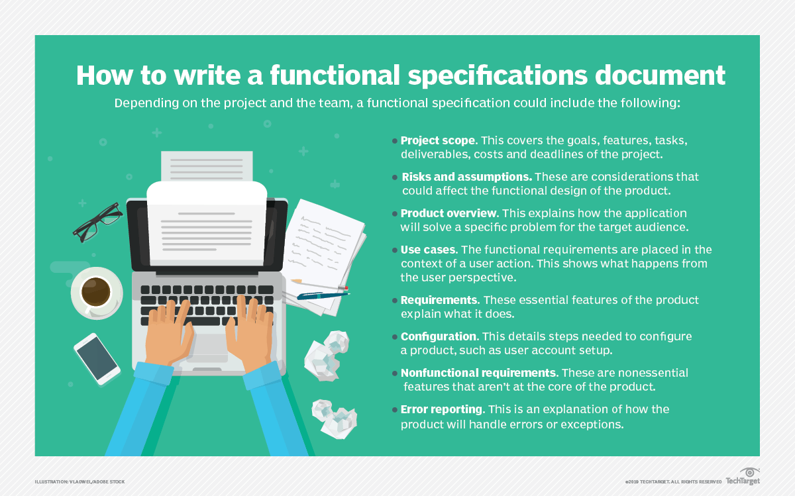
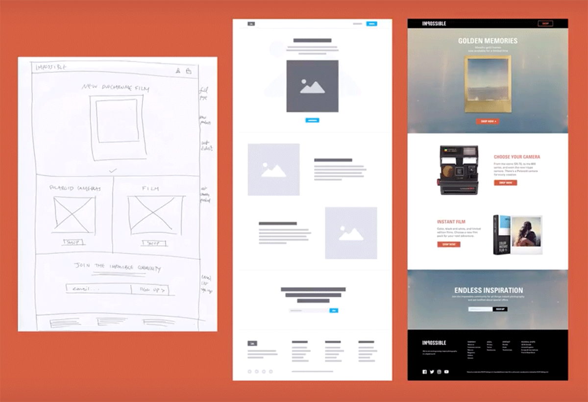

# The Language of Technical Requirements

## Introduction
As talked about previously while working with a team of both developers and designers many things can get lost in communication. Although to provide the customer with a concise final product, it’s very important that developers and designers stay on the same page for not only the design requirements but also the development requirements. So, in this section we’ll discuss some of the ways to outline the technical requirements and design requirements, so everyone is always on the same page. 

## Technical Requirements 
[Technical Requirements](https://www.indeed.com/career-advice/finding-a-job/technical-requirements) are the technical aspects and issues that are required for the product to run successfully. This is important since it specifies exactly how the software should function and the needs of the application. To achieve this documents that clearly define the specifications are often used, these can either be formal such as functional specification documents or informal such user stories and wireframes. Despite if the company goes formal or informal, these documents work well keeping the team on track.

## Formal Approaches 
[Functional specification documents]( https://www.techtarget.com/searchsoftwarequality/definition/functional-specification) (FSD) outline the capabilities of the software, the appearance, usability criteria and how users interact with the software in detail, as well as many other requirements. These documents serve as the outline of the whole project and how it should function. Although these documents are very formal in tone and can take considerable amounts of time to create as they may include several things as outlined in the picture below.

While the FSD may not include all these, even writing only the needed ones still takes plenty of time to create well. This is the reason some companies may not go the formal route. 

## Informal Approaches 
The first informal way to get all the information to the team is User Stories. [User Stories](https://www.visual-paradigm.com/guide/agile-software-development/what-is-user-story/) are a general description of a feature as described from the user’s perspective. These often take a “just enough” approach, which is practical for ever changing requirements as work on the project advances.  Since unlike FSD’s these are short and easy to write, they are easier to change if the client changes requirements. They are even written on post-it’s or index cards quite often, as the general layout is simplified to who, what and why. Most commonly in the format “As \[*who*\], I want \[*what*\], so that \[*why*\]”. An  example of this would be “As a (customer), I want to (receive an SMS when the item is arrived) so that (I can go pick it up right away)”. This is the reason user stories are a common method since they can be as broad or narrow as you want, save time while writing them and are easily changeable and are a way to outline the application from the user’s perspective. 

Another informal method is [wireframes]( https://careerfoundry.com/en/blog/ux-design/what-is-a-wireframe-guide/) these are an illustration that outline the page structure, layout and user flow. These can be either drawn by hand or created digitally. Wireframing is a quick and cost-effective way to layout to view the project visually. Which means it’s easy to see how everything works together and if any features need to be moved or removed. Wireframes tend to include logos, search fields, headers, navigation systems, and place holder text. These are useful for both developers and designers as they can easily see where everything goes and what needs to be completed. An excellent example of wireframes as they move through different stages is pictured below. 

### Conclusion
In conclusion the communication between developers and designers is a huge aspect of completing a cohesive end product. As outlined above there's many different strategies and applications that can help bridge the communication gap so that the whole project goes smoothly.
