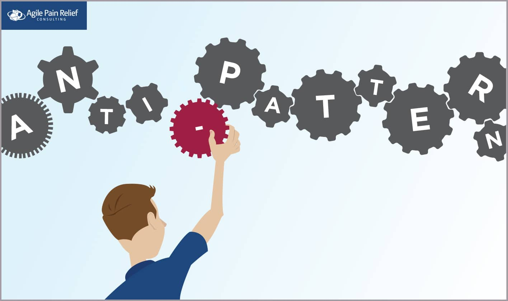
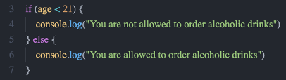
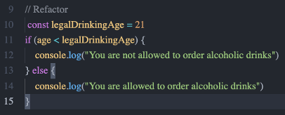

# Anti-Patterns

  

## 1. What are anti-patterns ?

Since the design patterns' advent, anti-patterns were also introduced later to the developer community. However, unlike design patterns, anti-patterns are bad solutions to learn. 
Anti-patterns mostly come from managers or developers who are not having the experience or knowledge to handle the problem. It might get the job done in general; however, their solution is risky and might bring more harm than good. On the other hand, any solutions or methods that make the system counterproductive and sluggish are also considered anti-patterns.

According to <a href="https://sourcemaking.com/antipatterns">Source Making</a>, Anti-patterns consist of 3 groups:

<ul>
    <li>
        <b>Software Development Anti-patterns</b>
        
A key goal of development Anti-patterns is to describe useful forms of software refactoring. Software refactoring is a form of code modification, used to improve the software structure in support of subsequent extension and long-term maintenance. In most cases, the goal is to transform code without impacting correctness.

    </li>
    <li>
        <b>Software Architecture Anti-patterns</b>
        
Architecture Anti-patterns focus on the system-level and enterprise-level structure of applications and components. Although the engineering discipline of software architecture is relatively immature, what has been determined repeatedly by software research and experience is the overarching importance of architecture in software development.

    </li>
    <li>
        <b>Software Project Management Anti-patterns</b>
        
In the modern engineering profession, more than half of the job involves human communication and resolving people issues. The management Anti-patterns identify some of the key scenarios in which these issues are destructive to software processes.

    </li>
</ul>
 

## 2. Examples
### Magic numbers and strings

You can see numbers and strings in any source code project. Some numbers have an implicit meaning. For example, in the US, alcoholic drinks are only allowed for people who are 21 and over. Imagine that your project validates the person's age if they can drink alcohol. The condition will be like this.

It looks pretty normal to the code above; however, it might be very confusing for those who do not live in the US, where it has a different rule for drinking alcohol. 
To avoid this, we can declare a variable with a name to make it easier to understand the context.

Suppose the project extends to another country where the law is different, and you need to change the number. In that case, all you have to do is to change to the number at “legalDrinkingAge,” and other places that use the number 21 will automatically be applied.

### Spaghetti Code

This Anti-pattern is very common in new developers, making the code with zero structure, and nothing is modulized. It makes the project difficult to maintain or add new functionality.
The solution for this pattern is to break things into small groups and start writing annotations for their functionality. Then, define the relationship between groups and modulize them by their relationship. The key is to make everything is more reusable and extendable.

You can acknowledge this Anti-pattern in the example code of Facade, where all the code is wrapped within one function.

### Gold Hammer

Imagine that you are very good at implementing the Facade pattern, and you started exploiting it in every project. However, the task gets more extensive, and the Facade pattern is no longer suitable. You do not care about the performance because it gets the job done. However, the unproductive and lagging will cost your business money and bring a bad experience to the customers.
There is no "best" technology in this industry, and every technology is born to solve a problem. If you pick the wrong tool to fix a problem, the result will worsen.

## References
<ul>
    <li><a href="https://en.wikipedia.org/wiki/Anti-pattern">Anti-pattern - Wikipedia</a></li>
    <li><a href="https://sourcemaking.com/antipatterns">Anti-pattern - Source Making</a></li>
    <li><a href="https://sahandsaba.com/nine-anti-patterns-every-programmer-should-be-aware-of-with-examples.html#management-by-numbers">9 Anti-Patterns Every Programmer Should Be Aware Of - Sahandsaba</a></li>
    <li><a href="https://www.freecodecamp.org/news/antipatterns-to-avoid-in-code/#:~:text=In%20software%2C%20anti%2Dpattern%20is,back%20and%20fix%20properly%20later">Anti-patterns You Should Avoid in Your Code - Freecodecamp</a></li>
</ul>