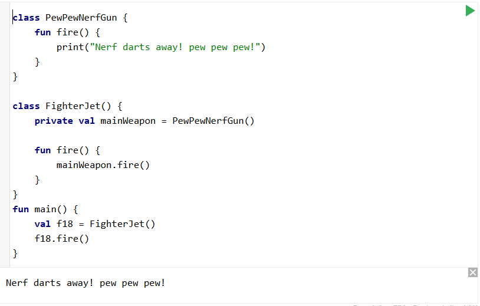
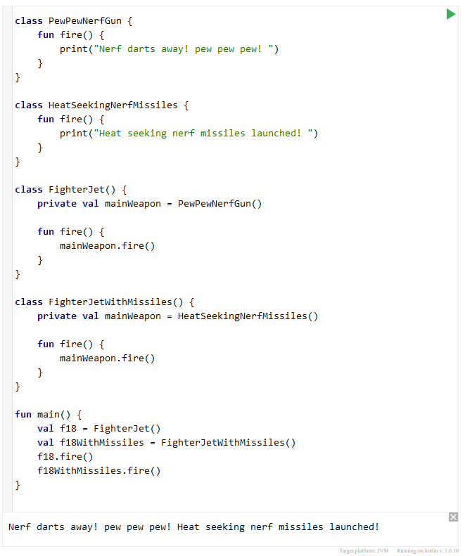
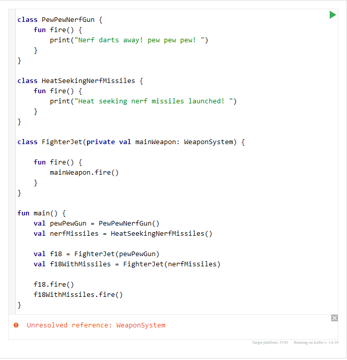
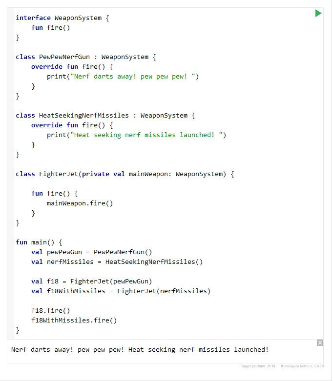
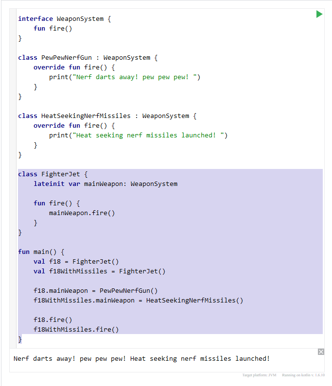

# Dependency Injection

## What is Dependency Injection?
Dependency injection is a design pattern, more particularly it is of the creational design pattern type and  Android’s recommended app architecture and it’s just what it sounds like, the injection of a dependency into a class. 
So, what is a dependency then? A Dependency is just an object that your class is going to require in order to function. This is pretty common and there are multiple ways a class can get access to the dependencies they need, such as.

1. The class can instantiate objects/dependencies it requires using the new operator from within the class. The problem here is class becomes coupled together creating an un-flexible implementation of the dependency within the class. If you wanted to variations of your class with different dependencies, you would need to create a whole duplicate class with different dependencies. This results in repeated code and makes testing more difficult.
2.	You can push the dependency into the class from outside of the class, such as accepting the dependency via the class constructor parameter, from a class setter method, or from an interface. This is an example of dependency injection.

## Why do we want to inject dependencies?
By de-coupling our dependencies and using dependency injection, we are actually de-coupling our implementations from one another which makes code more modular and easier to modify. Different dependencies can be substituted as along as they satisfy any required abstract methods or interface requirements.
There are 3 principals I came across that are not all necessarily related to dependency injection, but certainly resonate with it in practice.
1.	The Dependency Inversion Principle: states that code should depend upon abstractions. Dependency Inversion principle is concerned with “decoupling dependencies” between code through shared abstractions.
2.	The Inversion of Control Principle: states that generic code should control the execution of specific code. Inversion of control is used to increase the modularity of the program by having a generic framework handle the dispatch of events and more complex code / specialized code handling the event said events.
3.	The Separation of Concerns Principle: states that each class should have a single defined responsibility. In practice this leads to the creation of more, smaller classes that need to be connected together to fulfill each other’s dependencies.

## Dependency injection and mobile devices
There are 2 major ways of implementing dependency injection and I will attempt to provide examples to illustrate both.
1.	Constructor Injection: This type of dependency injection happens during your class instantiation; dependencies are initialized then passed as objects through your class constructor. 
2.	Field Injection (or Setter Injection):  This type of dependency injection happens after your class instantiation; dependencies are initialized and passed to the instantiated object’s setter method.

## Constructor Injection Example
Let’s take a look at an example of Constructor Injection first and build ourselves a toy fighter jet (because), and since it's a fighter jet we need to make it a weapon to go "pew! pew!", so let's do that first.

```
// Our PewPewNerfGun
class PewPewNerfGun {
    fun fire() {
        print("Nerf darts away! pew pew pew!")
    }
}
```

Next we'll make our fighter jet.
```
class FighterJet() {
    private val mainWeapon = PewPewNerfGun()

    fun fire() {
        mainWeapon.fire()
    }
}
```

With our classes created, we can now run this and create ourselves a fighter jet armed with a PewPewNerfGun, but we are not injecting dependencies yet. Instead we're creating our PewPewNerfGun object within our fighter jet class. Below is an example using [Kotlin Playground](https://developer.android.com/training/kotlinplayground?gclid=CjwKCAjwopWSBhB6EiwAjxmqDewmVKfVfbMKoZfeFZSn202J1QvNZZUJlPagp-zSGN7OjCtGLXfunBoCBsAQAvD_BwE&gclsrc=aw.ds).



This works of course, but the problem here is we can only make fighter jets armed with a `PewPewNerfGun()`. What if we are really in a pickle and require some heat seeking nerf missiles instead? First we'll need to create the new weapon as follows.

```
class HeatSeekingNerfMissiles {
    fun fire() {
        print("Heat Seeking Nerf missiles launched!")
    }
}
```

Great! But there in order to make a Fighter jet using the nerf missiles instead of the nerf gun we would have to create a new fighter class to make use of the new weapon system like so. 
```
class FighterJetWithMissiles() {
    private val mainWeapon = HeatSeekingNerfMissiles()

    fun fire() {
        mainWeapon.fire()
    }
}
```

So if we want 2 fighter jets with 2 different weapons, this is what we get.



This obviously isn't ideal because if we were really going to have a nerf air force we would want to be able to use many different nerf weapons without creating a whole new fighter jet each time. And we can solve this problem by changing our FighterJet class to accept it's weapon dependency from outside of the class through it's constructor as follows.

```
class FighterJet(private val mainWeapon: WeaponSystem) {
    fun fire() {
        mainWeapon.fire()
    }
}

fun main() {
    val pewPewGun = PewPewNerfGun()
    val nerfMissiles = HeatSeekingNerfMissiles()

    val f18 = FighterJet(pewPewGun)
    val f18WithMissiles = FighterJet(nerfMissiles)

    f18.fire()
    f18WithMissiles.fire()
}
```

Now lets run our code again and see what happens.



We pass our objects in through the constructor but we get an error message because the constructor is looking for our WeaponSystem type. To solve this we will create an interface for our weapon systems as seen in the example below.

```
interface WeaponSystem {
    fun fire()
}
```

Next we need to modify our `PewPewNerfGun()` and `HeatSeekingNerfMissile()` classes to implement our new WeaponSystem interface.

```
class PewPewNerfGun : WeaponSystem {
    override fun fire() {
        print("Nerf darts away! pew pew pew! ")
    }
}

class HeatSeekingNerfMissiles : WeaponSystem {
    override fun fire() {
        print("Heat seeking nerf missiles launched! ")
    }
}
```

Our complete code now looks like this when run through [Kotlin Playground](https://developer.android.com/training/kotlinplayground?gclid=CjwKCAjwopWSBhB6EiwAjxmqDewmVKfVfbMKoZfeFZSn202J1QvNZZUJlPagp-zSGN7OjCtGLXfunBoCBsAQAvD_BwE&gclsrc=aw.ds).



We can now create as many different `WeaponSystem` objects we want and arm our toy fighter jets with them without building a new fighter jet each time. Our WeaponSystems and FighterJets are decoupled.

## Field Injection (or Setter Injection) Example
Next we'll walk through modifying the our construction injection code to use field injection instead. Field injection in relevant when building mobile apps because sometimes you will not have access to a class constructor to pass dependencies through. Activities and Fragments are examples of this, they are instantiated by the system and do not provide easy access to their constructors to pass our dependencies through.

Let's start by modifying our FighterJet class by removing the constructor dependency injection, and we will declare a lateinit var on our mainWeapon, it has to be var because we're not instantiating it right away and it needs to be allowed to update after our class has been created. We'll also change our main function to reflect the change.

```
class FighterJet{
    lateinit var mainWeapon: WeaponSystem

    fun fire() {
        mainWeapon.fire()
    }
}

fun main() {
    val f18 = FighterJet()
    val f18WithMissiles = FighterJet()

    f18.mainWeapon = PewPewNerfGun()
    f18WithMissiles.mainWeapon = HeatSeekingNerfMissiles()

    f18.fire()
    f18WithMissiles.fire()
}
```

If we call this using [Kotlin Playground](https://developer.android.com/training/kotlinplayground?gclid=CjwKCAjwopWSBhB6EiwAjxmqDewmVKfVfbMKoZfeFZSn202J1QvNZZUJlPagp-zSGN7OjCtGLXfunBoCBsAQAvD_BwE&gclsrc=aw.ds).





# Singleton Design Pattern on mobile

The singleton design pattern is known for 2 major properties.
1. The singleton instance may only have a single instance at any given time.
2. The singleton instance is globally accessible.

The singleton design pattern is not unique to android development, but Kotlin does provide a relatively simple process very similiar to implementing a class file using the keyword `object`. 

Consider the following example.

```
object MySingleton {
    val name = "Mr.Singleton"

    init {
        println("Singleton Created")
    }

    fun printName() {
        println("This Singleton's name is: " + name)
    }
}

fun main() {
    MySingleton.printName()
}
```

If we run the code above we get:
```
Singleton Created
This Singleton's name is: Mr.Singleton
```

## Companion objects
In Kotlin we can define a singleton with the object keyword but what if we want to access to our singleton class and have the object data available across each instance of a class?

We can also implement companion objects in classes in Kotlin, these are initialized when their containing class is initialized and will function as a single object which is accessable across all instance of it's containing class.

For example, if we had a stock trading program and we wanted that program to buy stocks based on 1 of 3 strategies.  but we want to use the same wallet details so each strategy is connected to the same wallet account that holds our money. 

```
class StockTradingStrategy(private val strategy: TradingStrategy) {

    // Stock trading methods

    // Strategy detail implementation

    companion object Wallet {
        // wallet data
    }
}
```

This way our wallet will be the same wallet accessed across all instances preventing duplicate entries from accessing our wallet object which could be catastrophic if we were actually deploying such a program.

The following material was reference while writing.

Source 1: [Dependency Injection - Anthony Ferrara (YouTube)](https://youtu.be/IKD2-MAkXyQ)

Source 2: [Dependency Injection – (Android Developers)](https://developer.android.com/training/dependency-injection)

Source 3: [Dependency Injection – (Wikipedia)](https://en.wikipedia.org/wiki/Dependency_injection)

Source 4: [DIY Dependency Injection with Kotlin – Sam Edwards (YouTube)](https://www.youtube.com/watch?v=ucZnYS7LmGU)

