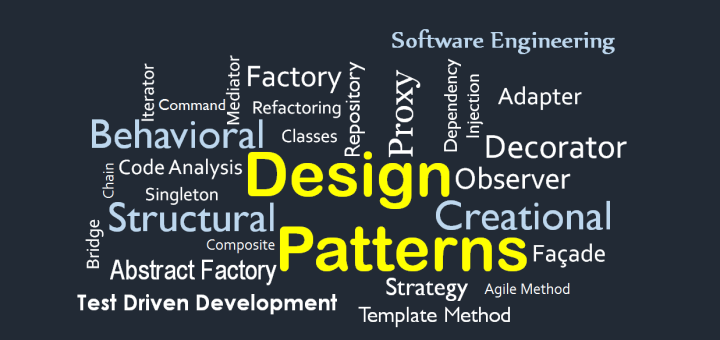
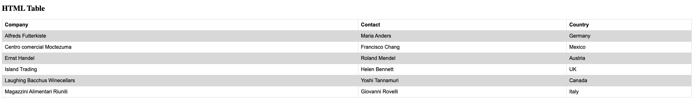

# Design Patterns
<p align="center">  </p>

<p align="justify">
In 1994, "The Gang Of Four" published the book Design Patterns: Elements of Reusable Object-Oriented Software, which introduced software design patterns to the developer community. This book is a legendary source that addresses the problems of <i>Object-Oriented Programming (OOP)</i> in the language C++. Since the advent of the design patterns, many modern programming languages have become more flexible and robust by implementing these concepts. So what are exactly design patterns? 
</p>

<p align="center">  </p>

## 1. What are design patterns ?
<p align="justify">
    Most programming languages support <i>Object-Oriented Programming (OOP)</i> with different mechanisms in software development. Since working with the concept of OOP, many developers have similar problems and handle them with similar solutions repeatedly. Therefore, design patterns are introduced as reusable solutions for commonly occurring issues in a high-level abstract meaning. In other words, you can not apply design patterns just by copying and pasting code. In contrast, they are implemented differently in different programming languages but remain the same core intention. This is because design patterns are concepts that explain the problem and describe the intent in an object-oriented way. 
</p>

<p>
According to <a href="https://refactoring.guru/design-patterns/catalog">Refactoring Guru</a>, there are 3 types of design patterns:
</p>
<ul>
    <li>
        <b>Creational patterns</b>
        <p>These patterns provide various object creation mechanisms, which increase flexibility and reuse of existing code.</p>
        <p>Include: <i> Factory Method, Abstract Factory, Prototype, Singleton, and Builder</i> </p>
    </li>
    <li>
        <b>Structural patterns</b>
        <p>These patterns explain how to assemble objects and classes into larger structures while keeping these structures flexible and efficient.</p>
        <p>Include: <i>Decorator, Facade, Flyweight, Adapter, Bridge, Composite and Proxy</i> </p>
    </li>
    <li>
        <b>Behavioral patterns</b>
        <p>These patterns are concerned with algorithms and the assignment of responsibilities between objects.</p>
        <p>Include: <i>Chain of Responsibility, Command, Iterator, Mediator, Memento, Observer, State, Strategy, Template Method and Visitor</i> </p>
    </li>
</ul>

<p align="justify">
   Above mentioned design patterns are common in software development. However, modern programming languages have problems, and new design patterns are also introduced. Thus, please keep in mind that the design patterns are also developing along with the growth of programming language; more design patterns will tackle modern problems in the future.
</p>

<br>

## 2. Why we need them?
<p align="justify">
    All of the patterns are proven and tested by experienced developers;
    therefore, instead of reinventing the wheel, we should implement design patterns to solve the same problem. Moreover, it is good to learn some design patterns to enhance your problem-solving skills. However, exploiting them will make everything more complicated and unnecessary. Design patterns do not solve all problems in software design, and the workflow will become complex and lengthy if developers implement them without consideration. On the other hand, software engineers use them as terms in communication to describe the ideas or solutions they mention.
</p>

<br>

## 3. Facade
<p align="center">  </p>

<p align="justify">
To have a clear picture of implementing design patterns in software development, this section will describe one of the common <i>Structural patterns</i>: <b>Facade</b>.
</p>

### **Intent**
<p align="justify">
The idea behind Facade is to provide a more straightforward interface to interact with other third-party libraries or frameworks.
</p>

### **Problem**
<p align="justify">
When the system integrates with other third-party libraries or frameworks, you need to keep track of every structure they provide. Moreover, initializing them requires running configuration with correct order or different steps chaining together. Therefore, It is tough to maintain or alter without rewriting the entire system.
</p>

### **Solution**
<p align="justify">
The solution is to create a class that includes all the features that we need from the library. That class needs to grab everything that it needs from the third-party library to develop simplified versions of them. Then, if we need to change the feature, all we need to do is rewrite the Facade class instead of changing all the calls of third-party’s functions.
</p>

### **Implementation**
1.	Check if you could create a simpler version of it. If possible, define a **Facade** class that contains all the features you need from the library.
2.	The **Facade** class has a responsibility to initialize the third-party library and only needs to make changes here when you want to change the library's configuration.
3.	Make sure the subsystem code only communicates with your **Facade** class when it uses the feature of the third-party library.
4.	If the code becomes long and complicated, break it down into small classes.

### **Example (with Javascript)**
#### Scenario

<p align="justify">
This example has a straightforward scenario. However, it requires you a little knowledge about HTML, CSS, and Javascript. The scenario is that you have a table on your webpage, and you need to provide a feature that alters the table. 
</p>

<p align="center">  </p>

<p align="justify">
In particular, to add a row to your table, these are the steps that you need to do in your code:

```javascript
function addNewRow() {
    const row = document.createElement("tr")
    // Company
    const companyCell = document.createElement("td")
    const companyText = document.createTextNode("Facade")
    companyCell.appendChild(companyText)

    // Contact
    const contactCell = document.createElement("td")
    const contactText = document.createTextNode("Phat Tran")
    contactCell.appendChild(contactText)

    // Country
    const countryCell = document.createElement("td")
    const countryText = document.createTextNode("Vietnam")
    countryCell.appendChild(countryText)

    // Attach cells to row
    row.appendChild(companyCell)
    row.appendChild(contactCell)
    row.appendChild(countryCell)

    // Add row to table
    const tableElement = document.getElementsByTagName("table")[0]
    tableElement.appendChild(row)
}

addNewRow()
```
</p>

### Problem #1
<p align="justify">
Obviously, the code is long and a little complex. It requires extra steps before a new row is created:
</p>

<ul>
    <li>Create a <b>td</b> element</li>
    <li>Create a <b>text node</b> and then append it to the <b>td</b> </li>
    <li>Repeat two steps above for creating another cell</li>
    <li>Append those <b>cells</b> to the <b>row</b> element</li>
    <li>Finally, attach the row to the table</li>
</ul>

It needs to be refactored so that the developers can reuse it to add any rows from the users. So let's refactor the code above.
</p>

```javascript

function createCell(text) {
    const tdElement = document.createElement("td")
    const textNode = document.createTextNode(text)
    tdElement.appendChild(textNode)
    return tdElement
}

function createNewRow(companyText, contactText, countryText) {
    const row = document.createElement("tr")

    // Cells
    const companyCell = createCell(companyText)
    const contactCell = createCell(contactText)
    const countryCell = createCell(countryText)

    // Attach cells to row
    row.appendChild(companyCell)
    row.appendChild(contactCell)
    row.appendChild(countryCell)

    return row
}

const row = createNewRow("Facade", "Phat Tran", "Vietnam")
// Add row to table
const tbodyElement = document.getElementsByTagName("tbody")[0]
tbodyElement.appendChild(row)
```

### Problem #2
<p align="justify">
During the refactoring process, I focus only on the reusability of creating cells and adding rows. Thus, I split the previous code and put it into two different functions. As a result, it seems more reusable and flexible than the last code. However, the code will be easier to maintain and more clarified if wrapped within a class. 
</p>

```javascript
class Table {
    constructor(table) {
        // Check if the table already existed
        if (table) {
            this._ = table
        } else {
            // Create new one
            this._ = document.createElement("table")
            document.getElementsByTagName("body")[0].appendChild(this._)
        }
    }

    createCell(content) {
        const cell = document.createElement("td")
        const textNode = document.createTextNode(content)
        cell.appendChild(textNode)

        return cell
    }

    addRow(cells) {
        const row = document.createElement("tr")

        cells.forEach((cell) => {
            const cellElement = this.createCell(cell)
            row.appendChild(cellElement)
        })

        // Add row to table
        document.getElementsByTagName("tbody")[0].appendChild(row)

        return row
    }
}
```

<p align="justify">
The purpose of wrapping within a class is to make it easier to maintain. Moreover, if the code requires more functions for creating a header or styling the cell, the time spent altering this class's implementation will not take long. All you do is call extra methods instead of refactoring the process.
</p>

```javascript
// Mockup data
const rows = [["Facade", "Phat Tran", "Vietnam"]]

// Create table instance
const table = new Table(document.getElementsByTagName("table")[0])

// Add rows to table
rows.forEach((row) => table.addRow(row))
```

<p align="justify">
As you can see, the implementation of the <b>Table</b> class. It only takes one line to call the function <i>addRow</i>. Imagine if we need to add more functions to create a  header and footer. All we have to do is to call another function from the <b>table</b> variable.
</p>

```
table.createHeader("Table header")
 ```

### Conclusion

<p align="justify">
After the above steps, you might realize that the Facade is similar to refactoring code. The Facade pattern intends to simplify the complex process, library, or framework. Thus, it requires a refactoring step to simplify your process and make them easy to use the function. Furthermore, in a real-life project, you integrate with other third-party APIs and might only use some of the features. This is where Facade comes in and helps you to wrap any necessary features and make them easier for anyone who might not get in deep into their documentation.
</p>

<p align="center">  </p>

<br>

### References
<ul>
    <li><a href="https://en.wikipedia.org/wiki/Design_Patterns">Wikipedia</a></li>
    <li><a href="https://refactoring.guru/design-patterns">Refactoring Guru</a></li>
    <li><a href="https://sourcemaking.com/design_patterns">Source Making</a></li>
    <li><a href="https://www.w3schools.com/html/tryit.asp?filename=tryhtml_table_intro">Table's template code of W3schools</a></li>
</ul>