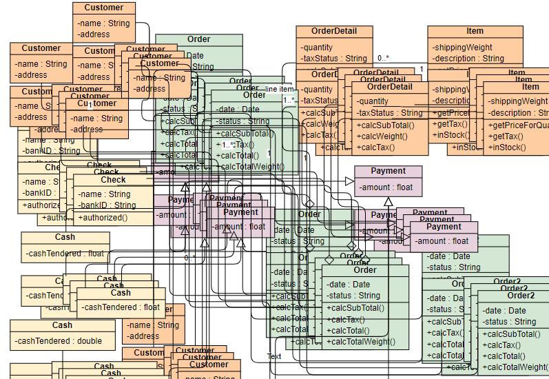

# <div align = "center"> Chapter 7 - Design Patterns </div>
<!-- DESIGN PATTERNS -->
<br />
<p align="center">  </p>
<br>
<p align="justify">
In 1994, "The Gang Of Four" published the book Design Patterns: Elements of Reusable Object-Oriented Software, which introduced software design patterns to the developer community. This book is a legendary source that addresses the problems of <i>Object-Oriented Programming (OOP)</i> in the language C++. Since the advent of the design patterns, many modern programming languages have become more flexible and robust by implementing these concepts. So what are exactly design patterns? 
</p>

<p align="center">  </p>
<br>

# 1. What are design patterns ?
<p align="justify">
    Most programming languages support <i>Object-Oriented Programming (OOP)</i> with different mechanisms in software development. Since working with the concept of OOP, many developers have similar problems and handle them with similar solutions repeatedly. Therefore, design patterns are introduced as reusable solutions for commonly occurring issues in a high-level abstract meaning. In other words, you can not apply design patterns just by copying and pasting code. In contrast, they are implemented differently in different programming languages but remain the same core intention. This is because design patterns are concepts that explain the problem and describe the intent in an object-oriented way. 
</p>

<p>According to <a href="https://refactoring.guru/design-patterns/catalog">Refactoring Guru</a>, there are 3 types of design patterns:</p>
<ul>
    <li>
        <b>Creational patterns</b>
        <p>These patterns provide various object creation mechanisms, which increase flexibility and reuse of existing code.</p>
        <p>Include: <i> Factory Method, Abstract Factory, Prototype, Singleton, and Builder</i> </p>
    </li>
    <li>
        <b>Structural patterns</b>
        <p>These patterns explain how to assemble objects and classes into larger structures while keeping these structures flexible and efficient.</p>
        <p>Include: <i>Decorator, Facade, Flyweight, Adapter, Bridge, Composite and Proxy</i> </p>
    </li>
    <li>
        <b>Behavioral patterns</b>
        <p>These patterns are concerned with algorithms and the assignment of responsibilities between objects.</p>
        <p>Include: <i>Chain of Responsibility, Command, Iterator, Mediator, Memento, Observer, State, Strategy, Template Method and Visitor</i> </p>
    </li>
</ul>

<p align="justify">
   Above mentioned design patterns are common in software development. However, modern programming languages have problems, and new design patterns are also introduced. Thus, please keep in mind that the design patterns are also developing along with the growth of programming language; more design patterns will tackle modern problems in the future.
</p>
<br>

# 2. Why we need them?
<p align="justify">
    All of the patterns are proven and tested by experienced developers;
    therefore, instead of reinventing the wheel, we should implement design patterns to solve the same problem. Moreover, it is good to learn some design patterns to enhance your problem-solving skills. However, exploiting them will make everything more complicated and unnecessary. Design patterns do not solve all problems in software design, and the workflow will become complex and lengthy if developers implement them without consideration. On the other hand, software engineers use them as terms in communication to describe the ideas or solutions they mention.
</p>
<br>


# 3. Facade
<p align="justify">
    To have a clear picture of implementing design patterns in software development, this section will describe one of the common <i>Structural patterns</i>: <b>Facade</b>.
</p>
<p align="center">  </p>
<br>

## **Intent**
<p align="justify">
    The idea behind Facade is to provide a more straightforward interface to interact with other third-party libraries or frameworks.
</p>

## **Problem**
<p align="justify">
    When the system integrates with other third-party libraries or frameworks, you need to keep track of every structure they provide. Moreover, initializing them requires running configuration with correct order or different steps chaining together. Therefore, It is tough to maintain or alter without rewriting the entire system.
</p>

## **Solution**
<p align="justify">
    The solution is to create a class that includes all the features that we need from the library. That class needs to grab everything that it needs from the third-party library to develop simplified versions of them. Then, if we need to change the feature, all we need to do is rewrite the Facade class instead of changing all the calls of third-party’s functions.
</p>

## **Implementation**
1.	Check if you could create a simpler version of it. If possible, define a **Facade** class that contains all the features you need from the library.
2.	The **Facade** class has a responsibility to initialize the third-party library and only needs to make changes here when you want to change the library's configuration.
3.	Make sure the subsystem code only communicates with your **Facade** class when it uses the feature of the third-party library.
4.	If the code becomes long and complicated, break it down into small classes.

## **Example (with Javascript)**
### ***Scenario***

<p align="justify">
This example has a straightforward scenario. However, it requires you a little knowledge about HTML, CSS, and Javascript. The scenario is that you have a table on your webpage, and you need to provide a feature that alters the table. 
</p>

<p align="center">  </p>
<br>
<p align="justify">In particular, to add a row to your table, these are the steps that you need to do in your code:</p>

```javascript
function addNewRow() {
    const row = document.createElement("tr")
    // Company
    const companyCell = document.createElement("td")
    const companyText = document.createTextNode("Facade")
    companyCell.appendChild(companyText)

    // Contact
    const contactCell = document.createElement("td")
    const contactText = document.createTextNode("Phat Tran")
    contactCell.appendChild(contactText)

    // Country
    const countryCell = document.createElement("td")
    const countryText = document.createTextNode("Vietnam")
    countryCell.appendChild(countryText)

    // Attach cells to row
    row.appendChild(companyCell)
    row.appendChild(contactCell)
    row.appendChild(countryCell)

    // Add row to table
    const tableElement = document.getElementsByTagName("table")[0]
    tableElement.appendChild(row)
}

addNewRow()
```
<br>

## ***Problem 1***
<p align="justify">Obviously, the code is long and a little complex. It requires extra steps before a new row is created:</p>

<ul>
    <li>Create a <b>td</b> element</li>
    <li>Create a <b>text node</b> and then append it to the <b>td</b> </li>
    <li>Repeat two steps above for creating another cell</li>
    <li>Append those <b>cells</b> to the <b>row</b> element</li>
    <li>Finally, attach the row to the table</li>
</ul>
<p>
    It needs to be refactored so that the developers can reuse it to add any rows from the users. So let's refactor the code above.
</p>

```javascript
function createCell(text) {
    const tdElement = document.createElement("td")
    const textNode = document.createTextNode(text)
    tdElement.appendChild(textNode)
    return tdElement
}

function createNewRow(companyText, contactText, countryText) {
    const row = document.createElement("tr")

    // Cells
    const companyCell = createCell(companyText)
    const contactCell = createCell(contactText)
    const countryCell = createCell(countryText)

    // Attach cells to row
    row.appendChild(companyCell)
    row.appendChild(contactCell)
    row.appendChild(countryCell)

    return row
}

const row = createNewRow("Facade", "Phat Tran", "Vietnam")
// Add row to table
const tbodyElement = document.getElementsByTagName("tbody")[0]
tbodyElement.appendChild(row)
```
<br>

## ***Problem 2***
<p align="justify">
    During the refactoring process, I focus only on the reusability of creating cells and adding rows. Thus, I split the previous code and put it into two different functions. As a result, it seems more reusable and flexible than the last code. However, the code will be easier to maintain and more clarified if wrapped within a class. 
</p>

```javascript
class Table {
    constructor(table) {
        // Check if the table already existed
        if (table) {
            this._ = table
        } else {
            // Create new one
            this._ = document.createElement("table")
            document.getElementsByTagName("body")[0].appendChild(this._)
        }
    }

    createCell(content) {
        const cell = document.createElement("td")
        const textNode = document.createTextNode(content)
        cell.appendChild(textNode)

        return cell
    }

    addRow(cells) {
        const row = document.createElement("tr")

        cells.forEach((cell) => {
            const cellElement = this.createCell(cell)
            row.appendChild(cellElement)
        })

        // Add row to table
        document.getElementsByTagName("tbody")[0].appendChild(row)

        return row
    }
}
```
<br>

<p align="justify">
    The purpose of wrapping within a class is to make it easier to maintain. Moreover, if the code requires more functions for creating a header or styling the cell, the time spent altering this class's implementation will not take long. All you do is call extra methods instead of refactoring the process.
</p>

```javascript
// Mockup data
const rows = [["Facade", "Phat Tran", "Vietnam"]]

// Create table instance
const table = new Table(document.getElementsByTagName("table")[0])

// Add rows to table
rows.forEach((row) => table.addRow(row))
```
<br>

<p align="justify">
    As you can see, the implementation of the <b>Table</b> class. It only takes one line to call the function <i>addRow</i>. Imagine if we need to add more functions to create a  header and footer. All we have to do is to call another function from the <b>table</b> variable.
</p>

```javascript
table.createHeader("Table header")
 ```
<br>

## Conclusion
<p align="justify">
After the above steps, you might realize that the Facade is similar to refactoring code. The Facade pattern intends to simplify the complex process, library, or framework. Thus, it requires a refactoring step to simplify your process and make them easy to use the function. Furthermore, in a real-life project, you integrate with other third-party APIs and might only use some of the features. This is where Facade comes in and helps you to wrap any necessary features and make them easier for anyone who might not get in deep into their documentation.
</p>
<br>
<br>

<!-- ANTI-PATTERNS -->
# <div align = "center">Anti-patterns </div>
<br>
<p align="center">  </p>
<br>

# 1. What are anti-patterns ?
<p align="justify">
Since the design patterns' advent, anti-patterns were also introduced later to the developer community. However, unlike design patterns, anti-patterns are bad solutions to learn. 
Anti-patterns mostly come from managers or developers who are not having the experience or knowledge to handle the problem. It might get the job done in general; however, their solution is risky and might bring more harm than good. On the other hand, any solutions or methods that make the system counterproductive and sluggish are also considered anti-patterns.
</p>

<p>
According to <a href="https://sourcemaking.com/antipatterns">Source Making</a>, Anti-patterns consist of 3 groups:
</p>

<ul>
    <li>
        <b>Software Development Anti-patterns</b>
        <p>A key goal of development Anti-patterns is to describe useful forms of software refactoring. Software refactoring is a form of code modification, used to improve the software structure in support of subsequent extension and long-term maintenance. In most cases, the goal is to transform code without impacting correctness.</p>
    </li>
    <li>
        <b>Software Architecture Anti-patterns</b>
        <p>Architecture Anti-patterns focus on the system-level and enterprise-level structure of applications and components. Although the engineering discipline of software architecture is relatively immature, what has been determined repeatedly by software research and experience is the overarching importance of architecture in software development.</p>
    </li>
    <li>
        <b>Software Project Management Anti-patterns</b>
        <p>In the modern engineering profession, more than half of the job involves human communication and resolving people issues. The management Anti-patterns identify some of the key scenarios in which these issues are destructive to software processes.</p>
    </li>
</ul>
<br>

# 2. Examples
## **Magic numbers and strings**
<p align="justify">
    You can see numbers and strings in any source code project. Some numbers have an implicit meaning. For example, in the US, alcoholic drinks are only allowed for people who are 21 and over. Imagine that your project validates the person's age if they can drink alcohol. The condition will be like this.
</p>

```javascript
const age = 18
 
if (age < 21) {
    console.log("You are not allowed to order alcoholic drinks")
} else {
    console.log("You are allowed to order alcoholic drinks")
}
```
<br>
<p align="justify">
It looks pretty normal to the code above; however, it might be very confusing for those who do not live in the US, where it has a different rule for drinking alcohol. 
To avoid this, we can declare a variable with a name to make it easier to understand the context.
</p>

```javascript
const age = 18
const legalDrinkingAge = 21

if (age < legalDrinkingAge) {
    console.log("You are not allowed to order alcoholic drinks")
} else {
    console.log("You are allowed to order alcoholic drinks")
}
```
<br>
<p align="justify">
    Suppose the project extends to another country where the law is different, and you need to change the number. In that case, all you have to do is to change to the number at “legalDrinkingAge,” and other places that use the number 21 will automatically be applied.
</p>
<br>

## **Spaghetti Code**
<br>
<p align="center">  </p>
<br>
<p align="justify">
    This Anti-pattern is very common in new developers, making the code with zero structure, and nothing is modulized. It makes the project difficult to maintain or add new functionality.
    The solution for this pattern is to break things into small groups and start writing annotations for their functionality. Then, define the relationship between groups and modulize them by their relationship. The key is to make everything is more reusable and extendable.
</p>

<p>You can acknowledge this Anti-pattern in the example code of Facade, where all the code is wrapped within one function.</p>
<br>

## **Gold Hammer**
<br>
<p align="center">  </p>
<br>
<p align="justify">
    Imagine that you are very good at implementing the Facade pattern, and you started exploiting it in every project. However, the task gets more extensive, and the Facade pattern is no longer suitable. You do not care about the performance because it gets the job done. However, the unproductive and lagging will cost your business money and bring a bad experience to the customers.
    There is no "best" technology in this industry, and every technology is born to solve a problem. If you pick the wrong tool to fix a problem, the result will worsen.
</p>
<br>
<br>

<!-- DESIGN PATTERNS IN  MOBILE DEVELOPMENT-->
# <div align = "center">Design Patterns In Mobile Development </div>
<br>
<p align="center">  </p>
<br>

<!-- Dependency Injection-->
# 1. Dependency Injection

## What is Dependency Injection?
<p align="justify">
Dependency injection is a design pattern, more particularly it is of the creational design pattern type and  Android’s recommended app architecture and it’s just what it sounds like, the injection of a dependency into a class. 
So, what is a dependency then? A Dependency is just an object that your class is going to require in order to function. This is pretty common and there are multiple ways a class can get access to the dependencies they need, such as.
</p>

1. The class can instantiate objects/dependencies it requires using the new operator from within the class. The problem here is class becomes coupled together creating an un-flexible implementation of the dependency within the class. If you wanted to variations of your class with different dependencies, you would need to create a whole duplicate class with different dependencies. This results in repeated code and makes testing more difficult.
2.	You can push the dependency into the class from outside of the class, such as accepting the dependency via the class constructor parameter, from a class setter method, or from an interface. This is an example of dependency injection.

<br>

## Why do we want to inject dependencies?
<p align="justify">
By de-coupling our dependencies and using dependency injection, we are actually de-coupling our implementations from one another which makes code more modular and easier to modify. Different dependencies can be substituted as along as they satisfy any required abstract methods or interface requirements.
</p>

There are 3 principals I came across that are not all necessarily related to dependency injection, but certainly resonate with it in practice.
1.	The Dependency Inversion Principle: states that code should depend upon abstractions. Dependency Inversion principle is concerned with “decoupling dependencies” between code through shared abstractions.
2.	The Inversion of Control Principle: states that generic code should control the execution of specific code. Inversion of control is used to increase the modularity of the program by having a generic framework handle the dispatch of events and more complex code / specialized code handling the event said events.
3.	The Separation of Concerns Principle: states that each class should have a single defined responsibility. In practice this leads to the creation of more, smaller classes that need to be connected together to fulfill each other’s dependencies.

<br>

## Dependency injection and mobile devices
There are 2 major ways of implementing dependency injection and I will attempt to provide examples to illustrate both.
1.	Constructor Injection: This type of dependency injection happens during your class instantiation; dependencies are initialized then passed as objects through your class constructor. 
2.	Field Injection (or Setter Injection):  This type of dependency injection happens after your class instantiation; dependencies are initialized and passed to the instantiated object’s setter method.

<br>

## Constructor Injection Example
<p align="justify">
Let’s take a look at an example of Constructor Injection first and build ourselves a toy fighter jet (because), and since it's a fighter jet we need to make it a weapon to go "pew! pew!", so let's do that first.</p>

```
// Our PewPewNerfGun
class PewPewNerfGun {
    fun fire() {
        print("Nerf darts away! pew pew pew!")
    }
}
```

Next we'll make our fighter jet.
```
class FighterJet() {
    private val mainWeapon = PewPewNerfGun()

    fun fire() {
        mainWeapon.fire()
    }
}
```

<p align="justify">
With our classes created, we can now run this and create ourselves a fighter jet armed with a PewPewNerfGun, but we are not injecting dependencies yet. Instead we're creating our PewPewNerfGun object within our fighter jet class. Below is an example using <a href="https://developer.android.com/training/kotlinplayground?gclid=CjwKCAjwopWSBhB6EiwAjxmqDewmVKfVfbMKoZfeFZSn202J1QvNZZUJlPagp-zSGN7OjCtGLXfunBoCBsAQAvD_BwE&gclsrc=aw.ds">Kotlin Playground</a>
</p>


<br>

This works of course, but the problem here is we can only make fighter jets armed with a `PewPewNerfGun()`. What if we are really in a pickle and require some heat seeking nerf missiles instead? First we'll need to create the new weapon as follows.

```
class HeatSeekingNerfMissiles {
    fun fire() {
        print("Heat Seeking Nerf missiles launched!")
    }
}
```

Great! But there in order to make a Fighter jet using the nerf missiles instead of the nerf gun we would have to create a new fighter class to make use of the new weapon system like so. 
```
class FighterJetWithMissiles() {
    private val mainWeapon = HeatSeekingNerfMissiles()

    fun fire() {
        mainWeapon.fire()
    }
}
```

So if we want 2 fighter jets with 2 different weapons, this is what we get.


This obviously isn't ideal because if we were really going to have a nerf air force we would want to be able to use many different nerf weapons without creating a whole new fighter jet each time. And we can solve this problem by changing our FighterJet class to accept it's weapon dependency from outside of the class through it's constructor as follows.

```
class FighterJet(private val mainWeapon: WeaponSystem) {
    fun fire() {
        mainWeapon.fire()
    }
}

fun main() {
    val pewPewGun = PewPewNerfGun()
    val nerfMissiles = HeatSeekingNerfMissiles()

    val f18 = FighterJet(pewPewGun)
    val f18WithMissiles = FighterJet(nerfMissiles)

    f18.fire()
    f18WithMissiles.fire()
}
```

Now lets run our code again and see what happens.


We pass our objects in through the constructor but we get an error message because the constructor is looking for our WeaponSystem type. To solve this we will create an interface for our weapon systems as seen in the example below.

```
interface WeaponSystem {
    fun fire()
}
```

Next we need to modify our `PewPewNerfGun()` and `HeatSeekingNerfMissile()` classes to implement our new WeaponSystem interface.

```
class PewPewNerfGun : WeaponSystem {
    override fun fire() {
        print("Nerf darts away! pew pew pew! ")
    }
}

class HeatSeekingNerfMissiles : WeaponSystem {
    override fun fire() {
        print("Heat seeking nerf missiles launched! ")
    }
}
```

Our complete code now looks like this when run through [Kotlin Playground](https://developer.android.com/training/kotlinplayground?gclid=CjwKCAjwopWSBhB6EiwAjxmqDewmVKfVfbMKoZfeFZSn202J1QvNZZUJlPagp-zSGN7OjCtGLXfunBoCBsAQAvD_BwE&gclsrc=aw.ds).


We can now create as many different `WeaponSystem` objects we want and arm our toy fighter jets with them without building a new fighter jet each time. Our WeaponSystems and FighterJets are decoupled.

<br>

## Field Injection (or Setter Injection) Example
<p align="justify">
Next we'll walk through modifying the our construction injection code to use field injection instead. Field injection in relevant when building mobile apps because sometimes you will not have access to a class constructor to pass dependencies through. Activities and Fragments are examples of this, they are instantiated by the system and do not provide easy access to their constructors to pass our dependencies through.
</p>
<p align="justify">
Let's start by modifying our FighterJet class by removing the constructor dependency injection, and we will declare a lateinit var on our mainWeapon, it has to be var because we're not instantiating it right away and it needs to be allowed to update after our class has been created. We'll also change our main function to reflect the change.
</p>

```
class FighterJet{
    lateinit var mainWeapon: WeaponSystem

    fun fire() {
        mainWeapon.fire()
    }
}

fun main() {
    val f18 = FighterJet()
    val f18WithMissiles = FighterJet()

    f18.mainWeapon = PewPewNerfGun()
    f18WithMissiles.mainWeapon = HeatSeekingNerfMissiles()

    f18.fire()
    f18WithMissiles.fire()
}
```

If we call this using [Kotlin Playground](https://developer.android.com/training/kotlinplayground?gclid=CjwKCAjwopWSBhB6EiwAjxmqDewmVKfVfbMKoZfeFZSn202J1QvNZZUJlPagp-zSGN7OjCtGLXfunBoCBsAQAvD_BwE&gclsrc=aw.ds).


<br>

<!-- Singleton -->
# 2. Singleton Design Pattern on mobile

The singleton design pattern is known for 2 major properties.
1. The singleton instance may only have a single instance at any given time.
2. The singleton instance is globally accessible.

The singleton design pattern is not unique to android development, but Kotlin does provide a relatively simple process very similiar to implementing a class file using the keyword `object`. 

Consider the following example.

```
object MySingleton {
    val name = "Mr.Singleton"

    init {
        println("Singleton Created")
    }

    fun printName() {
        println("This Singleton's name is: " + name)
    }
}

fun main() {
    MySingleton.printName()
}
```

If we run the code above we get:
```
Singleton Created
This Singleton's name is: Mr.Singleton
```
<br>

## Companion objects
<p align="justify">
In Kotlin we can define a singleton with the object keyword but what if we want to access to our singleton class and have the object data available across each instance of a class?</p>

<p align="justify">
We can also implement companion objects in classes in Kotlin, these are initialized when their containing class is initialized and will function as a single object which is accessible across all instance of it's containing class.</p>

<p align="justify">
For example, if we had a stock trading program and we wanted that program to buy stocks based on 1 of 3 strategies.  but we want to use the same wallet details so each strategy is connected to the same wallet account that holds our money. </p>

```
class StockTradingStrategy(private val strategy: TradingStrategy) {

    // Stock trading methods

    // Strategy detail implementation

    companion object Wallet {
        // wallet data
    }
}
```
<p align="justify">
This way our wallet will be the same wallet accessed across all instances preventing duplicate entries from accessing our wallet object which could be catastrophic if we were actually deploying such a program.</p>


# <div align = "center">Summary</div>
<br>

<p align="justify">
Design patterns are concepts of solutions that solve commonly recurring issues in software development. You can implement them with different programming languages or even different platforms. The purpose of design patterns is to solve the problem within a context. If you exploit them without consideration, you might turn them into anti-patterns and make your solution risky. Since the design patterns address the concurrent problems of the programming language C++, modern languages take advantage of it and implement them with a different mechanism. Thus, you might have been familiar with some of the patterns. You do not have to acknowledge all design patterns; instead, try to pick up which you find the most familiar.</p>

<br>

<!-- REFERENCES -->
# <div align = "center">References</div>
<ul>
    <li><a href="https://en.wikipedia.org/wiki/Anti-pattern">Anti-patterns (Wikipedia)</a></li>
    <li><a href="https://sourcemaking.com/antipatterns">Anti-patterns - (Sourcemaking)</a></li>
    <li><a href="https://www.freecodecamp.org/news/antipatterns-to-avoid-in-code/#:~:text=In%20software%2C%20anti%2Dpattern%20is,back%20and%20fix%20properly%20later">Anti-patterns You Should Avoid in Your Code (Freecodecamp)</a></li>
    <li><a href="https://en.wikipedia.org/wiki/Design_Patterns">Design Patterns  (Wikipedia)</a></li>
    <li><a href="https://refactoring.guru/design-patterns">Design Patterns (Refactoring)</a></li>
    <li><a href="https://sourcemaking.com/design_patterns">Design Patterns (Sourcemaking)</a></li>
    <li><a href="https://youtu.be/IKD2-MAkXyQ">Dependency Injection - Anthony Ferrara (YouTube)</a></li>
    <li><a href="https://developer.android.com/training/dependency-injection">Dependency Injection – (Android Developers)</a></li>
    <li><a href="https://en.wikipedia.org/wiki/Dependency_injection">Dependency Injection – (Wikipedia)</a></li>
    <li><a href="https://www.youtube.com/watch?v=ucZnYS7LmGU">DIY Dependency Injection with Kotlin – Sam Edwards (YouTube)</a>
    </li>
    <li><a href="https://www.w3schools.com/html/tryit.asp?filename=tryhtml_table_intro">Table's template code (W3schools)</a></li>
    <li><a href="https://sahandsaba.com/nine-anti-patterns-every-programmer-should-be-aware-of-with-examples.html#management-by-numbers">9 Anti-Patterns Every Programmer Should Be Aware Of  (Sahandsaba)</a></li>
</ul>
