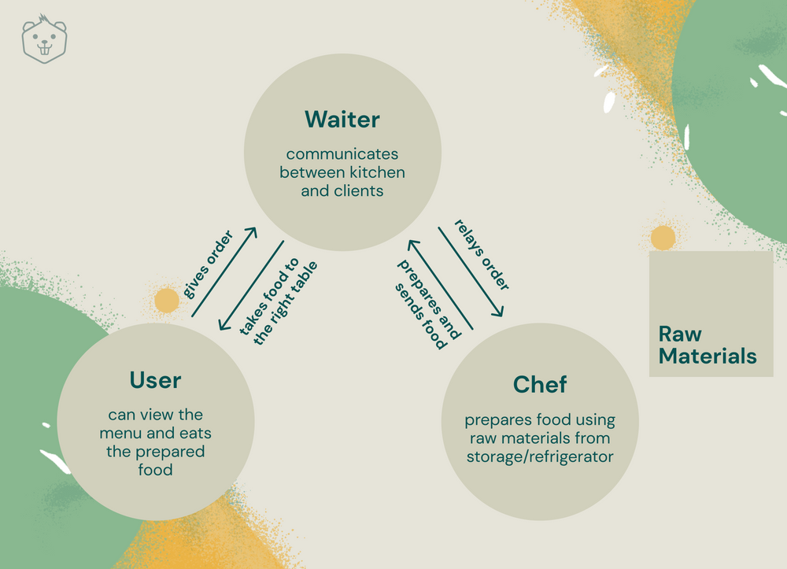
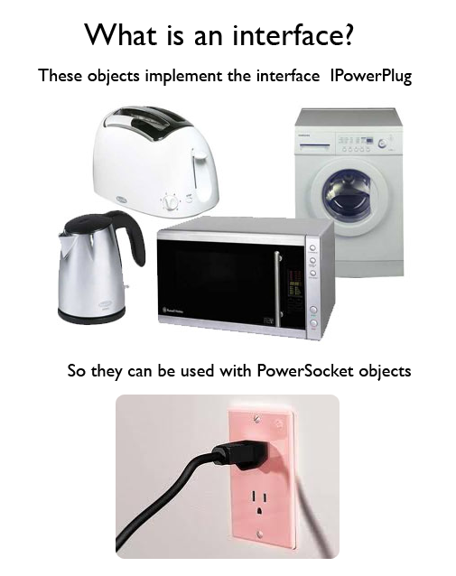
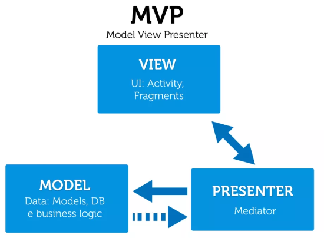

# What are architectural patterns anyway?

According to [Wikipedia](https://en.wikipedia.org/wiki/Architectural_pattern)<sup>[[1]](#1)</sup> , an architectural pattern is a general, reusable solution to a commonly occurring problem in software architecture. If you’re like me with no background experience in software architecture, you’re probably still scratching your head. Let’s break it down.

## Pattern

What is a pattern? Here is the definition straight from the [dictionary](https://dictionary.cambridge.org/dictionary/english/pattern)<sup>[[2]](#2)</sup>, “[a pattern is] a particular way in which something is done, is organized, or happens,” and in our case, design patterns. But you probably heard all about design patterns in _chapter 7_ so I’m not going to delve deep into that, but let’s talk more about the relation between architecture patterns and design patterns.

## Architecture

What is the first thing you think of when you see the word [architecture](https://www.merriam-webster.com/dictionary/architecture)<sup>[[3]](#3)</sup>… buildings, right? Software architecture is all about the blueprint or design pattern but broader. A great resource on the differences between design and architecture is shown here on [Medium by Ezra Lazuardy](https://ezralazuardy.medium.com/design-or-architecture-pattern-5314ee71ed6c)<sup>[[4]](#4)</sup>. To summarize, instead of a blueprint of a building, it’s like the blueprint for the whole city.

“Whoa..” you may be thinking, “wait, that’s way too much, having a detailed blueprint of the whole city?!”. Well, kind of, but it’s simpler than that.

Think of [abstraction in coding](https://www.educative.io/edpresso/what-is-abstraction-in-programming)<sup>[[5]](#5)</sup>, where we hide unnecessary data to the end-user so they are left with a clean app without worrying about the nuts and bolts. Architectural patterns are an abstraction of all the design patterns of the application, “the abstract blueprint of the city.”

“Ahh, now I get it!” is what I’m hoping you’re saying, but if you’re still unsure, hopefully by the end of this section, you can be an expert(...<sub>maybe slightly better than a beginner></sub>…) on architectural patterns!

# MV\* Framework Patterns and MVP

Okay, you heard all about MVC (Model, View, Controller) pattern in the **_last section_**, but it’s not the only type. As you may have figured out, there are more iterations of the MV\* framework, which stands for [“Model-View- (Whatever).”](https://www.techbloginterview.com/what-is-a-mv-framework/)<sup>[[6]](#6)</sup>

## The **“Model”**

Handles any data-related information, think of it as the “content” of the app. It also may take care of the “logic” in some patterns, or just house the data, usually taken from a database. The model may also add, delete, query data from the database.

## The **“View”**

What the user sees, also known as GUI (Graphical User Interface), more on GUIs can be found on [Graphical user interface -Wikipedia.](https://en.wikipedia.org/wiki/Graphical_user_interface#:~:text=The%20graphical%20user%20interface%20)<sup>[[7]](#7)</sup> The view can also be summarized as the “visual representation of our data” as when the user interacts with the GUI, the view will display or render the data. How the view knows what to display may differ from each MV\* pattern.

## The **“Whatever”**

Finally, what separates the different MV_patterns. The “Whatever” is the “_” in the MV\* patterns and basically is dictates how our data will flow between the layers. For example, The Controller, in MVC:

To put things into perspective, I will use the Restaurant Analogy as described in the blog [Understand MVC Architecture in 5 min](https://www.crio.do/blog/understand-mvc-architecture/)<sup>[[8]](#8)</sup>, it’s a great read and it helped me understand MVC.

Consider your a customer at a restaurant, you sit down at the table and depending on the type of restaurant, you will look through the menu on the table or be presented the menu by the waiter. Then, when you’re ready, the waiter will take your order and send that information to the chef. The chef will start preparing your meal, and depending on the order, will take the necessary ingredients from the fridge, shelf, etc.

## Now, how does that relate to MVC?

You may be saying, “Well I know how a restaurant works, why are you explaining this to me.” Well, basically that's how the MVC pattern works too.

First, the restaurant is our application. The user would be you, the customer. The user then interacts with the view (the menu) which then that information will be sent to the controller (our waiter). The controller sends the information to our model (our chef) and will process the data (our food) back to the controller. The controller then updates the view (the waiter putting food on the tray) and sends that to the user (the customer).

Also, the view (menu) references data from the model. Meaning, the food that is served and the menu, in our example, will be based on what the chef can prepare and is available in the kitchen(also could be considered the “database” in MVC). The View really depends on the Model’s data so reusing the View in another application may be difficult. It’s like using this restaurant menu in another restaurant, it may not work out. More can be read on [Reengineering .NET: Understanding Application Architecture -Bradley Irby](https://www.informit.com/articles/article.aspx?p=1966031&seqNum=3#:~:text=however%2C%20this%20means%20the%20views%20are%20more%20difficult%20to%20reuse%20outside%20of%20the%20current%20application%20because%20they%20are%20bound%20to%20a%20specific%20data%20model%20that%20might%20not%20be%20used%20in%20another%20application.%20it%20also%20means%20the%20binding%20logic%20cannot%20be%20tested%20because%20it%20resides%20in%20the%20view.)<sup>[[9]](#9)</sup> which also states that MVC is difficult to test because the logic that binds the two layers resides in the view.

So to solve that problem, [Taligent](https://en.wikipedia.org/wiki/Model%E2%80%93view%E2%80%93presenter#:~:text=the%20model-view-presenter%20software%20pattern%20originated%20in%20the%20early%201990s%20at%20taligent%2C%20a%20joint%20venture%20of%20apple%2C%20ibm%2C%20and%20hewlett-packard.%5B2%5D%20mvp%20is%20the%20underlying%20programming%20model%20for%20application%20development%20in%20taligent%27s%20c%2B%2B-based%20commonpoint%20environment.%20)<sup>[[10]](#10)</sup>, revised the MVC pattern and created a new pattern called MVP. [_Maybe founded before then_](https://en.wikipedia.org/wiki/Model%E2%80%93view%E2%80%93presenter#cite_note-2)<sup>[[11]](#11)</sup>

# Model View Presenter

## So what is MVP?
The model view presenter or MVP, is derived from MVC but instead of the “controller” being in charge, it’s the [view layer.](https://medium.datadriveninvestor.com/model-view-presenter-mvp-5c3439227f83)<sup>[[12]](#12)</sup>

To further understand it let’s break down MVP into their respective layers:

I’m going to show some code copied from [swing Tutorial => Simple MVP Example](https://riptutorial.com/swing/example/14137/simple-mvp-example)<sup>[[13]](#13)</sup> in the explanations.

These use the swing utility library for java, which implements frames(windows) for our user interface

### **Model**
Similar to MVC, the model initializes data and may get data from a database

For our example:

We created a simple model in which the “data” is the count
Usually data will be in outside of the application like a database, so a Model class wouldn’t be needed per se, and all the methods in our models could be implemented in the presenter.

Each time the addOneToCount() method is called, count is incremented by 1.

``` Java
public class Model {
    private int count = 0;

    public void addOneToCount(){
        count++;
    }

    public int getCount(){
        return count;
    }

}
```

### **View**

Responsible for all of the visualization aspects of the program.

Has “listeners” that track interactions from the user
These listeners will be passed on to the presenter via the viewListener

In our example:

* We are using the swing utilities from Java to create our UI.

* The UI will consist of the main window, the button with the text “Hello, World!”  

* Another text box will be created “label” that stores any text
* We will use this in our presenter class
Our listeners will track when the **“Hello, World!”** button is pressed and that information will be passed on to the presenter.

```Java 

/**
* Provides the UI elements
* The view class constructs all UI elements.
* The view, and only the view, should have reference to UI elements
* (ie. no buttons, text fields, etc. in the presenter or other classes).
 */

public class View {
    // A list of listeners subscribed (connected) to this view
    private final ArrayList<ViewListener> listeners;
    private final JLabel label;

    public View(){
        final JFrame frame = new JFrame();
        frame.setSize(300,300);
        frame.setDefaultCloseOperation(WindowConstants.EXIT_ON_CLOSE);
        frame.setLayout(new GridLayout());

        final JButton button = new JButton("Hello, world!");

        button.addActionListener(new ActionListener() {
            @Override
            public void actionPerformed(final ActionEvent e){
                notifyListenersOnButtonClicked();
            }
        });
        frame.add(button);

        label = new JLabel();
        frame.add(label);

        this.listeners = new ArrayList<ViewListener>();

        frame.setVisible(true);
    }
    // Iterate through the list, notifying each listener individually
    private void notifyListenersOnButtonClicked(){
        for(final ViewListener listener : listeners){
            listener.onButtonClicked();
        }
    }

    //Subscribe (connect) a listener
    public void addListener(final ViewListener listener){
        listeners.add(listener);
    }

    public void setLabelText(final String text){
        label.setText(text);
    }
}
```

### ViewListener

An Interface that creates methods if needed to connect different,unrelated classes.

For example we can use the same method for the model and view class without forcing a relationship.

Also, this may be referred to as the “contract” between the View class and the Presenter. As explained in [Introduction to the MVP Design Pattern on Android - Kotlin 1.2, Android 4.4+ - raywenderlich.com](https://www.youtube.com/watch?v=Iue2otccWBk&t=175s)<sup>[[14]](#14)</sup>


<br>
<sup>Image courtesy of [Why are interfaces useful? - Software Engineering Stack Exchange](https://softwareengineering.stackexchange.com/questions/108240/why-are-interfaces-useful#:~:text=246-,so%20in%20this%20example,-%2C%20the%20PowerSocket%20doesn%27t)</sup>

In our example:

* The view interface will add a new method that we will use, called onButtonClicked()

* Which the presenter can implement to record the model’s data
``` Java
public interface ViewListener {

    public void onButtonClicked();
}
```
Presenter
And finally, our (P)resenter communicates with the model and the view, implementing the viewlistener/s and returns the updated view

Our example:
implements the viewInterface we created above
Calls the view and model classes into it’s own Presenter method
Uses the model’s method for counting
Uses the view display method to update the count to the view.

``` Java
public class Presenter implements ViewListener{

private final View view;
private final Model model;

    public Presenter(final View view, final Model model){
        this.view = view;
        view.addListener(this);
        this.model = model;
    }

    @Override
    public void onButtonClicked(){
        // Update the model (ie. the state of the application)
        model.addOneToCount();
        // Update the view
        view.setLabelText(String.valueOf(model.getCount()));
    }

}
```
### Now to run it

In our application file, we import the swingutilites so we can run our application
Also inheriting the other classes we created
``` Java

public class Application {
    public Application() {
        final View view = new View();
        final Model model = new Model();
        new Presenter(view, model);
    }
    public static void main(String[] args) {
        SwingUtilities.invokeLater(new Runnable() {
            @Override
            public void run() {
                new Application();
            }
        });
    }
}
```

### Output


As you can see, each time our button is pressed the the text box is updated with the count, which we set up in the presenter.

## The core of MVP

That’s just one way to approach the MVP pattern, but we have to realize the “core” of the pattern as explained in [“Should I use MVC or MVP in my project? -Medium”](https://medium.com/@m7amdelbana/should-i-use-mvc-or-mvp-in-my-project-1270f2b2f4ed#:~:text=best%20way%20to%20implement%20the%20mvp%20pattern)<sup>[[15]](#15)</sup>.
<br>


**The Presenter** is the middle man, return our modified data to the view, But unlike the controller, it has control over how the data will be shown or “presented”

**The View** will connect to the presenter with interfaces as we implemented in our example above, and display the UI.

**The Model** will only be the gateway to the data or the “warehouse.”

### ***Pros and Cons***

So why go with MVP over MVC? As mentioned in [MVP (Model View Presenter) Architecture Pattern in Android with Example - GeeksforGeeks.](https://www.geeksforgeeks.org/mvp-model-view-presenter-architecture-pattern-in-android-with-example/?ref=gcse#:~:text=%20using%20mvc%20as%20the%20software%20architecture%2C%20developers%20end%20up%20with%20the%20following%20difficulties%3A)<sup>[[16]](#16)</sup>
MVC:

* Most of the responsibility is on the controller, which makes data difficult to manage as the application grows

* The view layer is deeply coupled with the model making it hard to separate them from the UI aspect. In turn, this makes it challenging to change existing features.

For more on the history visit the [MVP wiki -Wikipedia.](https://en.wikipedia.org/wiki/Model%E2%80%93view%E2%80%93presenter#:~:text=6%20External%20links-,history)<sup>[[10]][#10] But now let’s talk about the [pros and cons of MVP](https://www.codeproject.com/Tips/31292/MVC-v-s-MVP-How-Common-and-How-Different#:~:text=its%20associated%20view-,benefits,-Any%20pattern%20has)<sup>[[10]](#10)</sup>

### Pros
#### **Easier to test**

* As stated above, the “logic” and “display” elements of the view are in one class, making it hard to test the “logic” separate from the UI. So in MVP, the presenter takes care of the logic and the view is more “dumbed down” and just displays the UI. This makes it easier to test, as the layers are more isolated

#### **Adaptable**

* Code is isolated, making view model changes are easy, as it only affects the building blocks of the UI not how it’s presented.

### Cons

#### **Complexity**

* As it’s derived from MVC, even with these changes the code is still complex. Meaning to implement correctly, each layer must be coded following the core principles, which can be time-consuming.

#### **Not suited for small projects**

* Which is ironic considering I used a small project as an example, but it is still true. These patterns are mainly used for larger projects as it's complex and for smaller projects [it will be redundant.](https://developpaper.com/mvp-architecture-in-android-development/#:~:text=**-,malpractice,-Redundant%2C%20especially%20small)<sup>[[18]](#18)</sup> Basically, this pattern will be overkill.

## Conclusion
Thank you for reading through this. Hopefully, you understand architectural patterns a bit more and can see their benefits and implement them in your future projects. With that, that wraps up the section on MVP, an overview on MV* patterns and the meaning of architectural patterns. Next, we will discuss another MV* Framework, MVVM.

# Resources
1. <sub> <a name="1"> Architectural pattern (2022, February, 2) In ***Wikipedia***. https://en.wikipedia.org/w/index.php?title=Architectural_pattern&oldid=1069477266 </a> </sub>
2. <sub> <a name="2"> Pattern. 2022. In Dictionary.Cambridge.org. Retrieved March 3, 2022 https://dictionary.cambridge.org/dictionary/english/pattern </a> </sub>
3. <sub> <a name="3"> Architecture. 2022. In Merriam-Webster.com. Retrieved March 3, 2022, from https://www.merriam-webster.com/dictionary/architecture </a> </sub>
4. <sub> <a name="4"> Design or Architecture Pattern?. (2019) Ezra Lazuardy-Medium https://ezralazuardy.medium.com/design-or-architecture-pattern-5314ee71ed6c </a> </sub>
5. <sub> <a name="5"> What is abstraction in programming?. Retrieved March 3, 2022 www.educative.io/edpresso/what-is-abstraction-in-programming </a> </sub>
6. <sub> <a name="6"> What is a MV* framework?. (2017) Keshab Nayak-TechBlogInterview https://www.techbloginterview.com/what-is-a-mv-framework/ </a> </sub>
7. <sub> <a name="7"> Graphical user interface (2022, February, 25) In ***Wikipedia*** https://en.wikipedia.org/w/index.php?title=Graphical_user_interface&oldid=1073925137 </a> </sub>
8. <sub> <a name="8"> Understand MVC Architecture in 5 mins (2021) Jaidev Singh Bhui-Crio.do https://www.crio.do/blog/understand-mvc-architecture/ </a> </sub>
9. <sub> <a name="9"> Reengineering .NET: Understanding Application Architecture (2012) Differences Among MVP, MVC, and MVVM https://www.informit.com/articles/article.aspx?p=1966031&seqNum=3 </a> </sub>
10. <sub> <a name="10"> Model-View-Presenter ***History*** (2021, November, 8) In ***Wikipedia*** https://en.wikipedia.org/w/index.php?title=Model%E2%80%93view%E2%80%93presenter&oldid=1054194939 </a> </sub>
11. <sub> <a name="11"> Model-View-Presenter ***Cite Note 2*** (2021, November, 8) In ***Wikipedia*** https://en.wikipedia.org/w/index.php?title=Model%E2%80%93view%E2%80%93presenter&oldid=1054194939#cite_note-2 </a> </sub>
12. <sub> <a name="12"> Model View Presenter(MVP) (2020) Zanfina Svirca-Medium https://medium.datadriveninvestor.com/model-view-presenter-mvp-5c3439227f83 </a> </sub>
13. <sub> <a name="13"> Simple MVP Example In ***RIP Tutorial*** Retrieved March 3, 2022 https://riptutorial.com/swing/example/14137/simple-mvp-example </a> </sub>
14. <sub> <a name="14"> Introduction to the MVP Design Pattern on Android - Kotlin 1.2, Android 4.4+ - raywenderlich.com, In ***Youtube*** https://www.youtube.com/watch?v=Iue2otccWBk&t=175s from https://www.raywenderlich.com/9216-mvp-on-android </a> </sub>
15. <sub> <a name="15"> Should I use MVC or MVP in my project? (2017) ***Best way to implement the MVP pattern*** Mohamed Elbana-Medium https://medium.com/@m7amdelbana/should-i-use-mvc-or-mvp-in-my-project-1270f2b2f4ed </a> </sub>
16. <sub> <a name="16"> MVP (Model View Presenter) Architecture Pattern in Android with Example (2020) ***Using MVC as the software architecture, developers end up with the following difficulties:*** RISHU_MISHRA-GeeksForGeeks https://www.geeksforgeeks.org/mvp-model-view-presenter-architecture-pattern-in-android-with-example/ </a> </sub>
17. <sub> <a name="17"> MVC v/s MVP - How Common and How Different ***Benefits*** (2013) Neeraj Soni-Code Project. https://www.codeproject.com/Tips/31292/MVC-v-s-MVP-How-Common-and-How-Different </a> </sub>
18. <sub> <a name="18"> MVP architecture in Android Development (2021) ***Malpractice*** . https://developpaper.com/mvp-architecture-in-android-development/ </a> </sub>

