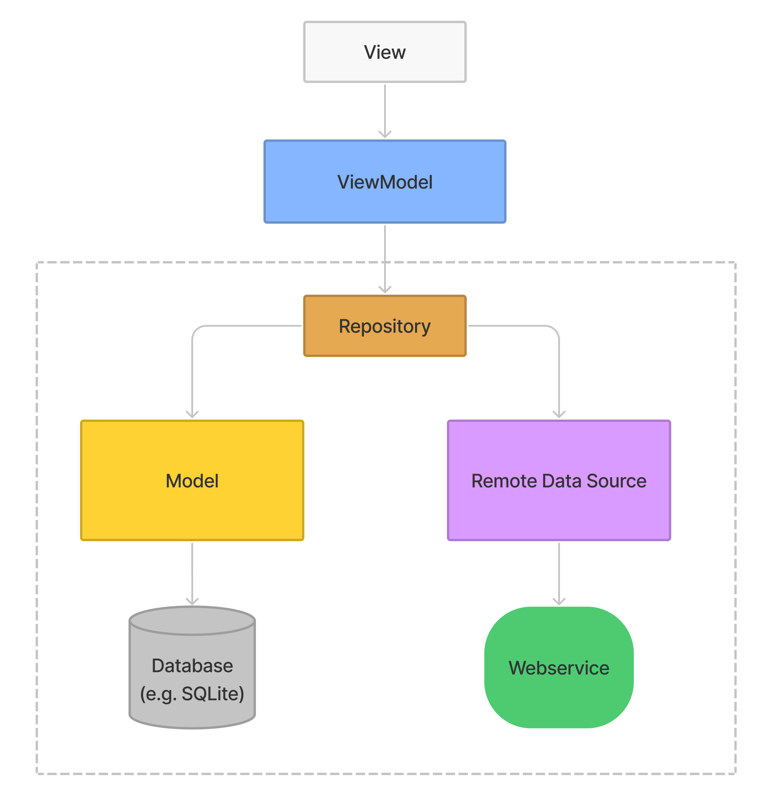
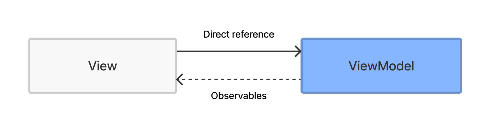

<p align="center">

</p>

# A detailed exploration of the Model View ViewModel architectural pattern

As part of my course, I want to introduce you to MVVM. Microsoft introduced this pattern in 2005, and it runs on [.NET](https://dotnet.microsoft.com/en-us/), [Silverlight](https://www.microsoft.com/silverlight/). Google also fully supports and [encourages using MVVM](https://developer.android.com/jetpack/guide) for Android development with their first-party libraries such as LiveData. Kotlin is the technology that I’m going to use for my demonstration.

MVVM uses [Separation of concerns](https://en.wikipedia.org/wiki/Separation_of_concerns) to separate a computer program into distinct sections. In the case of MVVM, there are three parts that help accomplish the separation of concerns: View, ViewModel, and DataModel.

<p align="center">

<p align="center"><i>MVVM architecture</i></p>
</p>

## View

As in other patterns such as MVP or MVC, a View is a user interface that displays data and a layout that users can see and interact with, such as TextViews and RecyclerViews. Generally speaking, a View might do everything that Activity or Fragment can do.

## ViewModel

A ViewModel is like a middleman that prepares data for a View. It binds data and business logic from the repository.

<p align="center">

<p align="center"><i>View-ViewModel class structure</i></p>
</p>

In the image above, you can see how this all works. A ViewModel makes the appropriate data observable. That means the ViewModel exposes relevant data from the Model, and ViewModels don’t need to be directly connected to Views. Views are observing it and reflect changes that the ViewModel makes.

The advantage of this approach is that the ViewModel doesn’t know that Views are observing it. Having less engagement between classes makes easier to test.
We would use the [LiveData](https://developer.android.com/topic/libraries/architecture/livedata) library for observing data to create observables. The biggest advantage of this library is that it unsubscribes activities or fragments that have been destroyed. A developer is then free from managing the lifecycle methods.

## Model

Model, also known as a DataModel, exposes data. However, there is one intermediate step between the Model and a ViewModel which is called Repository. The Repository is known as the [Single Source of Truth](https://www.mulesoft.com/resources/esb/what-is-single-source-of-truth-ssot) (SSOT). It has access to the data sources and decides where the data is coming from. The data can be of any kind, and they can come from a remote server or the local database. Whenever a ViewModel needs some data, this comes from the Repository. As it was with a View and a ViewModel, the Repository doesn’t know that ViewModels is using its data.

<p align="center">

<p align="center"><i>Model class structure</i></p>
</p>

## Pros

- Due to the separation of the ViewModel and the Model, they are testable with libraries such as JUnit.
- The ViewModel is no longer bound to a specific View.
- MVVM reduces the number of interfaces that [MVP](https://en.wikipedia.org/wiki/Model%E2%80%93view%E2%80%93presenter) makes you do.
- It makes the code easier to read, more scalable, and  more maintainable.
- It prevents putting extra code inside a View.

## Cons

- It is a bit complicated to understand how it works and to distinguish it from other patterns.
- It can be overkill for smaller apps.

## Conclusion

MVVM offers lots of advantages of separation of concerns by leveraging data binding. Also, the Models drive as much business logic as possible and avoid the logic in Views.

Personally, I feel it seems complicated at first. However, once you figure out how MVVM works, you might benefit from it and you will stick to this pattern.

# Crash Course

For my coding demonstration I picked a MVVM tutorial [[2](https://www.youtube.com/watch?v=eUQebUJLnXI)] by Denis Panjuta ([Tutorials.eu](tutorials.eu)). The original course doesn't provide any code resource, therefore I decided to show it and explain MVVM pattern in practice.

We will build a simple app that displays mock data from [Rick and Morty API](https://rickandmortyapi.com/). We will need a recycler view, Repository, HTTP Client, Moshi, and LiveData. This project will give an idea of how MVVM works in Android Development. Our architecture will reflect the image below, so we will remove a local database from the pattern.

<p align="center">

<p align="center"><i>Architecture used for our example</i></p>
</p>

## Get started

We have to create a new Empty Activity as a starting point. Also, it's necessary to pick Kotlin as the default language. When the project is completed, it's essential to import several libraries.

### build.gradle

```gradle
dependencies {

	def moshi_version = "1.9.3"
	def retrofit_version = "2.9.0"

	// First we declare a variable for the lifecycle version so we can we use it
	def lifecycle_version = "2.4.0-alpha02"

	//ViewModel - Will help us manage data in a lifecycle in ViewModels
	implementation "androidx.lifecycle:lifecycle-viewmodel-ktx:$lifecycle_version"

	//LiveData - Will help us to handle observables
	implementation "androidx.lifecycle:lifecycle-livedata-ktx:$lifecycle_version"

	// Retrofit - A type-safe HTTP client for Android and Java
	implementation "com.squareup.retrofit2:retrofit:$retrofit_version"

	// Moshi - It makes it easy to parse JSON into Java and Kotlin classes
	implementation "com.squareup.moshi:moshi-kotlin:$moshi_version"

	// Retrofit with moshi
	implementation "com.squareup.retrofit2:converter-moshi:$retrofit_version"

	// Coil - Use an image only with url
	implementation("io.coil-kt:coil:1.3.0")

```

This tutorial is not focused on an excellent user interface, although we will try to make it more user-friendly with a RecyclerView. We have to create a RecyclerView item XML and an adapter. As you can see in the image below, there is a list of characters displayed on cards.

<p align="center">

<p align="center"><i>Demo app</i></p>
</p>

We will create XML files with a CardView and ConstraintLayout with an ImageView and a TextView. The second XML file will be our main activity, where we will display the RecyclerView and a ProgressBar that will indicate whether the data is being fetched from a server.

### rv_item.xml

```xml
<androidx.cardview.widget.CardView xmlns:android="http://schemas.android.com/apk/res/android"
	xmlns:app="http://schemas.android.com/apk/res-auto"
	xmlns:tools="http://schemas.android.com/tools"
	android:layout_width="match_parent"
	android:layout_height="wrap_content"
	app:cardUseCompatPadding="true">

	<androidx.constraintlayout.widget.ConstraintLayout
		android:layout_width="wrap_content"
		android:layout_height="match_parent"
		android:gravity="center">

		<ImageView
			android:id="@+id/image"
			android:layout_width="wrap_content"
			android:layout_height="wrap_content"
			android:scaleType="centerCrop"
			android:src="@drawable/ic_launcher_background"
			app:layout_constraintStart_toStartOf="parent"
			app:layout_constraintTop_toTopOf="parent" />

		<TextView
			android:id="@+id/name"
			android:layout_width="0dp"
			android:layout_height="wrap_content"
			android:textColor="@color/black"
			android:textSize="14sp"
			app:layout_constraintEnd_toEndOf="@+id/image"
			app:layout_constraintStart_toStartOf="@+id/image"
			app:layout_constraintTop_toBottomOf="@+id/image"
			tools:text="Name"

			/>

	</androidx.constraintlayout.widget.ConstraintLayout>

</androidx.cardview.widget.CardView>
```

### activity_main.xml

```XML
<androidx.constraintlayout.widget.ConstraintLayout xmlns:android="http://schemas.android.com/apk/res/android"
    xmlns:app="http://schemas.android.com/apk/res-auto"
    xmlns:tools="http://schemas.android.com/tools"
    android:layout_width="match_parent"
    android:layout_height="match_parent"
    tools:context=".MainActivity">

	<ProgressBar
		android:layout_width="wrap_content"
		android:layout_height="wrap_content"
		android:id="@+id/progressBar"
		tools:visibility="visible"
		android:visibility="gone"
		app:layout_constraintTop_toTopOf="parent"
		app:layout_constraintBottom_toBottomOf="parent"
		app:layout_constraintStart_toStartOf="parent"
		app:layout_constraintEnd_toEndOf="parent"
		/>

	<androidx.recyclerview.widget.RecyclerView
		android:id="@+id/characterRv"
		android:layout_height="match_parent"
		android:layout_width="match_parent"
		app:layout_constraintTop_toTopOf="parent"
		app:layout_constraintBottom_toBottomOf="parent"
		/>

</androidx.constraintlayout.widget.ConstraintLayout>
```

Once we have prepared the XML files, we have to prepare Kotlin files that will handle [Rick and Morty API](https://rickandmortyapi.com/), and we have to create an adapter that will manage the RecyclerView.

### MainAdapter.kt

```kotlin
import android.view.LayoutInflater
import android.view.View
import android.view.ViewGroup
import android.widget.ImageView
import android.widget.TextView
import androidx.recyclerview.widget.RecyclerView
import coil.load
import coil.transform.CircleCropTransformation

class MainAdapter(val characterList: List<Character>) :
	RecyclerView.Adapter<MainAdapter.MainViewHolder>() {

	inner class MainViewHolder(private val itemView: View) : RecyclerView.ViewHolder(itemView) {
		fun bindData(character: Character) {
			val name = itemView.findViewById<TextView>(R.id.name)
			val image = itemView.findViewById<ImageView>(R.id.image)

			name.text = character.name
			// for displaying images that have only url we use coil library
			image.load(character.image) {
				transformations(CircleCropTransformation())
			}
		}
	}

	override fun onCreateViewHolder(parent: ViewGroup, viewType: Int): MainViewHolder {
		return MainViewHolder(
			LayoutInflater.from(parent.context).inflate(R.layout.rv_item, parent, false)
		)
	}

	override fun onBindViewHolder(holder: MainViewHolder, position: Int) {
		holder.bindData(characterList[position])
	}

	override fun getItemCount(): Int {
		return characterList.size
	}
}
```

Once we've completed the adapter, we will start with a Kotlin class Character.kt which will indicate a 'data class' where we will structure the data we want to display. We use a library [Moshi](https://github.com/square/moshi) that parses JSON into a Kotlin class.

### Character.kt

```kotlin
import com.squareup.moshi.Json

data class Character(
	@Json(name = "name")
	val name: String,
	@Json(name = "image")
	val image: String
)

data class CharacterResponse(
	@Json(name = "results")
	val result: List<Character>
)
```

Next, we will make an API service that uses a library Retrofit for requesting the remote API.

### ApiClient.kt

```kotlin
import com.squareup.moshi.Moshi
import com.squareup.moshi.kotlin.reflect.KotlinJsonAdapterFactory
import retrofit2.Call
import retrofit2.Retrofit
import retrofit2.converter.moshi.MoshiConverterFactory
import retrofit2.http.GET
import retrofit2.http.Query

// object allows us to call ApiClient service without initializing the class
object ApiClient {

	private val BASE_URL = "https://rickandmortyapi.com/api/"

	private val moshi = Moshi.Builder().add(KotlinJsonAdapterFactory()).build()

	// lazy means it is used just when it is needed
	private val retrofit: Retrofit by lazy {
		Retrofit.Builder().baseUrl(BASE_URL)
			.addConverterFactory(MoshiConverterFactory.create(moshi)).build()
	}

	val apiService:ApiService by lazy {
		retrofit.create(ApiService::class.java)
	}
}

interface ApiService {
	@GET("character")
	fun fetchCharacters(@Query("page")page:String): Call<CharacterResponse>
}
```

Now we will make a Repository that has the decision-making role. It decides where the data comes from. Does it fetch data from the local database? Does it fetch the data from a remote data source? How long does it need to keep the data?

However, our Repository will be simple and only call ApiClient to fetch the characters.

### Repository.kt

```kotlin
class Repository(private val apiService: ApiService) {
	fun getCharacters(page:String) = apiService.fetchCharacters(page)
}
```

Before we create our ViewModel, we should make a screen state that will help with the asynchronous stages of a request. Let's make a sealed class ScreenState.kt.

### ScreenState.kt

```kotlin
sealed class ScreenState<T>(val data: T? = null, val message: String? = null) {

	class Success<T>(data: T) : ScreenState<T>(data)

	class Loading<T>(data: T? = null) : ScreenState<T>(data)

	class Error<T>(message: String, data: T? = null) : ScreenState<T>(data, message)
}
```

In our ViewModel, we will manage an observable that will notify our Views (in our case, only one View) that there is a change and send the data once it fetches it from the repository.

### MainViewModel.kt

```kotlin
import androidx.lifecycle.LiveData
import androidx.lifecycle.MutableLiveData
import androidx.lifecycle.ViewModel
import retrofit2.Call
import retrofit2.Callback
import retrofit2.Response

class MainViewModel(private val repository: Repository = Repository(ApiClient.apiService)) :
	ViewModel() {

	// create an observable
	private var _charactersLiveData = MutableLiveData<ScreenState<List<Character>?>>()

	// create a getter for the observable
	val characterLiveData: LiveData<ScreenState<List<Character>?>> get() = _charactersLiveData

	// first execution after constructor
	init {
		fetchCharacter()
	}

	private fun fetchCharacter() {
		// we define a call we want to make
		val client = repository.getCharacters("1")
		// our observable gets a heads up that data is loading
		_charactersLiveData.postValue(ScreenState.Loading())
		// enqueue will send a request asynchronously, the parameter is a callback
		client.enqueue(object : Callback<CharacterResponse> {
			override fun onResponse(
				call: Call<CharacterResponse>,
				response: Response<CharacterResponse>
			) {
				if (response.isSuccessful) {
					_charactersLiveData.postValue(ScreenState.Success(response.body()?.result))
				} else {
					_charactersLiveData.postValue(ScreenState.Error(response.code().toString()))
				}
			}
			override fun onFailure(call: Call<CharacterResponse>, t: Throwable) {
				_charactersLiveData.postValue(ScreenState.Error(t.message.toString()))
			}
		})
	}
}
```

Finally, we can wire everything up and create our MainActivity, observing LiveData from the ViewModel. There will be a progress bar that will occur while the data is being fetched. Based on each stage that we initialized in ScreenState.kt, we will display the progress bar, recycler view, or snack bar with an error.

### MainActivity.kt

```kotlin
import androidx.appcompat.app.AppCompatActivity
import android.os.Bundle
import android.view.View
import android.widget.ProgressBar
import androidx.lifecycle.ViewModelProvider
import androidx.recyclerview.widget.RecyclerView
import androidx.recyclerview.widget.StaggeredGridLayoutManager
import com.google.android.material.snackbar.Snackbar


class MainActivity : AppCompatActivity() {

	// gets initialized once it's needed and it calls Init method the starts fetching data
	private val viewModel: MainViewModel by lazy {
		ViewModelProvider(this).get(MainViewModel::class.java)
	}

	override fun onCreate(savedInstanceState: Bundle?) {
		super.onCreate(savedInstanceState)
		setContentView(R.layout.activity_main)

		viewModel.characterLiveData.observe(this) { state ->
			processCharactersResponse(state)
		}
	}

	private fun processCharactersResponse(state: ScreenState<List<Character>?>) {

		val pb = findViewById<ProgressBar>(R.id.progressBar)
		when (state) {
			is ScreenState.Loading -> {
				pb.visibility = View.VISIBLE
			}
			is ScreenState.Success -> {
				pb.visibility = View.GONE
				if (state.data != null) {
					val adapter = MainAdapter(state.data)
					val recyclerView = findViewById<RecyclerView>(R.id.characterRv)
					recyclerView?.layoutManager =
						StaggeredGridLayoutManager(2, StaggeredGridLayoutManager.VERTICAL)
					recyclerView?.adapter = adapter
				}
			}
			is ScreenState.Error -> {
				pb.visibility = View.GONE
				val view = pb.rootView
				// tells the snack bar where it is
				Snackbar.make(view, state.message!!, Snackbar.LENGTH_LONG).show()
			}
		}
	}
}
```

## Conclusion

That's it! Now you can make an app in MVVM pattern! Wasn't it fun? You can improve the app and implement a local database with a library Room and SQLite to have a complete code example in MVVM. Once you finish the crash course, it will make more sense than having the pattern theoretically explained.

### Resource:

1. [Model View View-Model (MVVM): Getting Started](https://codingwithmitch.com/blog/getting-started-with-mvvm-android/)

2. [MVVM in Android- Model View View Model Tutorial with Project](https://www.youtube.com/watch?v=eUQebUJLnXI)

3. [Guide to app architecture ](https://developer.android.com/jetpack/guide)

4. [Introduction to MVVM on Android](https://resocoder.com/2018/08/31/introduction-to-mvvm-on-android/)

5. [Simple Android MVVM using RX and Kotlin](https://medium.com/corebuild-software/simple-android-mvvm-using-rx-and-kotlin-9769a91b03ef)

6. [Android Architecture Patterns Part 3: Model-View-ViewModel](https://medium.com/upday-devs/android-architecture-patterns-part-3-model-view-viewmodel-e7eeee76b73b)

7. [Separation of concerns](https://en.wikipedia.org/wiki/Separation_of_concerns)

8. [What is a Single Source of Truth (SSOT)](https://www.mulesoft.com/resources/esb/what-is-single-source-of-truth-ssot)
