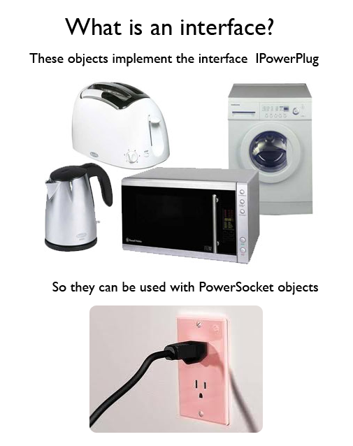
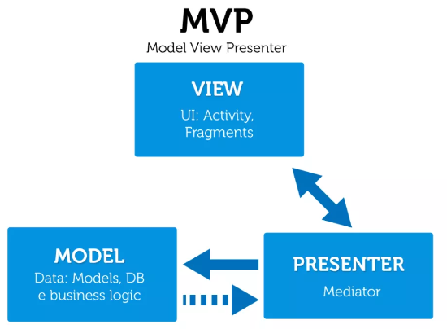
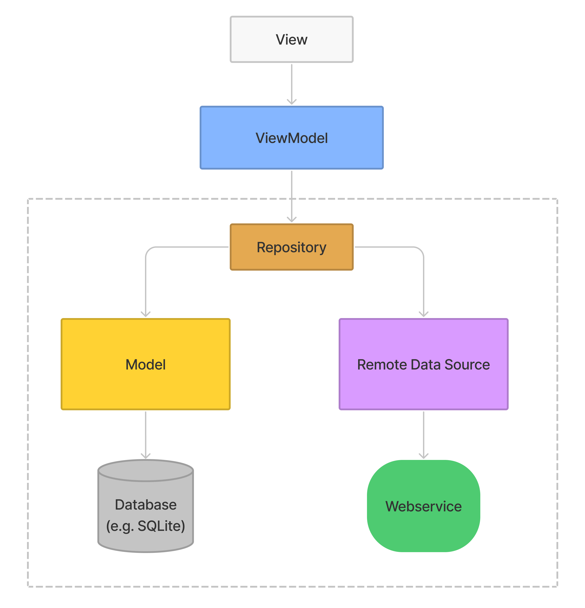
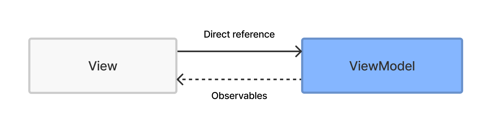
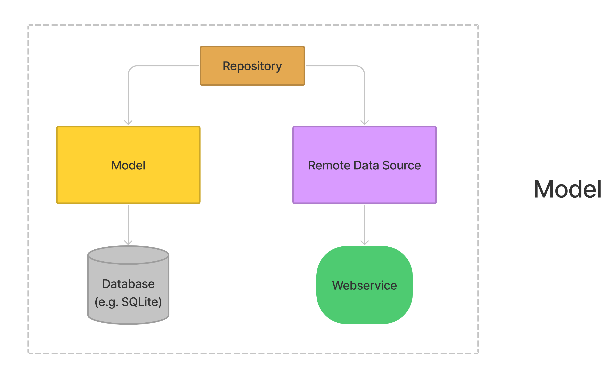
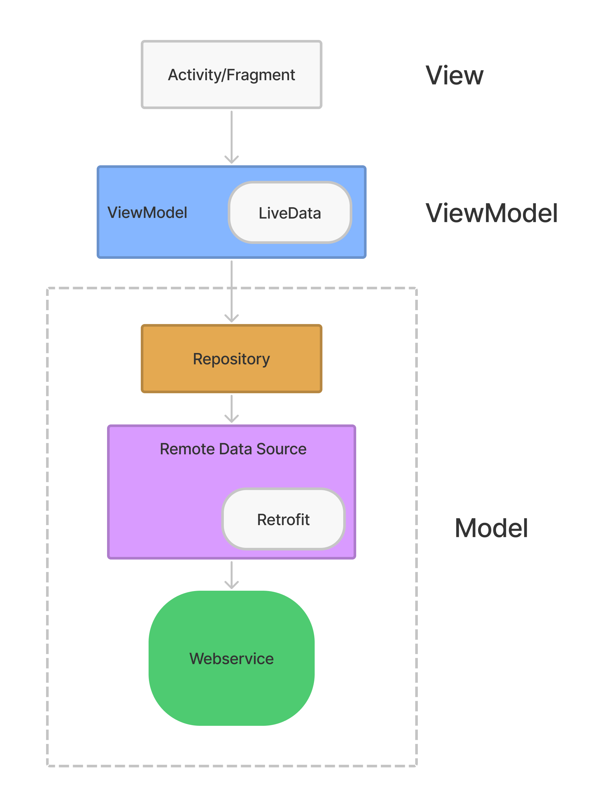
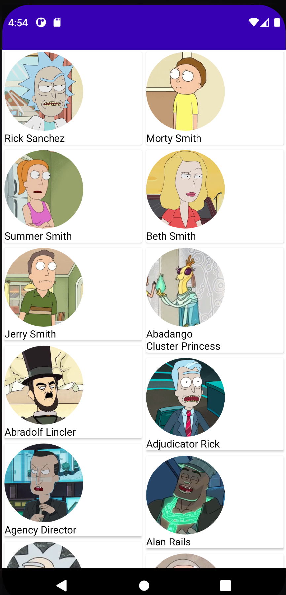

# <div align = "center"> Chapter 8 - Architectural Patterns </div>
<br />

<p align="center">

</p>

## What are architectural patterns?

According to [Wikipedia](https://en.wikipedia.org/wiki/Architectural_pattern)<sup>[[1]](#1)</sup> , an architectural pattern is a general, reusable solution to a commonly occurring problem in software architecture. If you’re like me with no background experience in software architecture, you’re probably still scratching your head. Let’s break it down.

## Pattern

What is a pattern? Here is the definition straight from the [dictionary](https://dictionary.cambridge.org/dictionary/english/pattern)<sup>[[2]](#2)</sup>, “[a pattern is] a particular way in which something is done, is organized, or happens,” and in our case, design patterns. But you probably heard all about design patterns in [Chapter 7](https://github.com/nic-dgl104-winter-2022/class-textbook/tree/main/ch7) so I’m not going to delve deep into that, but let’s talk more about the relation between architecture patterns and design patterns.

## Architecture

What is the first thing you think of when you see the word [architecture](https://www.merriam-webster.com/dictionary/architecture)<sup>[[3]](#3)</sup>… buildings, right? Software architecture is all about the blueprint or design pattern but broader. A great resource on the differences between design and architecture is shown here on [Medium by Ezra Lazuardy](https://ezralazuardy.medium.com/design-or-architecture-pattern-5314ee71ed6c)<sup>[[4]](#4)</sup>. To summarize, instead of a blueprint of a building, it’s like the blueprint for the whole city.

“Whoa..” you may be thinking, “wait, that’s way too much, having a detailed blueprint of the whole city?!”. Well, kind of, but it’s simpler than that.

Think of [abstraction in coding](https://www.educative.io/edpresso/what-is-abstraction-in-programming)<sup>[[5]](#5)</sup>, where we hide unnecessary data to the end-user so they are left with a clean app without worrying about the nuts and bolts. Architectural patterns are an abstraction of all the design patterns of the application, “the abstract blueprint of the city.”

“Ahh, now I get it!” is what I’m hoping you’re saying, but if you’re still unsure, hopefully by the end of this chapter, you can be an expert(...<sub>maybe slightly better than a beginner></sub>…) on architectural patterns!
<br />

# <div align = "center"> MV*Frameworks </div>

In this chapter, we are mainly focusing on the MV* Frameworks. which stands for [“Model-View- (Whatever).”](https://www.techbloginterview.com/what-is-a-mv-framework/)<sup>[[6]](#6)</sup>

## The **“Model”**

Handles any data-related information, think of it as the “content” of the app. It also may take care of the “logic” in some patterns, or just house the data, usually taken from a database. The model may also add, delete, query data from the database.

## The **“View”**

What the user sees, also known as GUI (Graphical User Interface), more on GUIs can be found on [Graphical user interface -Wikipedia.](https://en.wikipedia.org/wiki/Graphical_user_interface#:~:text=The%20graphical%20user%20interface%20)<sup>[[7]](#7)</sup> The view can also be summarized as the “visual representation of our data” as when the user interacts with the GUI, the view will display or render the data. How the view knows what to display may differ from each MV\* pattern.

## The **“Whatever”**

Finally, what separates the different MV_patterns. The “Whatever” is the “_” in the MV\* patterns and basically is dictates how our data will flow between the layers. 

<br />

# <div align = "center"> MVC, MVP, MVVM </div>

For this chapter, we will focus on three MV* architectural patterns. 

<div align = "center">

MVC       |  MVP     |  MVVM 
| :-----: | :-----:| :-----:
Model-View-Controller| Model-View-Presenter| Model-View-ViewModel 

</div>

Each section will describle the models in detail, followed by a code example.


Once we discuss each pattern, hopefully, you will notice the slight differences between them.
<br  />

# <div align = "center"> MVC 
</div>

**MVC** is an architectural pattern and it stands for Model, View, and Controller. It is a pattern to represent information and data to the user. It was used for desktop graphical user interfaces but nowadays is used in designing mobile apps and web apps. Let’s dive into it by first understanding its history.

## History

Trygve Reenskaug was the first who proposed the idea of MVC to this world. According to Wikipedia, when he was a visiting scientist at Xerox Palo Alto Research Laboratory (PARC) in 1978/79, he wrote the initial reports on MVC. MVC was originally known as "Thing Model View Editor," but it was soon changed to "Model View Controller."

As with every technology, it keeps updating over time, something similar happened to MVC. It gets evolved over the years as Trygve & his mates designed it to address the issue of users controlling a large and complex data set.
From the book Naked Objects <sup>[[8]](#9)</sup> , the motivation behind MVC was to allow the creation of a graphical interface for any object.

According to Matin Fowler 2006 GUI Architectures blog <sup>[[9]](#10)</sup> , MVC pattern started giving rise to other architectures like the hierarchical model–view–controller (HMVC), model–view–adapter (MVA), model–view–presenter (MVP), model–view–ViewModel (MVVM), etc.


## MVC Architecture

<p align="center">
  
</p>

**1. User View Interaction:** First of all a user will interact with the views present in the app or website. Views are like Textview, EditText, ImageView, etc, which are used to display the text, images to the user. 

**2. View Controller Interaction:** When a view is displayed to the user, it alerts the controller of that particular event.

**3. Controller Model Interaction:** Now, the controller updates the Model i.e. view requires data to show the user.

**4. Model View Interaction:** Model alerts View that data is changed now in the Model.

**5. View Model Interaction:** Final work of View is to get that updated data from the Model and display it to the user.

This cycle keeps rotating until and unless the user closes the app or website. Here, Model, View, and Controller are the main components of the MVC architecture let’s look more closely at each of them.

## Model

Model is the heart of your application. Complete work related to data is managed using Model. For example, if we have to collect data of a user which includes his name, date of birth and a profile picture then we will simply create a data class with three variables of name, date of birth and profile picture. It is like being a type of data we can model. Model’s work is to notify View about their current state.

## View

Views are like user-interface in an application. Like we have cfm/ HTML to render your application. The main work of a View is to observe the model to get data in views but this data is passed through the controller.

## Controller

 The controller prohibits the direct connection between the view and model and its work is to connect both of them. Whenever a user gets to see a view, view alerts controller that it requires data and then controller alerts model to send data to view. Basically, it is like an alarm for model and view.

## Why use MVC?

● First and the most important advantage of the using MVC or any architectural pattern in your app or website is the organized code.

● MVC is great if you are working on any large-size projects.

● One more reason to use MVC in your project is that it can be easily modifiable and easy to maintain. 

## Demand & its Future:

From the answers to this question on Quora, MVC’s future is bright and demanding. Most of the top companies like Microsoft, Dell, Go Daddy, Visual Studio, etc. uses MVC design patterns for User interface and models. So, for new developers, MVC is a complete package of new skills and methods. Learning MVC can easily boost a developer’s career. 

## Prerequisites:

MVC is an architectural pattern so it can be used in both phone and web applications. Before start learning MVC, you should have a prior understanding of the below points-

• Basic knowledge of Coding and language such as C++, Java, Kotlin or Python.
• Object-Oriented Programming. 
• Understanding of a framework related to web or mobile applications. 


##  MVC EXAMPLE

Let’s try to understand the MVC architecture pattern using a very simple android application.
Here we will be building an app for login or authentication. We will be using Kotlin<sup>[[10]](#10)</sup> but you
can also use Java<sup>[[11]](#11)</sup>.

### Step 1. - Create a new Android Project

Click on your Android Studio icon and create a new project with an empty activity. You can
name your project anything you like, we named it as MVC Example.

### Step 2. – Create three packages

To implement MVC architecture in this project we have to create three different packages-

**1. Model**

**2. View**

**3. Controller**

Each package will be containing classes and interfaces. To create these package
folders –

```
Right Click on the project name > New > Package
```
             
### Step 3. – Create interfaces and classes

Now, we have to create files and interfaces in the package we created above.
In Model Package create two files-

### iUser.kt
```kotlin
package com.prabhjot.mvcexample.Model
interface iUser {
  fun getEmail(): String?
  fun getPassword(): String?
  fun isValid(): Int
}
```

### User.kt

```kotlin
package com.prabhjot.mvcexample.Model

import android.text.TextUtils
import android.util.Patterns

class User(
    private val email: String?,
    private val password: String?
) : iUser {

    override fun getEmail(): String? {
        return email
    }

    override fun getPassword(): String? {
       return password
    }

    override fun isValid(): Int {
        if (TextUtils.isEmpty(getEmail()))
            return 0
        else if (!Patterns.EMAIL_ADDRESS.matcher(getEmail()).matches())
            return 1
        else if (TextUtils.isEmpty(getPassword()))
            return 2
        else if (getPassword()?.length!! <= 6)
            return 3
        else
            return -1;
    }
}
```
Now, for the controller package, we have to create one interface iLogin, and a class named as Login.

### iLogin.kt
```kotlin
package com.prabhjot.mvcexample.Controller

interface iLogin {
    fun OnLogin(email: String?, Password: String?)
}
```

### Login.kt
```kotlin
package com.prabhjot.mvcexample.Controller

import com.prabhjot.mvcexample.Model.User
import com.prabhjot.mvcexample.View.LoginView

class Login(
    private val loginView: LoginView
) : iLogin {

    override fun OnLogin(email: String?, password: String?) {
        val user = User(email, password)
        val loginCode = user.isValid()

        when (loginCode) {
            0 -> {
                loginView.OnLoginError("Enter Email");
            }
            1 -> {
                loginView.OnLoginError("Enter a valid Email");
            }
            2 -> {
                loginView.OnLoginError("Enter Password");
            }
            3 -> {
                loginView.OnLoginError("Enter Password greater the 6 char");
            }
            else -> {
                loginView.OnLoginSuccess("You logged in.");
            }
        }

    }
}
```

We are done with model and controller. Now, its time to design UI using View so that data will be displayed in the views.

### LoginView.kt
```kotlin
package com.prabhjot.mvcexample.View

interface LoginView {
    fun OnLoginSuccess(message: String?)
    fun OnLoginError(message: String?)
}
```

### Output

<p align="center">
  
</p>

With this example, we learned how we can implement MVC architecture in an Android App
using Kotlin. Below are some recommended posts by which you can understand MVC
examples more clearly.

 [MVC Architecture Pattern in Android with Example](https://www.geeksforgeeks.org/mvc-model-view-controller-architecture-pattern-in-android-with-example/)

[Use MVC pattern to create very basic Shopping Cart](https://androidexample.com/Use_MVC_Pattern_To_Create_Very_Basic_Shopping_Cart__-_Android_Example/index.php?view=article_discription&aid=116)

[Implementing MVC pattern in Android with Kotlin](https://www.codementor.io/@dragneelfps/implementing-mvc-pattern-in-android-with-kotlin-i9hi2r06c)

 [The Model View Controller – MVC Architecture and Frameworks Explained.](https://www.freecodecamp.org/news/the-model-view-controller-pattern-mvc-architecture-and-frameworks-explained/)

 
## Summary

So MVC isn't easy to understand; in fact, it's really difficult to understand, but it's not impossible to learn, and every developer should keep it in mind when designing an application. The model is concerned with the facts and logic of your system. The controller maintains the link between the model and the view, while the view only displays data. This 'division' improves the user experience and modularity while also making testing easier.

<br />

# <div align = "center"> MVP </div>


## So what is MVP?
The model view presenter or MVP, is derived from MVC but instead of the “controller” being in charge, it’s the [view layer.](https://medium.datadriveninvestor.com/model-view-presenter-mvp-5c3439227f83)<sup>[[12]](#12)</sup>

To further understand it let’s break down MVP into their respective layers:

I’m going to show some code copied from [swing Tutorial => Simple MVP Example](https://riptutorial.com/swing/example/14137/simple-mvp-example)<sup>[[13]](#13)</sup> in the explanations.

These use the swing utility library for java, which implements frames(windows) for our user interface

### **Model**
Similar to MVC, the model initializes data and may get data from a database

For our example:

We created a simple model in which the “data” is the count
Usually data will be in outside of the application like a database, so a Model class wouldn’t be needed per se, and all the methods in our models could be implemented in the presenter.

Each time the addOneToCount() method is called, count is incremented by 1.

``` Java
public class Model {
    private int count = 0;

    public void addOneToCount(){
        count++;
    }

    public int getCount(){
        return count;
    }

}
```

### **View**

Responsible for all of the visualization aspects of the program.

Has “listeners” that track interactions from the user
These listeners will be passed on to the presenter via the viewListener

In our example:

* We are using the swing utilities from Java to create our UI.

* The UI will consist of the main window, the button with the text “Hello, World!”  

* Another text box will be created “label” that stores any text
* We will use this in our presenter class
Our listeners will track when the **“Hello, World!”** button is pressed and that information will be passed on to the presenter.

```Java 

/**
* Provides the UI elements
* The view class constructs all UI elements.
* The view, and only the view, should have reference to UI elements
* (ie. no buttons, text fields, etc. in the presenter or other classes).
 */

public class View {
    // A list of listeners subscribed (connected) to this view
    private final ArrayList<ViewListener> listeners;
    private final JLabel label;

    public View(){
        final JFrame frame = new JFrame();
        frame.setSize(300,300);
        frame.setDefaultCloseOperation(WindowConstants.EXIT_ON_CLOSE);
        frame.setLayout(new GridLayout());

        final JButton button = new JButton("Hello, world!");

        button.addActionListener(new ActionListener() {
            @Override
            public void actionPerformed(final ActionEvent e){
                notifyListenersOnButtonClicked();
            }
        });
        frame.add(button);

        label = new JLabel();
        frame.add(label);

        this.listeners = new ArrayList<ViewListener>();

        frame.setVisible(true);
    }
    // Iterate through the list, notifying each listener individually
    private void notifyListenersOnButtonClicked(){
        for(final ViewListener listener : listeners){
            listener.onButtonClicked();
        }
    }

    //Subscribe (connect) a listener
    public void addListener(final ViewListener listener){
        listeners.add(listener);
    }

    public void setLabelText(final String text){
        label.setText(text);
    }
}
```

### ViewListener

An Interface that creates methods if needed to connect different,unrelated classes.

For example we can use the same method for the model and view class without forcing a relationship.

Also, this may be referred to as the “contract” between the View class and the Presenter. As explained in [Introduction to the MVP Design Pattern on Android - Kotlin 1.2, Android 4.4+ - raywenderlich.com](https://www.youtube.com/watch?v=Iue2otccWBk&t=175s)<sup>[[14]](#14)</sup>

 <div align = "center">
 
 
<br>
<sup>Image courtesy of [Why are interfaces useful? - Software Engineering Stack Exchange](https://softwareengineering.stackexchange.com/questions/108240/why-are-interfaces-useful#:~:text=246-,so%20in%20this%20example,-%2C%20the%20PowerSocket%20doesn%27t)</sup>

</div>
In our example:

* The view interface will add a new method that we will use, called onButtonClicked()

* Which the presenter can implement to record the model’s data
``` Java
public interface ViewListener {

    public void onButtonClicked();
}
```
Presenter
And finally, our (P)resenter communicates with the model and the view, implementing the viewlistener/s and returns the updated view

Our example:
implements the viewInterface we created above
Calls the view and model classes into it’s own Presenter method
Uses the model’s method for counting
Uses the view display method to update the count to the view.

``` Java
public class Presenter implements ViewListener{

private final View view;
private final Model model;

    public Presenter(final View view, final Model model){
        this.view = view;
        view.addListener(this);
        this.model = model;
    }

    @Override
    public void onButtonClicked(){
        // Update the model (ie. the state of the application)
        model.addOneToCount();
        // Update the view
        view.setLabelText(String.valueOf(model.getCount()));
    }

}
```
### Now to run it

In our application file, we import the swingutilites so we can run our application
Also inheriting the other classes we created
``` Java

public class Application {
    public Application() {
        final View view = new View();
        final Model model = new Model();
        new Presenter(view, model);
    }
    public static void main(String[] args) {
        SwingUtilities.invokeLater(new Runnable() {
            @Override
            public void run() {
                new Application();
            }
        });
    }
}
```

### Output
<div align = "center">


</div>

As you can see, each time our button is pressed the the text box is updated with the count, which we set up in the presenter.

## The core of MVP

That’s just one way to approach the MVP pattern, but we have to realize the “core” of the pattern as explained in [“Should I use MVC or MVP in my project? -Medium”](https://medium.com/@m7amdelbana/should-i-use-mvc-or-mvp-in-my-project-1270f2b2f4ed#:~:text=best%20way%20to%20implement%20the%20mvp%20pattern)<sup>[[15]](#15)</sup>.
<br/>
<div align = "center">



</div>

**The Presenter** is the middle man, return our modified data to the view, But unlike the controller, it has control over how the data will be shown or “presented”

**The View** will connect to the presenter with interfaces as we implemented in our example above, and display the UI.

**The Model** will only be the gateway to the data or the “warehouse.”

## **Pros and Cons**

So why go with MVP over MVC? As mentioned in [MVP (Model View Presenter) Architecture Pattern in Android with Example - GeeksforGeeks.](https://www.geeksforgeeks.org/mvp-model-view-presenter-architecture-pattern-in-android-with-example/?ref=gcse#:~:text=%20using%20mvc%20as%20the%20software%20architecture%2C%20developers%20end%20up%20with%20the%20following%20difficulties%3A)<sup>[[16]](#16)</sup>

MVC:

* Most of the responsibility is on the controller, which makes data difficult to manage as the application grows

* The view layer is deeply coupled with the model making it hard to separate them from the UI aspect. In turn, this makes it challenging to change existing features.

For more on the history of MVP visit the [MVP wiki -Wikipedia.](https://en.wikipedia.org/wiki/Model%E2%80%93view%E2%80%93presenter#:~:text=6%20External%20links-,history)<sup>[[17]](#17)</sup>


But now let’s talk about the [pros and cons of MVP](https://www.codeproject.com/Tips/31292/MVC-v-s-MVP-How-Common-and-How-Different#:~:text=its%20associated%20view-,benefits,-Any%20pattern%20has)<sup>[[18]](#18)</sup>


Pros | Cons
:--: | :--:
Easier to test | Complexity
As stated above, the “logic” and “display” elements of the view are in one class, making it hard to test the “logic” separate from the UI. So in MVP, the presenter takes care of the logic and the view is more “dumbed down” and just displays the UI. This makes it easier to test, as the layers are more isolated | As it’s derived from MVC, even with these changes the code is still complex. Meaning to implement correctly, each layer must be coded following the core principles, which can be time-consuming.
Adaptable | Not suited for small projects
Code is isolated, making view model changes are easy, as it only affects the building blocks of the UI not how it’s presented. | Which is ironic considering I used a small project as an example, but it is still true. These patterns are mainly used for larger projects as it's complex and for smaller projects [it will be redundant.](https://developpaper.com/mvp-architecture-in-android-development/#:~:text=**-,malpractice,-Redundant%2C%20especially%20small)<sup>[[19]](#19)</sup> Basically, this pattern will be overkill.


## Summary
Hopefully, you understand architectural patterns a bit more and can see their benefits and implement them in your future projects. With that, that wraps up the section on MVP, an overview on MV* patterns and the meaning of architectural patterns. Next, we will discuss another MV* Framework, MVVM.

# <div align = "center"> MVVM </div>

# A detailed exploration of the Model View ViewModel architectural pattern

As part of my course, I want to introduce you to MVVM. Microsoft introduced this pattern in 2005, and it runs on [.NET](https://dotnet.microsoft.com/en-us/), [Silverlight](https://www.microsoft.com/silverlight/). Google also fully supports and [encourages using MVVM](https://developer.android.com/jetpack/guide)<sup>[[22]](#22)</sup> for Android development with their first-party libraries such as LiveData. Kotlin is the technology that I’m going to use for my demonstration.

MVVM uses [Separation of concerns](https://en.wikipedia.org/wiki/Separation_of_concerns)<sup>[[26]](#26)</sup> to separate a computer program into distinct sections. In the case of MVVM, there are three parts that help accomplish the separation of concerns: View, ViewModel, and DataModel.

<p align="center">

<p align="center"><i>MVVM architecture</i></p>
</p>

## View

As in other patterns such as MVP or MVC, a View is a user interface that displays data and a layout that users can see and interact with, such as TextViews and RecyclerViews. Generally speaking, a View might do everything that Activity or Fragment can do.

## ViewModel

A ViewModel is like a middleman that prepares data for a View. It binds data and business logic from the repository.

<p align="center">

<p align="center"><i>View-ViewModel class structure</i></p>
</p>

In the image above, you can see how this all works. A ViewModel makes the appropriate data [observable](https://www.raywenderlich.com/books/reactive-programming-with-kotlin/v2.0/chapters/2-observables). That means the ViewModel exposes relevant data from the Model, and ViewModels don’t need to be directly connected to Views. Views are observing it and reflect changes that the ViewModel makes.

The advantage of this approach is that the ViewModel doesn’t know that Views are observing it. Having less engagement between classes makes easier to test.
We would use the [LiveData](https://developer.android.com/topic/libraries/architecture/livedata) library for observing data to create observables. The biggest advantage of this library is that it unsubscribes activities or fragments that have been destroyed. A developer is then free from managing the lifecycle methods.

## Model

Model, also known as a DataModel, exposes data. However, there is one intermediate step between the Model and a ViewModel which is called Repository. The Repository is known as the [Single Source of Truth](https://www.mulesoft.com/resources/esb/what-is-single-source-of-truth-ssot)<sup>[[27]](#27)</sup>(SSOT). It has access to the data sources and decides where the data is coming from. The data can be of any kind, and they can come from a remote server or the local database. Whenever a ViewModel needs some data, this comes from the Repository. As it was with a View and a ViewModel, the Repository doesn’t know that ViewModels is using its data.

<p align="center">

<p align="center"><i>Model class structure</i></p>
</p>

## Pros

- Due to the separation of the ViewModel and the Model, they are testable with libraries such as JUnit.
- The ViewModel is no longer bound to a specific View.
- MVVM reduces the number of interfaces that [MVP](https://en.wikipedia.org/wiki/Model%E2%80%93view%E2%80%93presenter) makes you do.
- It makes the code easier to read, more scalable, and  more maintainable.
- It prevents putting extra code inside a View.

## Cons

- It is a bit complicated to understand how it works and to distinguish it from other patterns.
- It can be overkill for smaller apps.


# Crash Course

For my coding demonstration I picked a MVVM tutorial <sup>[[21]](#21)</sup> by Denis Panjuta ([Tutorials.eu](tutorials.eu)). The original course doesn't provide any code resource, therefore I decided to show it and explain MVVM pattern in practice.

We will build a simple app that displays mock data from [Rick and Morty API](https://rickandmortyapi.com/). We will need a recycler view, Repository, HTTP Client, Moshi, and LiveData. This project will give an idea of how MVVM works in Android Development. Our architecture will reflect the image below, so we will remove a local database from the pattern.

<p align="center">

<p align="center"><i>Architecture used for our example</i></p>
</p>

## Get started

We have to create a new Empty Activity as a starting point. Also, it's necessary to pick Kotlin as the default language. When the project is completed, it's essential to import several libraries.

### build.gradle

```gradle
dependencies {

	def moshi_version = "1.9.3"
	def retrofit_version = "2.9.0"

	// First we declare a variable for the lifecycle version so we can we use it
	def lifecycle_version = "2.4.0-alpha02"

	//ViewModel - Will help us manage data in a lifecycle in ViewModels
	implementation "androidx.lifecycle:lifecycle-viewmodel-ktx:$lifecycle_version"

	//LiveData - Will help us to handle observables
	implementation "androidx.lifecycle:lifecycle-livedata-ktx:$lifecycle_version"

	// Retrofit - A type-safe HTTP client for Android and Java
	implementation "com.squareup.retrofit2:retrofit:$retrofit_version"

	// Moshi - It makes it easy to parse JSON into Java and Kotlin classes
	implementation "com.squareup.moshi:moshi-kotlin:$moshi_version"

	// Retrofit with moshi
	implementation "com.squareup.retrofit2:converter-moshi:$retrofit_version"

	// Coil - Use an image only with url
	implementation("io.coil-kt:coil:1.3.0")

```

This tutorial is not focused on an excellent user interface, although we will try to make it more user-friendly with a RecyclerView. We have to create a RecyclerView item XML and an adapter. As you can see in the image below, there is a list of characters displayed on cards.

<p align="center">

<p align="center"><i>Demo app</i></p>
</p>

We will create XML files with a CardView and ConstraintLayout with an ImageView and a TextView. The second XML file will be our main activity, where we will display the RecyclerView and a ProgressBar that will indicate whether the data is being fetched from a server.

### rv_item.xml

```xml
<androidx.cardview.widget.CardView xmlns:android="http://schemas.android.com/apk/res/android"
	xmlns:app="http://schemas.android.com/apk/res-auto"
	xmlns:tools="http://schemas.android.com/tools"
	android:layout_width="match_parent"
	android:layout_height="wrap_content"
	app:cardUseCompatPadding="true">

	<androidx.constraintlayout.widget.ConstraintLayout
		android:layout_width="wrap_content"
		android:layout_height="match_parent"
		android:gravity="center">

		<ImageView
			android:id="@+id/image"
			android:layout_width="wrap_content"
			android:layout_height="wrap_content"
			android:scaleType="centerCrop"
			android:src="@drawable/ic_launcher_background"
			app:layout_constraintStart_toStartOf="parent"
			app:layout_constraintTop_toTopOf="parent" />

		<TextView
			android:id="@+id/name"
			android:layout_width="0dp"
			android:layout_height="wrap_content"
			android:textColor="@color/black"
			android:textSize="14sp"
			app:layout_constraintEnd_toEndOf="@+id/image"
			app:layout_constraintStart_toStartOf="@+id/image"
			app:layout_constraintTop_toBottomOf="@+id/image"
			tools:text="Name"

			/>

	</androidx.constraintlayout.widget.ConstraintLayout>

</androidx.cardview.widget.CardView>
```

### activity_main.xml

```XML
<androidx.constraintlayout.widget.ConstraintLayout xmlns:android="http://schemas.android.com/apk/res/android"
    xmlns:app="http://schemas.android.com/apk/res-auto"
    xmlns:tools="http://schemas.android.com/tools"
    android:layout_width="match_parent"
    android:layout_height="match_parent"
    tools:context=".MainActivity">

	<ProgressBar
		android:layout_width="wrap_content"
		android:layout_height="wrap_content"
		android:id="@+id/progressBar"
		tools:visibility="visible"
		android:visibility="gone"
		app:layout_constraintTop_toTopOf="parent"
		app:layout_constraintBottom_toBottomOf="parent"
		app:layout_constraintStart_toStartOf="parent"
		app:layout_constraintEnd_toEndOf="parent"
		/>

	<androidx.recyclerview.widget.RecyclerView
		android:id="@+id/characterRv"
		android:layout_height="match_parent"
		android:layout_width="match_parent"
		app:layout_constraintTop_toTopOf="parent"
		app:layout_constraintBottom_toBottomOf="parent"
		/>

</androidx.constraintlayout.widget.ConstraintLayout>
```

Once we have prepared the XML files, we have to prepare Kotlin files that will handle [Rick and Morty API](https://rickandmortyapi.com/), and we have to create an adapter that will manage the RecyclerView.

### MainAdapter.kt

```kotlin

class MainAdapter(val characterList: List<Character>) :
	RecyclerView.Adapter<MainAdapter.MainViewHolder>() {

	inner class MainViewHolder(private val itemView: View) : RecyclerView.ViewHolder(itemView) {
		fun bindData(character: Character) {
			val name = itemView.findViewById<TextView>(R.id.name)
			val image = itemView.findViewById<ImageView>(R.id.image)

			name.text = character.name
			// for displaying images that have only url we use coil library
			image.load(character.image) {
				transformations(CircleCropTransformation())
			}
		}
	}

	override fun onCreateViewHolder(parent: ViewGroup, viewType: Int): MainViewHolder {
		return MainViewHolder(
			LayoutInflater.from(parent.context).inflate(R.layout.rv_item, parent, false)
		)
	}

	override fun onBindViewHolder(holder: MainViewHolder, position: Int) {
		holder.bindData(characterList[position])
	}

	override fun getItemCount(): Int {
		return characterList.size
	}
}
```

Once we've completed the adapter, we will start with a Kotlin class Character.kt which will indicate a 'data class' where we will structure the data we want to display. We use a library [Moshi](https://github.com/square/moshi) that parses JSON into a Kotlin class.

### Character.kt

```kotlin
import com.squareup.moshi.Json

data class Character(
	@Json(name = "name")
	val name: String,
	@Json(name = "image")
	val image: String
)

data class CharacterResponse(
	@Json(name = "results")
	val result: List<Character>
)
```

Next, we will make an API service that uses a library Retrofit for requesting the remote API.

### ApiClient.kt

```kotlin

// object allows us to call ApiClient service without initializing the class
object ApiClient {

	private val BASE_URL = "https://rickandmortyapi.com/api/"

	private val moshi = Moshi.Builder().add(KotlinJsonAdapterFactory()).build()

	// lazy means it is used just when it is needed
	private val retrofit: Retrofit by lazy {
		Retrofit.Builder().baseUrl(BASE_URL)
			.addConverterFactory(MoshiConverterFactory.create(moshi)).build()
	}
	val apiService:ApiService by lazy {
		retrofit.create(ApiService::class.java)
	}
}

interface ApiService {
	@GET("character")
	fun fetchCharacters(@Query("page")page:String): Call<CharacterResponse>
}
```

Now we will make a Repository that has the decision-making role. It decides where the data comes from. Does it fetch data from the local database? Does it fetch the data from a remote data source? How long does it need to keep the data?

However, our Repository will be simple and only call ApiClient to fetch the characters.

### Repository.kt

```kotlin
class Repository(private val apiService: ApiService) {
	fun getCharacters(page:String) = apiService.fetchCharacters(page)
}
```

In our ViewModel, we will manage an observable that will notify our Views (in our case, only one View) that there is a change and send the data once it fetches it from the repository.

### MainViewModel.kt

```kotlin

class MainViewModel(private val repository: Repository = Repository(ApiClient.apiService)) :
	ViewModel() {

	// create an observable
	private var _charactersLiveData = MutableLiveData<ScreenState<List<Character>?>>()

	// create a getter for the observable
	val characterLiveData: LiveData<ScreenState<List<Character>?>> get() = _charactersLiveData

	// first execution after constructor
	init {
		fetchCharacter()
	}
	private fun fetchCharacter() {
		// we define a call we want to make
		val client = repository.getCharacters("1")
		// our observable gets a heads up that data is loading
		_charactersLiveData.postValue(ScreenState.Loading())
		// enqueue will send a request asynchronously, the parameter is a callback
		client.enqueue(object : Callback<CharacterResponse> {
			override fun onResponse(
				call: Call<CharacterResponse>,
				response: Response<CharacterResponse>
			) {
				_charactersLiveData.postValue(ScreenState.Success(response.body()?.result))
			}
		})
	}
}
```

Finally, we can wire everything up and create our MainActivity, observing LiveData from the ViewModel. There will be a progress bar that will occur while the data is being fetched. Based on each stage that we initialized in ScreenState.kt, we will display the progress bar, recycler view, or snack bar with an error.

### MainActivity.kt

```kotlin

class MainActivity : AppCompatActivity() {

	// gets initialized once it's needed and it calls Init method the starts fetching data
	private val viewModel: MainViewModel by lazy {
		ViewModelProvider(this).get(MainViewModel::class.java)
	}

	override fun onCreate(savedInstanceState: Bundle?) {
		super.onCreate(savedInstanceState)
		setContentView(R.layout.activity_main)

		viewModel.characterLiveData.observe(this) { state ->
			processCharactersResponse(state)
		}
	}

	private fun processCharactersResponse(state: ScreenState<List<Character>?>) {

		val pb = findViewById<ProgressBar>(R.id.progressBar)
			if (state.data != null) {
			val adapter = MainAdapter(state.data)
			val recyclerView = findViewById<RecyclerView>(R.id.characterRv)
			recyclerView?.layoutManager =
				StaggeredGridLayoutManager(2, StaggeredGridLayoutManager.VERTICAL)
			recyclerView?.adapter = adapter
	}
}
```

## Summary

Now you can make an app in MVVM pattern. You can improve the app and implement a local database with a library Room and SQLite to have a complete code example in MVVM. Once you finish the crash course, it will make more sense than having the pattern theoretically explained.

MVVM offers lots of advantages of separation of concerns by leveraging data binding. Also, the Models drive as much business logic as possible and avoid the logic in Views.


<br />

# <div align = "center"> Final Thoughts </div>
Thank you for reading through this. Wasn't it fun? Hopefully, you have a good grasp of the MV* patterns and architectural patterns in general. As a developer, you should keep in mind that  each MV* pattern has pros and cons depending on your application. There is no ‘right’ pattern for any kind of application. We personally feel it seems complicated at first. However, once you figure out differences between MV* patterns, you might benefit from them, and you will stick to this pattern.

<br />


# Resources

1. <sub> <a name="1"> Architectural pattern (2022, February, 2) In ***Wikipedia***. <https://en.wikipedia.org/w/index.php?title=Architectural_pattern&oldid=1069477266> </a> </sub>
2. <sub> <a name="2"> Pattern. 2022. In Dictionary.Cambridge.org. Retrieved March 3, 2022 <https://dictionary.cambridge.org/dictionary/english/pattern> </a> </sub>
3. <sub> <a name="3"> Architecture. 2022. In Merriam-Webster.com. Retrieved March 3, 2022, from <https://www.merriam-webster.com/dictionary/architecture> </a> </sub>
4. <sub> <a name="4"> Design or Architecture Pattern?. (2019) Ezra Lazuardy-Medium <https://ezralazuardy.medium.com/design-or-architecture-pattern-5314ee71ed6c> </a> </sub>
5. <sub> <a name="5"> What is abstraction in programming?. Retrieved March 3, 2022 www.educative.io/edpresso/what-is-abstraction-in-programming </a> </sub>
6. <sub> <a name="6"> What is a MV* framework?. (2017) Keshab Nayak-TechBlogInterview <https://www.techbloginterview.com/what-is-a-mv-framework/> </a> </sub>
7. <sub> <a name="7"> Graphical user interface (2022, February, 25) In ***Wikipedia*** <https://en.wikipedia.org/w/index.php?title=Graphical_user_interface&oldid=1073925137> </a> </sub>
8. <sub> <a name="8"> [Book Naked Objects by Richard Pawson & Robert Mathews](https://www.amazon.com/Naked-Objects-Richard-Pawson/dp/0470844205) </a> </sub>
9. <sub> <a name="9"> [Matin Fowler 2006 GUI Architectures blog](https://martinfowler.com/eaaDev/uiArchs.html) </a> </sub>
10. <sub> <a name="10"> [MVC Login Validation Example in Kotlin](https://medium.com/@anilkumar2681/kotlin-login-demo-using-mvc-pattern-with-validation-a4e030b50f9f) </a> </sub>
11. <sub> <a name="11"> [MVC Login Validation Example in JAVA](https://protocoderspoint.com/model-view-controller-android-mvc-example-login-validation/) </a> </sub>
12. <sub> <a name="12"> Model View Presenter(MVP) (2020) Zanfina Svirca-Medium https://medium.datadriveninvestor.com/model-view-presenter-mvp-5c3439227f83 </a> </sub>
13. <sub> <a name="13"> Simple MVP Example In ***RIP Tutorial*** Retrieved March 3, 2022 https://riptutorial.com/swing/example/14137/simple-mvp-example </a> </sub>
14. <sub> <a name="14"> Introduction to the MVP Design Pattern on Android - Kotlin 1.2, Android 4.4+ - raywenderlich.com, In ***Youtube*** https://www.youtube.com/watch?v=Iue2otccWBk&t=175s from https://www.raywenderlich.com/9216-mvp-on-android </a> </sub>
15. <sub> <a name="15"> Should I use MVC or MVP in my project? (2017) ***Best way to implement the MVP pattern*** Mohamed Elbana-Medium https://medium.com/@m7amdelbana/should-i-use-mvc-or-mvp-in-my-project-1270f2b2f4ed </a> </sub>
16. <sub> <a name="16"> MVP (Model View Presenter) Architecture Pattern in Android with Example (2020) ***Using MVC as the software architecture, developers end up with the following difficulties:*** RISHU_MISHRA-GeeksForGeeks https://www.geeksforgeeks.org/mvp-model-view-presenter-architecture-pattern-in-android-with-example/ </a> </sub>
17. <sub> <a name="17"> Model-View-Presenter ***History*** (2021, November, 8) In ***Wikipedia*** https://en.wikipedia.org/w/index.php?title=Model%E2%80%93view%E2%80%93presenter&oldid=1054194939 </a> </sub>
18. <sub> <a name="18"> MVC v/s MVP - How Common and How Different ***Benefits*** (2013) Neeraj Soni-Code Project. https://www.codeproject.com/Tips/31292/MVC-v-s-MVP-How-Common-and-How-Different </a> </sub>
19. <sub> <a name="19"> MVP architecture in Android Development (2021) ***Malpractice*** . https://developpaper.com/mvp-architecture-in-android-development/ </a> </sub>
20. <sub> <a name="20"> [Model View View-Model (MVVM): Getting Started](https://codingwithmitch.com/blog/getting-started-with-mvvm-android/)

21. <sub> <a name="21"> [MVVM in Android- Model View View Model Tutorial with Project](https://www.youtube.com/watch?v=eUQebUJLnXI)

22.  <sub> <a name="22"> [Guide to app architecture ](https://developer.android.com/jetpack/guide)

23. <sub> <a name="23"> [Introduction to MVVM on Android](https://resocoder.com/2018/08/31/introduction-to-mvvm-on-android/)

24. <sub> <a name="24"> [Simple Android MVVM using RX and Kotlin](https://medium.com/corebuild-software/simple-android-mvvm-using-rx-and-kotlin-9769a91b03ef)

25. <sub> <a name="25"> [Android Architecture Patterns Part 3: Model-View-ViewModel](https://medium.com/upday-devs/android-architecture-patterns-part-3-model-view-viewmodel-e7eeee76b73b)

26. <sub> <a name="26"> [Separation of concerns](https://en.wikipedia.org/wiki/Separation_of_concerns)

27. <sub> <a name="27"> [What is a Single Source of Truth (SSOT)](https://www.mulesoft.com/resources/esb/what-is-single-source-of-truth-ssot)
